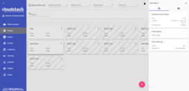

[](https://travis-ci.org/bwsw/cloudstack-ui)

Table of Contents
=================

   * [Cloudstack UI](#cloudstack-ui)
      * [Project Story](#project-story)
      * [Implementation Details](#implementation-details)
      * [Features Supported](#features-supported)
      * [Features Yet Unsupported](#features-yet-unsupported)
      * [Current To Do's](#current-to-dos)
      * [Long Term To Do's](#long-term-to-dos)
      * [Far Away To Do's](#far-away-to-dos)
      * [Screenshots and Features descriptions](#screenshots--features-descriptions)
         * [Login view](#login-view)
         * [Virtual machines view](#virtual-machines-view)
         * [New virtual machine form](#new-virtual-machine-form)
         * [Resource usage bar](#resource-usage-bar)
         * [Templates and ISOs view](#templates--isos-view)
         * [Firewall Templates View](#firewall-templates-view)
         * [Spare Drives View](#spare-drives-view)
         * [Activity log view](#activity-log-view)
      * [Project Sponsors](#project-sponsors)
      * [How to Contribute](#how-to-contribute)
      * [License](#license)
   * [Documentation](#documentation)
      * [Deployment](#deployment)
      * [Configuration Options](#configuration-options)

# Cloudstack UI

Cloudstack UI is a project whose purpose is to develop an easy-to-use, light, and user friendly frontend interface for the [Apache Cloudstack](http://cloudstack.apache.org/) virtualization management system. Apache Cloudstack itself is a great product which is used very widely, but its frontend is developed for administrators (from our point of view), not for end cloud users. Some of the interactions are not straightforward and unnatural to an average user and require quite a long time to adapt. Other reasons to develop are connected with a lack of functions like virtual machine statistics & charting, sophisticated resource accounting, and application management. These are in our long-term TODO list.

## Project Story

At Bitworks, we run an ACS public cloud for 3 years (actually we still run CS 4.3 cloud in production) and we found that average users who are familiar with Digital Ocean, Amazon AWS, and other VPS management systems feel uncomfortable with Cloudstack UI and make a lot of operational mistakes. That’s why we decided to implement a convenient and neat end-user facing UI covering regular activities, which are important for day-to-day VM management.

The project is developed by Bitworks Software Frontend Division within the educational marathon, which has the purpose to incorporate our new team members and show them our standard frontend development instrument.

## Implementation Details

* Designed compatible with [Apache Cloudstack](http://cloudstack.apache.org/) 4.9 and hasn't tested for the previous versions of CS
* Powered by [Angular 2](https://angular.io/) and [Google Material Design Lite](https://getmdl.io/)
* Tested and works fine in next modern browsers
   * Google Chrome 56.0.2924.76
   * Chromium 53.0.2785.143

## Features Supported

Since we designed the product from the perspective of well-known use cases, which are common to our public cloud deployment, we implemented only ones which are 100% required and cover most of use cases. Other deployments may imply other requirements, which is why it’s an open source product.

So, what is supported:

* Basic Cloudstack zones with virtual router
* Security groups
* KVM Hypervisor
* Security group templates
* Multiple zones
* Virtual machine standard operations supported by Apache Cloudstack
* Root and Data disks management
* Ad-hoc and periodical snapshots for disks
* Affinity groups management
* VM groups
* Localization support
* Frontend Themes, Custom VM colors
* Custom and Fixed service and disk offerings
* Password management
* SSH keys management

## Features Yet Unsupported

We intensively use features like projects in our own Cloudstack cloud to manage resources dedicated to project groups, etc. but generic users don’t need them, so we don’t support the following features yet:

* Advanced Zones
* Hypervisors other than KVM have not been tested

## Current To Dos

* Projects
* Responsive interface for smart devices
* API keys management
* A lot of small improvements which affect  user experience greatly

## Long Term To Dos

* Plugins
   * VM metrics a.k.a. Pulse (charts and availability information)
   * Resource utilization stats, traffic, IO stats, CS entities stats a.k.a. Accounting
   * Self registration for public cloud
   * Web SSH/RDP (guacamole)

## Far Away To Dos
* Plugins
   * Applications a.k.a. Roller (Docker swarm or Ansible, tbd)


## Screenshots & Features Descriptions

#### Login view

Just a simple login screen. Nothing really new. But it has a nice preloader which can be used to brand it for specific company. By default it shows Apache Cloudstack banner.

<a href="https://raw.githubusercontent.com/bwsw/cloudstack-ui/master/screens/loginView.png" target="_blank"></a>

#### Virtual machines view

This screen was rethought greatly. First of all, we implemented the “one step” approach everywhere, and we also made it work without moving from view to view, like ACS native interface does. Thus, all actions on VM instances are managed from the same screen. Also, the interface allows to view several zones immediately, group virtual machines by zones, by logical groups (e.g. Databases, WWW), and by colors.
We added a feature to brush a virtual machine with a specific color to make it look unique and meaningful to users from a certain perspective.
Also we moved most of VM information to the sidebar, which now has two tabs - the first one is for the general view and virtual-machine related activities (like security groups, additional ips) and the second one is for virtual machine storage management (disks, snapshots, and ISO).
From the system behavior standpoint, we have changed it sometimes, e.g. when the user wants to change service offering for running VM, the interface says that VM will be stopped and started, and it doesn’t make the user do it separately. So we replaced disconnected action sequences with connected ones.

<a href="https://raw.githubusercontent.com/bwsw/cloudstack-ui/master/screens/vmView1.png" target="_blank"></a>&nbsp;&nbsp;
<a href="https://raw.githubusercontent.com/bwsw/cloudstack-ui/master/screens/vmView2.png" target="_blank"></a>&nbsp;&nbsp;
<a href="https://raw.githubusercontent.com/bwsw/cloudstack-ui/master/screens/vmView3.png" target="_blank"></a>

#### New virtual machine form

We changed the new virtual machine screen a lot. Now it’s one-step and it allows to select everything from one screen without additional steps and so on. We believe it’s much better for a regular user than the one which is used in the native UI. It also generates meaningful VM names from usernames like `vm-<username>-<counter>`. Another important thing is that the form immediately checks that the user has the required amount of resources to create the virtual machine, and thus it doesn’t allow them to launch creation of impossible things which will fail for sure.

<a href="https://raw.githubusercontent.com/bwsw/cloudstack-ui/master/screens/newVMView.png" target="_blank"></a>

#### Resource usage bar

We also decided to place resource usage bar on the same virtual machine view screen. It can be collapsed or displayed. You also can see that the interface is in chocolate and blue colors. It’s because we enabled instant theme changing in the settings area. Material Design allows doing it natively, default theme colors can be specified in configuration json file.

<a href="https://raw.githubusercontent.com/bwsw/cloudstack-ui/master/screens/resourceUsageBar.png" target="_blank"></a>

#### Templates & ISOs view

We changed the templates and ISOs view to make it more obvious and neat to use. Also, the user can choose the required OS family to filter out unnecessary images. Also the same concept of single view without moving between screens is applied here. Additional things are displayed in the sidebar.

<a href="https://raw.githubusercontent.com/bwsw/cloudstack-ui/master/screens/templatesISOsView.png" target="_blank"></a>&nbsp;&nbsp;
<a href="https://raw.githubusercontent.com/bwsw/cloudstack-ui/master/screens/templatesISOsView2.png" target="_blank"></a>

#### Firewall Templates View

So, here is somewhat of a controversial thing here. Actually, we don’t think the security group concept is quite clear for an average user. There is a reason. The user can not change the security group for a virtual machine, but he or she can change the rules inside of the security group; as a result those changes affect all the virtual machines which share the same group. From our experience it’s not what an average user expects. We tried to change it to make it work in a better way, so we created the “Firewall rules template” concept, which is a preset that can be system default or developed by the user, and those presets (many of them) can be used to specify for a newly created virtual machine. Upon creation the system creates a new security group for every virtual machine which is initially filled with all the rules from specified presets. Next, when the user changes the rules for a certain virtual machine, they don’t affect other machines. So, basically the interface disables sharing one security group between several virtual machines. Every virtual machine always gets a unique security group which is built from presets specified when the virtual machine was created. Also, system administrators can specify default presets during the interface deployment in json configuration file; now we have “TCP Permit All”, “UDP Permit All”, “ICMP Permit All” presets which just pass all the traffic because we would like the user who doesn’t read manuals and doesn’t mention the details to still make his virtual machines accessible.

<a href="https://raw.githubusercontent.com/bwsw/cloudstack-ui/master/screens/firewallTemplatesView.png" target="_blank"></a>&nbsp;&nbsp;
<a href="https://raw.githubusercontent.com/bwsw/cloudstack-ui/master/screens/firewallTemplatesView2.png" target="_blank"></a>

#### Spare Drives View

This panel displays only the drives which are detached from virtual machines. Original ACS UI has the “Storage” zone where the user can see all the drives, but we don’t think an average user needs such a function. Current ACS releases allow root volumes resizing, so fewer and fewer users require more than one drive. But, some deployments can have different storage offerings, so it’s still important to let the user work with additional drives, but in the native ACS UI we found that users often forget about additional drives and they assume they will be removed when the virtual machine is removed, so in 99% of the cases they don’t expect that they can be reused. So we made it work that way. All drives can be automatically removed on when a virtual machine is removed. The attached drives are not displayed in the “Spare drives” list, the drives that are detached are displayed there. Also, we don’t allow the user to create additional disks on a virtual machine creation because it leads to confusion when the virtual machine is created from a template – the user doesn’t realize that they add an “additional” drive and it’s not a root one.

<a href="https://raw.githubusercontent.com/bwsw/cloudstack-ui/master/screens/spareDrivesView.png" target="_blank"></a>&nbsp;
<a href="https://raw.githubusercontent.com/bwsw/cloudstack-ui/master/screens/spareDrivesView2.png" target="_blank"></a>


#### Activity log view

It’s a simplified view for account activities. It lets you choose the date and levels and see all of them. It’s close to the same screen in the ACS native UI, but we believe that the user is interested in the events of specific date and scrolling a huge event log back to find something is not productive. Sometimes the HelpDesk service just wants to show the user that something had happened on a specific date, and thus the interface allows you to find information easier.  

<a href="https://raw.githubusercontent.com/bwsw/cloudstack-ui/master/screens/activityLog.png" target="_blank"></a>


## Project Sponsors

The project is currently supported by [Bitworks Software](https://bitworks.software/).


## How to Contribute

You can contribute to the project development in various ways:

1. Share the information about the project with other people, try to install the UI and share your opinion with us and your colleagues.
2. Propose useful features. Ideas are always welcome. 
3. Deploy it somewhere and inform us about your success story and we will share it in the adopters section.
4. Fix bugs and send us the PR.
5. Implement a feature from the Roadmap or simply make something new.
6. Support and promote the development of specific functions which are important to you and may be shared.
7. Provide testing environment for other deployment schemes. Now we interested in testing the app with
   1. KVM with RBD
   2. Xen with NFS, Local, RBD
   3. Oher browsers and operating systems
7. Hire us for frontend or backend development of custom software development projects. Take a look at our [website](https://bitworks.software/) to know where we can be useful. Take a look at our [presentation](https://www.slideshare.net/secret/BpNGxtaPUfOIqj) to learn more about us.

To contribute, just contact us via e-mail: info@bw-sw.com

## License

It’s released under the Apache 2.0 license.

# Documentation

## Deployment

### Main UI container

To run docker container with default configuration options use:

```
docker run -d -p 80:80 --name cloudstack-ui \
           -e API_BACKEND_URL=http://link_to_api_endpoint \
           bwsw/cloudstack-ui
```

If you want to override default options use:

```
docker run -d -p 80:80 --name cloudstack-ui \
           -e API_BACKEND_URL=http://link_to_api_endpoint \
           -v /my/config/path:/config \
           bwsw/cloudstack-ui
```

`http://link_to_api_endpoint` - url of ACS API

`/my/config/path` - path to a directory with a custom configuration file named config.json.

### Assisting object cleanup container

Some operations implemented in the UI require "delayed" activities, so we use additional cleaner container that cleans objects marked for the removal.

Download and start [bwsw/cloudstack-ui-cleaner](https://hub.docker.com/r/bwsw/cloudstack-ui-cleaner/) container.

## Configuration Options

You can customize the application by providing your own configuration file (example link).

### securityGroupTemplates:

Predefined templates for security groups. You can define your own security groups that will be available for all users by default. Format:

    "securityGroupTemplates": [
        {
          "id": "templateTCP",
          "name": "TCP Permit All",
          "description": "Permits all TPC traffic",
          "preselected": true,
          "ingressRules": [
            {
              "ruleId": "9552c7e9-9421-4a16-8a09-00a6bab4aa5a",
              "protocol": "tcp",
              "startPort": 1,
              "endPort": 65535,
              "CIDR": "0.0.0.0/0"
            }
          ],
          "egressRules": [
            {
              "ruleId": "dcaeefe0-0014-4431-b21d-db2e66f9162d",
              "protocol": "tcp",
              "startPort": 1,
              "endPort": 65535,
              "CIDR": "0.0.0.0/0"
            }
          ]
        },
        {...}
    ]


Parameters:

* id: a unique identifier
* name
* description
* preselected (true or false) - specifies whether network rules from this template will be automatically applied for newly created virtual machines
* ingress and egress rules:
   * ruleId: a unique identifier
   * protocol: either 'tcp', 'udp' or 'icmp'
   * CIDR: subnet mask (e.g. 0.0.0.0/0)
   * For TCP and UDP: startPort and endPort
   * For ICMP: icmpCode and icmpType

### vmColors

The set of colors for virtual machines in hexadecimal format. You can specify any colors you like.

### themeColors

Color info for Material design themes. Changes are not recommended.

### offeringAvailability

In this section you can specify which offerings will be available for which zones. Format:

    offeringAvailability: {
      "filterOfferings": true,
        "zoneId": {
          "diskOfferings": ["offeringId1", "offeringId2"],
          "serviceOfferings": ["offeringId3", "offeringId4"]
        }
    }

If filterOfferings is set to false, all offerings will be available for all zones.

### customOfferingRestrictions

In this sections you can specify limits for custom offerings in the following format:

    "customOfferingRestrictions": {
      "offeringId1": {
        "cpuNumber": {
          "min": number,
          "max": number
        },
        "cpuSpeed": {
          "min": speed_in_mhz,
          "max": speed_in_mhz
        },
        "memory": {
          "min": memory_in_mb,
          "max": memory_in_mb
        }
      }
    }
    
Any of these parameters may be left unspecified, in which case 0 will be used for min and infinity will be used for max.
