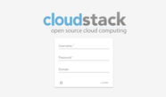
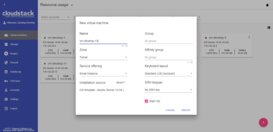
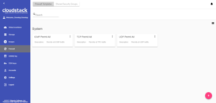

# Cloudstack UI
Cloudstack UI is a project which purpose is to develop easy to use, light and user friendly frontend interface for Apache Cloudstack virtualization management system. Cloudstack itself is great product which is used widely but it's frontend is developed for administrators, not for end users. Some of behaviours are not transparent and not natural to average user and require quite long adaptation. Another reasons to develop are connected with lack of functions like virtual machine statistics & charting, sophisticated resource accounting and application management. This are in our long-term TODO list.

## Project Story

We at Bitworks run an ACS public cloud for 3 years (actually we still run CS 4.3 cloud in production) and we found that average users which are familiar to Digital Ocean, Amazon AWS and other VPS management systems feel uncomfortable with Cloudstack UI and make a lot of operational mistakes. That's why we decided to implement convinient and neat end-user facing UI covering regular activities which are important for day to day VM management.

The project is developed by Bitworks Software Frontend Division during educational marathon which purpose was to incorporate new team members and show them our standard development instruments for frontend development.

## Implementation Details

* Designed compatible with Apache Cloudstack 4.9 and wasn't tested with previous versions of CS
* Powered by Angular 2 and Google Material Design

## Features Supported

Since we designed the product from the perspective of well-known use cases which are common to our public cloud deployment we implemented only ones which are 100% required and covers most of use cases. May be in another deployment there are other requirements, but it's open source product indeed. 

So, what is supported:

* Basic Cloudstack zones with virtual router
* Security groups
* KVM Hypervisor
* Security group templates
* Multiple zones
* Virtual machine standard operations supported by Apache Cloudstack
* Root and Data disks management
* Ad-hoc and periodical snapshots for disks
* Affinity groups management
* VM groups
* Localization support
* Frontend Themes, Custom VM colors
* Custom and Fixed service and disk offerings

## Features Yet Unsupported

We intensively use features like projects in our own Cloudstack cloud to manage resources dedicated to project groups, etc. but generic users don't need them, so we don't support next features yet:

* Advanced Zones
* Other hypervisors than KVM are not tested
* Domains

## Current To Do's

* Projects
* Responsive interface for smart devices
* SSH keys management
* API keys management
* Password management

## Long Term To Do's

* VM metrics a.k.a. Pulse Plugin
* VM expenses like resource utilization stats, traffic, IO stats a.k.a. Accounting Plugin
* Applications a.k.a. Roller Plugin

## Screenshots & Features descriptions

#### Login view

Just simple login screen. Nothing specially new. But it has nice preloader which can be used to brand it for specific company. By default it shows Apache Cloudstack banner.

#### Virtual machines view

This screen was rethinked very greatly. First of all, we implemented "one step" approach everywhere and also we did it work without moving from view to view like ACS native interface works. Thus, all actions on VM instances are managed from the same screen. Also, the interface allows to view several zones immediately, group virtual machines by zones, by logical groups (e.g. Databases, WWW) and by colors. 

We added an facility to brush virtual machine with specific color to make it look unique and meaingful to user from a certain perspective.

Also we moved most of VM information to the sidebar which now has two tabs - the first one is for general view and virtual-machine related activities (like security groups, additional ips) and the second one is for virtual machine storage management (disks, snapshots and ISO).

From the perspective of the system behaviour we changed it sometimes, e.g. when user wants to change service offering for running VM the interface says that VM will be stopped and started and it doesn't bother the user to do it separately. So we changed disconnected action sequences to connected ones.

&nbsp;&nbsp;
&nbsp;&nbsp;

#### New virtual machine form

We changed new virtual machine screen a lot. Now it's one step and it allows select everything from one screen without additional steps and so on. We believe it's much better to regular user than the one which is used in native UI. It also generates meaningful VM name from username like `vm-<username>-<counter>`. Other important thing is that the form immediately checks that user has required amount of resources to create the virtual machine and thus it doesn't allow him to launch creation of impossible things which will fail for sure.

#### Resource usage bar

We also decided to place resource usage bar on the same virtual machine view screen. It can be collapsed or displayed. You also can see that the interface is in chocolate and blue colors. It's because we allow to change the theme instantly in settings area. Material Design allows doing it natively, default theme colors can be specified in configuration json file.

#### Templates & ISOs view

We changed templates and ISOs view to make it more obvious and neat to use. Also, user can switch required OS family to filter out unnecessary images. Also, here is the same concept of single view without moving between screens is applied. Additional things are displayed in the sidebar.

&nbsp;&nbsp;

#### Firewall Templates View

So, here is a somekind controversial thing here. Actually, we don't think security group concept is quite clear for an average user. There is a reason. The user can not change security group for virtual machine, but he or she can change the rules inside of security group, as a result those changes affect all the virtual machines which share the same group. From out experience it's not what average user expects. We tried to change it to make it work in better way, so we created a concept "Firewall rules template" which is a preset which can be system default or developed by user and those presets (many) can be used to specify for newly created virtual machine. Upon creation the system creates new security group for every virtual machine which is initially filled with all the rules from specified presets. Next, when the user changes the rules for specific virtual machine they don't affect other machines. So, basically the interface doesn't allow to share a single security group between several virtual machines. Every virtual machine always gets unique security group which is built from presets specified when the virtual machine were created. Also, system administrators can specify default presents during the interface deploy in json configuration file, now we have "TCP Permit All", "UDP Permit All", "ICMP Permit All" presets which just pass all the traffic because we would like the user who doesn't read manuals and doesn't mention the details still gets his virtual machines accessible.

&nbsp;&nbsp;

#### Activity log view

It's simplified view for account activities. It allows choosing the date and levels and see all of them. It's close to the same screen in ACS native UI but we believe that an user is interested in events of specific date and scrolling huge event log back to find something is not productive. Sometimes HelpDesk service just wants to show user that something had happened at specific date and thus the interface allows finding information easier.  

## Project Sponsors

Currently project is supported by [Bitworks Software](https://bitworks.software/).

## How to Contribute

You can contribute to development of the project in various ways:

1. Share the information about the project with other people, try to install the UI and share your opinion with us and your fellows.
2. Propose useful feature. Ideas are always welcome. 
3. Deploy it somewhere and inform us about success story and we will share it in adopters section.
4. Fix bugs and send us PR.
5. Implement a feature from Roadmap or just do something which is new.
6. Support and promote the development of specific functions which are important to you and may be shared.
7. Hire us for frontend or backend development of custom software development projects. Take a look at our [website](https://bitworks.software/) to know where we can be useful. Take a look at our presentation to know more about us.

To do a contribution, just contact us with next e-mail: info@bw-sw.com

## License

It's released under Apache 2.0 license.

# Documentation

## Deployment

## Configuration Options

