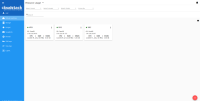
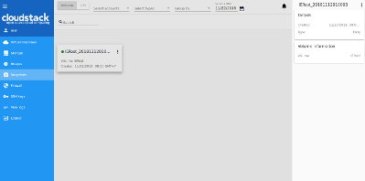

[](https://travis-ci.org/bwsw/cloudstack-ui) [](https://coveralls.io/github/bwsw/cloudstack-ui?branch=master)

# Table of Contents

- [CloudStack-UI](#cloudstack-ui)
  - [Project Story](#project-story)
  - [Implementation Details](#implementation-details)
  - [Features Supported](#features-supported)
  - [Plugins Supported](#plugins-supported)
  - [Features Yet Unsupported](#features-yet-unsupported)
  - [Current To Do's](#current-to-dos)
  - [Long Term To Do's](#long-term-to-dos)
  - [Far Away To Do's](#far-away-to-dos)
  - [Screenshots and Features descriptions](#screenshots--features-descriptions)
    - [Login view](#login-view)
    - [Virtual machines](#virtual-machines-view)
    - [New virtual machine form](#new-virtual-machine-form)
    - [Resource usage bar](#resource-usage-bar)
    - [Storage](#storage)
    - [Images](#images)
    - [Snapshots](#snapshots)
    - [Firewall](#firewall)
    - [Activity log](#activity-log)
    - [Accounts](#accounts)
- [Documentation](#documentation)
  - [User Guide](#user-guide)
  - [Getting started guide](#getting-started-guide)
    - [Prerequisites](#prerequisites)
    - [Download and install dependencies](#download-and-install-dependencies)
    - [Main commands](#main-commands)
  - [Deployment](#deployment)
    - [Main UI Container](#main-ui-container)
  - [Versioning](#versioning)
  - [Configuration Options](#configuration-options)
- [Project Sponsors](#project-sponsors)
  - [How to Contribute](#how-to-contribute)
  - [License](#license)

# CloudStack-UI

CloudStack-UI is a project which purpose is to develop an easy-to-use, light, and user-friendly frontend interface for the [Apache CloudStack](http://cloudstack.apache.org/) virtualization management system. Apache CloudStack itself is a great product which is used very widely, but its frontend is developed for administrators (from our point of view), not for cloud end-users. Some of the interactions are not straightforward and unnatural to an average user and require quite a long time to adapt. Other reasons to develop alternative UI are connected with the lack of functions such as virtual machine statistics & charting, sophisticated resource accounting, and application management. These are in our long-term TODO list.

Join CloudStack-UI LinkedIn [Group](https://www.linkedin.com/groups/13540203).

## Project Story

At [Bitworks Software](https://bitworks.software/), we run an ACS public cloud for 3 years (actually we still run CS 4.3 cloud in production) and we found that average users who are familiar with Digital Ocean, Amazon AWS, and other VPS management systems feel uncomfortable with original CloudStack UI and make a lot of operational mistakes. That’s why we decided to implement a convenient and neat end-user facing UI covering regular activities, which are important for day-to-day VM management.

The project is developed by Bitworks Software Frontend Division within the educational marathon, which has the purpose to incorporate our new team members and show them our standard frontend development instrument.

## Implementation Details

- Designed compatible with [Apache CloudStack](http://cloudstack.apache.org/) 4.11 and has been tested for the previous versions of CS (4.9, 4.10).
- Powered by [Angular](https://angular.io/) and [Material 2](https://material.angular.io/).
- Tested and works fine in the next modern browsers:
  - Google Chrome 60.0.3112.78
  - Chromium 60.0.3169.0
  - Mozilla Firefox 54.0.1
  - Safari 5.1.7
  - Internet Explorer 11.483.150630

## Features Supported

Actual Changelog can be found [here](https://github.com/bwsw/cloudstack-ui/blob/master/CHANGELOG.md).

Since we designed the product from the perspective of well-known use cases, which are common to our public cloud deployment, we implemented only ones which are 100% required and cover most of the use cases. Other deployments may imply other requirements, which is why it’s an open source product.

So, what is supported:

- Basic CloudStack zones with virtual router
- Security groups
- KVM Hypervisor
- Security group templates
- Multiple zones
- CloudStackAccount Domains
- Virtual machine standard operations supported by Apache CloudStack
- Root and Data disks management
- Ad-hoc snapshots for disks
- Affinity groups management
- VM groups
- Localization support
- Frontend Themes, Custom VM colors
- Custom and Fixed service and disk offerings
- Password management
- SSH keys management
- API keys management
- Accounts management
- A lot of small improvements which affect user experience greatly

## Plugins Supported

**Pulse plugin**

Pulse Plugin is designed for visualization of virtual machines performance statistics. Currently, this CloudStack-UI extension is only compatible with ACS clusters that use the KVM hypervisor. With help of sensors that collect virtual machines performance statistics via the Libvirt API and store them in an InfluxDB datastore and RESTful statistics server, CloudStack-UI is able to display CPU, RAM, disk IO and network traffic utilization in the form of convenient visual charts.

Pulse allows users of Apache CloudStack to monitor current and previous operational states of virtual machines. The plugin supports various view scales like minutes, hours, days and enables data overlays to monitor peak and average values.

We consider this plugin very important for the CloudStack ecosystem as currently there is no built-in functionality to track VM operational states, although it is vital for system administrators to successfully operate virtual servers. Read more about Plugin deployment [here](https://github.com/bwsw/cloudstack-ui/wiki/Pulse-Plugin#how-to-deploy-and-configure-pulse-plugin).

**WebShell Plugin**

WebShell is a CloudStack-UI extension designed to perform a clientless SSH connection to a virtual machine. The extension is activated in the CloudStack-UI configuration file and is supported by an additional Docker container. As for the way of WebShell usage, the plugin is similar to NoVNC interface provided by CloudStack. However, WebShell uses the SSH protocol and doesn’t allow VM emergency management.

This feature is not available in basic CloudStack UI and API. Plugin deployment and configuration instructions can be found on [the plugin page](https://github.com/bwsw/cloudstack-ui/wiki/WebShell-Plugin#webshell-plugin-deployment).

**View Logs Plugin**

This extension is an API plugin featured with the UI that our team has developed to process and view virtual machine logs which are handled by ELK and delivered by Filebeat. The extension is activated in the CloudStack-UI configuration file after installing it into CloudStack and deploying the required components. The version of the plugin matches Apache CloudStack version that it is built for. The plugin is developed and tested only with Apache CloudStack 4.11.1

After deployment, the _View logs_ section is available in the CloudStack-UI. There a user can select the log files to display by setting up main parameters - a virtual machine and a date for which a user wishes to see the logs. Optionally, you can specify a time period and keywords to filter the log files.

Plugin deployment and configuration instructions can be found at the [plugin page](https://github.com/bwsw/cloudstack-ui/wiki/View-Logs-Plugin).

## Features Yet Unsupported

We intensively use features like projects in our own CloudStack cloud to manage resources dedicated to project groups, etc. but generic users don’t need them, so we don’t support the following features yet:

- Advanced Zones
- Hypervisors other than KVM have not been tested

## Current To Dos

- Responsive interface for smart devices

## Long Term To Dos

- Plugins
  - Resource utilization stats, traffic, IO stats, CS entities stats a.k.a. Accounting
  - Self registration for public cloud
  - RDP/VNC (guacamole)

## Far Away To Dos

- Plugins
  - Applications a.k.a. Roller (Docker swarm or Ansible, tbd)

## Screenshots & Features Descriptions

#### Login view

The login screen has a nice preloader which can be used to brand it for specific company. By default, it shows Apache CloudStack banner. There are three possible ways to use domain (the form presented on the screen like in native UI, default domain in settings or an URL-based scheme).

<a href="https://raw.githubusercontent.com/bwsw/cloudstack-ui/master/screens/loginView.png" target="_blank"></a>

#### Virtual machines view

This screen was rethought greatly. First of all, we implemented the “one step” approach everywhere, and we also made it work without moving from view to view, like ACS native interface does. Thus, all actions on VM instances are managed from the same screen. Also, the interface allows to view several zones immediately, group virtual machines by zones, by logical groups (e.g. Databases, WWW), and by colors.
We added a feature to brush a virtual machine with a specific color to make it look unique and meaningful to users from a certain perspective.

Also, we moved most of VM information to the sidebar, which now has four tabs - General view, Storage (disks, snapshots, and ISO), Network (NICs configuration, Firewall rules) and Tags.
From the system behavior standpoint, we have changed it sometimes, e.g. when the user wants to change service offering for running VM, the interface says that VM will be stopped and started, and it doesn’t make the user do it separately. So we replaced disconnected action sequences with connected ones. The data representation can be changed between the "card" and "table" view. Each section contains a switch and this improvement gives a user an opportunity to work with data in each specific section in a more convenient way.

<a href="https://raw.githubusercontent.com/bwsw/cloudstack-ui/master/screens/VM_View1.png" target="_blank"></a>&nbsp;&nbsp;
<a href="https://raw.githubusercontent.com/bwsw/cloudstack-ui/master/screens/VM_View2.png" target="_blank"></a>&nbsp;&nbsp;
<a href="https://raw.githubusercontent.com/bwsw/cloudstack-ui/master/screens/VM_View3.png" target="_blank"></a>

#### New virtual machine form

We changed a new virtual machine screen a lot. Now it’s a one-step dialog and it allows selecting everything from one screen without additional steps. We believe it’s much better for a regular user than the one used with the native UI. It also generates meaningful VM names from usernames like `vm-<username>-<counter>`. Another important thing is that the form checks that a user has a required amount of resources to create the virtual machine immediately and thus it doesn’t allow him launching creation that will fail for sure.

Our team has made a big contribution to the improvement of UX when creating a virtual machine. First of all, a user now has an access to the list of all creation steps. Depending on installation source (ISO or a Template) system allows getting not only a login, password, and IP of the machine but also an access to VM interaction interface.

Currently supported:

- VNC console,
- WebShell if VM has a csui.vm.auth-mode tag with SSH value. To configure access to VM using WebShell, please refer to [wiki](https://github.com/bwsw/cloudstack-ui/wiki/Tags),
- Access via HTTP if VM has a csui.vm.auth-mode tag with HTTP value. To configure access to VM via HTTP, please refer to [wiki](https://github.com/bwsw/cloudstack-ui/wiki/Tags).

<a href="https://raw.githubusercontent.com/bwsw/cloudstack-ui/master/screens/newVM_View.png" target="_blank"></a>
<a href="https://raw.githubusercontent.com/bwsw/cloudstack-ui/master/screens/newVM_View2.png" target="_blank"></a>

#### Resource usage bar

We also decided to place the resource usage bar on the same virtual machine view screen. It can be collapsed or displayed. A resource usage bar allows switching between "used" and "free" presentations to help users understanding capabilities in a better way. Domain administrators can also choose between Account and Domain view.

<a href="https://raw.githubusercontent.com/bwsw/cloudstack-ui/master/screens/resource_UsageBar.png" target="_blank"></a>

#### Storage

This panel displays existing drives. Root disks are visually distinguished from data disks. In addition, there is an option to display only spare disks, which allows saving user's time in certain cases. Each drive has a detailed sidebar with two tabs (Volume and Snapshots). When a virtual machine is removed, attached drives can be automatically removed. Also, we don’t allow a user to create additional disks on a virtual machine creation because it leads to confusion when the virtual machine is created from a template – the user doesn’t realize that they add an “additional” drive and it’s not a root one.

<a href="https://raw.githubusercontent.com/bwsw/cloudstack-ui/master/screens/spare_DrivesView.png" target="_blank"></a>&nbsp;
<a href="https://raw.githubusercontent.com/bwsw/cloudstack-ui/master/screens/spare_DrivesView2.png" target="_blank"></a>
<a href="https://raw.githubusercontent.com/bwsw/cloudstack-ui/master/screens/spare_DrivesView3.png" target="_blank"></a>

#### Images

We changed the templates and ISOs view making it more obvious and neat to use. Also, a user can choose a required OS family to filter out unnecessary images. Also, the same concept of single view without moving between screens is applied here. Additional things are displayed in the sidebar.

<a href="https://raw.githubusercontent.com/bwsw/cloudstack-ui/master/screens/templatesISOsView.png" target="_blank"></a>&nbsp;&nbsp;
<a href="https://raw.githubusercontent.com/bwsw/cloudstack-ui/master/screens/templatesISOsView2.png" target="_blank"></a>

#### Snapshots

We have added a section - Snapshots - that makes it easier for a user to manage snapshots created for volumes in the system. A user can view the list of snapshots and filter or group it by type or account (available to Administrators). We also added filtering snapshots by date.

In the details sidebar a user can see the snapshot general information and the volume that the snapshot is created for.

Here the action box also allows a user to create template or volume from the snapshot, revert a volume to the snapshot, or delete a snapshot.

<a href="https://raw.githubusercontent.com/bwsw/cloudstack-ui/master/screens/snapshotsView.png" target="_blank"></a>&nbsp;&nbsp;

<a href="https://raw.githubusercontent.com/bwsw/cloudstack-ui/master/screens/snapshotsDetails.png" target="_blank"></a>

#### Firewall

Firewall section includes three views: Firewall templates, Shared security groups and Private security groups.

It is important to understand the concept of Firewall _templates_. This is a preset of rules that can be system default or developed by a user. System administrators can specify default presets during the interface deployment in the json configuration file. Upon VM creation the system uses a default security group defined in the configuration file, or a user can create a new security group right in the VM creation form. Next, when a user changes the rules for a certain virtual machine, they don’t affect other machines. These changed rules make a _private_ security group used for that virtual machine only.

The second way is to use a _shared_ security group - a group that is used by other VMs.

Users can manage security group rules in two modes: a "view" mode with filtering by types and protocols and an “edit” mode. Security groups editing is available when switching from "view" mode to "editing" mode. If editing a shared group, a user is warned that changes will affect other VMs using this group. This behavior allows avoiding undesirable changes for other VMs.

<a href="https://raw.githubusercontent.com/bwsw/cloudstack-ui/master/screens/firewall_TemplatesView.png" target="_blank"></a>&nbsp;&nbsp;
<a href="https://raw.githubusercontent.com/bwsw/cloudstack-ui/master/screens/firewall_TemplatesView2.png" target="_blank"></a>

#### Activity Log

It’s a simplified view for account activities. It lets you choose the date and levels and see all of them. It’s close to the same screen in the ACS native UI, but we believe that the user is interested in the events of specific date and scrolling a huge event log back to find something is not productive. Sometimes the HelpDesk service just wants to show a user that something had happened on a specific date, and thus the interface allows you to find information easier.

<a href="https://raw.githubusercontent.com/bwsw/cloudstack-ui/master/screens/activityLog.png" target="_blank"></a>

#### Accounts

Here domain administrators can manage existing accounts, create new accounts and apply filtering and grouping as in other sections. There is also an access to the details sidebar of each account with a possibility of editing settings and resource restrictions. In addition to this, an administrator can apply filtering by accounts in other sections, thus narrowing a context and working with a data that he needs at the moment.

<a href="https://raw.githubusercontent.com/bwsw/cloudstack-ui/master/screens/accounts1.png" target="_blank"></a>
<a href="https://raw.githubusercontent.com/bwsw/cloudstack-ui/master/screens/accounts2.png" target="_blank"></a>

# Documentation

## User Guide

You can find an official User Guide at https://cloudstackui.readthedocs.io/en/latest/ .

## Getting started guide

### Prerequisites

Before you start, please, prepare Node development environment. Install Node.js or update your current node.js to latest stable version.

### Download and install dependencies

1. Clone the CS-UI project from GitHub.
2. Run `npm install` command. This command installs all dependencies, which are used in the project. Also, you may use `yarn` command.
3. Add your own `proxy-conf.js` file in the project root folder and set the API endpoint in this file. See [proxy-conf-example](https://github.com/bwsw/cloudstack-ui/blob/master/proxy-conf-example.js).

```
git clone https://github.com/bwsw/cloudstack-ui.git
cd cloudstack-ui
npm install
```

### Main commands

| command       | action                                                                                                          |
| ------------- | --------------------------------------------------------------------------------------------------------------- |
| npm test      | use this command to execute tests via Karma                                                                     |
| npm run build | use this command to build the project, the build artifacts will be stored in the "dist/cloudstack-ui" directory |
| npm start     | use this command to compile the application, it will be available at URL - "localhost:8080".                    |

## Deployment

### Main UI container

To run docker container use:

```
docker pull bitworks.software:8443/cloudstack-ui:1.411.23

docker run -d -p 80:80 --name cloudstack-ui \
           -e CLIENT_ENDPOINT=http://cloudstack/client \
           -e BASE_HREF=base_href \
           -v /path/to/config.json:/static/config/config.json \
           bitworks.software:8443/cloudstack-ui:1.411.23
```

`http://cloudstack/client` - URL of CloudStack client endpoint (e.g. http://host:8080/client)

`base_href` - custom base URL (optional, defaults to "/")

`/path/to/config.json` - path to a custom configuration file named `config.json` (optional)

Additionally, you can change favicon and CloudStack logo on login screen and in the sidebar:

```
-v /path/to/favicon.ico:/static/img/favicon.ico \
-v /path/to/cloudstack_logo.png:/static/img/cloudstack_logo.png \
-v /path/to/cloudstack_logo_light.png:/static/img/cloudstack_logo_light.png \
```

where the `favicon.ico` is the favicon, `cloudstack_logo.png` is the logo displayed on the login screen and `cloudstack_logo_light.png` is the CloudStack logo displayed in the sidebar with the light theme.

## Versioning

```
+- Major version containing breaking changes.
| +- Minor version synchronized with the CloudStack version (major and minor without a dot).
| | +- Patch version defining the iteration number.
| | |
x.x.x
```

[See details](https://github.com/bwsw/cloudstack-ui/wiki/CS-UI-version-enumeration)

## Configuration Options

You can customize the application by providing your own configuration file config.json. See the [Config Guide](https://github.com/bwsw/cloudstack-ui/blob/master/config-guide.md) for more information on configuration options.

## Project Sponsors

The project is currently supported by [Bitworks Software](https://bitworks.software/).


## How to Contribute

You can contribute to the project development in various ways:

1. Share the information about the project with other people, try to install the UI and share your opinion with us and your colleagues.
2. Propose useful features. Ideas are always welcome.
3. Deploy it somewhere and inform us about your success story, and we will share it in the adopters section.
4. Fix bugs and send us the PR.
5. Implement a feature from the Roadmap or simply make something new.
6. Support and promote the development of specific functions which are important to you and may be shared.
7. Provide testing environment for other deployment schemes. Now we interested in testing the app with
   1. KVM with RBD
   2. Xen with NFS, Local, RBD
   3. Oher browsers and operating systems
8. Hire us for frontend or backend development of custom software development projects. Take a look at our [website](https://bitworks.software/) to know where we can be useful. Take a look at our [presentation](https://www.slideshare.net/secret/BpNGxtaPUfOIqj) to learn more about us.

To contribute, just contact us via e-mail: info@bw-sw.com

## License

It’s released under the Apache 2.0 license.
