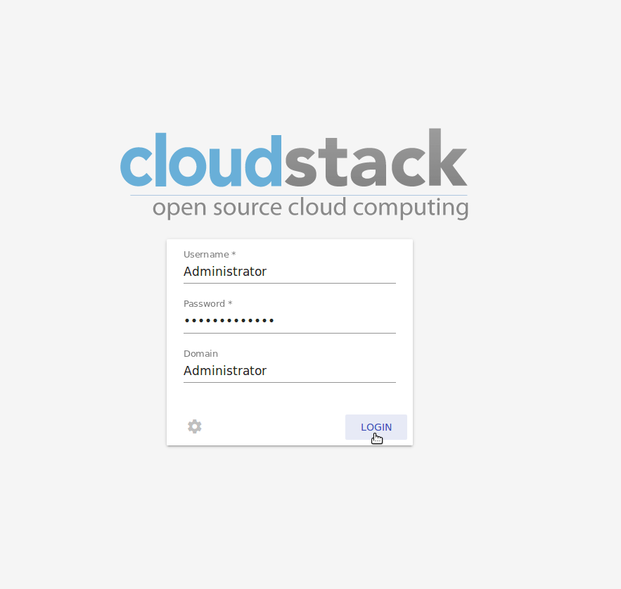

Cloudstack-UI User Guide
=============================
.. Contents::

CloudStack-UI is created to make it easier for end-users to use cloud infrastructure - to view and use their cloud resources, including virtual machines, templates and ISOs, data volumes and snapshots, guest networks, and IP addresses. 

Logging In 
-------------
If you have never worked with CloudStack before, you should start with installing the CloudStack platform. Follow the instruction at `the official documentation <http://docs.cloudstack.apache.org/projects/cloudstack-installation/en/4.9/>`_.

Then deploy CloudStack-UI (link to Deployment documentation).

To enter the platform use your credentials provided by the administrator:

- Login * -   The user ID of your account. 
- Password * - The password associated with the user ID.
- Domain - If you are a root user, leave this field blank. If you are a user in the sub-domains, enter the full path to the domain, excluding the root domain.

**Note**: Required fields are marked with asterisks (*).

Push "Login" to proceed to CloudStack.

Virtual Machines
-------------------

This is the starting page you see when entering the platform. Here and in all other views we implemented the “one step” approach, and we also made it work without moving from view to view. So all actions on VMs can be managed from one screen view.

At this page you can see the list of virtual machines existing in the system.

.. figure:: _static/VMs.png

.. _Resource_Usage:

Resource Usage
~~~~~~~~~~~~~~~~~~~~~~~~~~~~~~~
It is important that now in this section you can see the resource statistics: used and free VMs, computational resources, volumes and storage space.

Unfold Resource Usage panel in the upper part of the screen.

.. figure:: _static/VMs_ResourceUsage.png

It provides information on the following resources:

1) Virtual machines;
2) Computational resources - CPU, RAM;
3) Volumes and snapshots;
4) Storage - primary and secondary.

You can view resources for your account or the whole domain, as well as select the information on used or free resources. Click the options that you need above the resource data list.

Filtering of Virtual Machines
~~~~~~~~~~~~~~~~~~~~~~~~~~~~~~~~

The filtering and search tool will help you to find a virtual machine in the list. 

.. figure:: _static/VMs_Filter&Search.png

You can filter the VM list by accounts (available for domain administrators) and/or zones and/or groups and/or states. In the drop-down lists tick the filtering parameters and see the immediate result.

Besides, VMs can be grouped by zones and/or groups and/or colors and/or accounts. Grouping makes it easier to identify necessary VMs in the list.

.. figure:: _static/VMs_Filter.png

Use the search tool to find a virtual machine by its name or a part of the name.

Alerts on Operations with Virtual Machines
~~~~~~~~~~~~~~~~~~~~~~~~~~~~~~~~~~~~~~~~~~~~~~~~~

In the upper-right corner of the screen you can expand the list of pending operations by clicking a bell icon |bell icon|. It informs you of the latest operations with VMs. You can clear the list after its reviewing by deleting every notification one by one or clicking "Clear All" at the list bottom.

.. figure:: _static/VMs_Alerts.png

Under the Virtual Machines you can create a new virtual machine.

.. _Create_VM:

Create a Virtual Machine 
~~~~~~~~~~~~~~~~~~~~~~~~~~~~~
Creating a new VM in CloudStack-UI is a one-step action. You can select options from one screen without additional steps.

An important thing is that the system immediately checks that the user has the amount of resources required to create a virtual machine. Thus, it doesn’t allow him/her to launch creation of a VM which will fail for sure because of the resource lack.

To create a new VM click the "Create" button at the bottom-left corner. 

.. figure:: _static/VMs_Create.png

In the *Create VM* form fill in the following fields:

1. Name - a name of VM. The system suggest a meaningful autogenerated name in the following form ``vm-<username>-<counter>``.
2. Zone - a zone of VM operation. Select a zone from the drop-down list. How to add a zone to this list see here (ссылка на зоны) 
3. Service offerings - ? Select a small instance or a medium instance, or custom (?).
4. Installation source - Click "Select" to choose istallation source. Traditionally, there are two options of the virtual machine creation:
    
    - from a template, 
    - from an ISO file.
    
    The filtering tool allows to find a necessary option selecting among templates/ISOs by OS families, types and groups, or search the source by a name of its element. Tick the source in the list and click "Select" to implement the selected source.

.. figure:: _static/VMs_Create_IstallationSource.png
   :align: centrer
    
Click "Cancel" to drop selected options. No source will be selected then. 
    
5. Disk offering - available if ISO is selected as a source. Select from the drop-down list the option on disks.
6. Group - Select a group from the drop-down list. Or create a new group by typing its name right in the field.
7. Affinity group - Select an affinity group from the drop-down list. By defining affinity groups and assigning VMs to them, the user or administrator can influence (but not dictate) which VMs should run on separate hosts. This feature lets users specify that certain VMs won’t be on the same host.  Find more information on affinity groups and their addition to the system here (ссылка на раздел).
8. Firewall rules - Click "Edit" to specify a security group for the VM. In the appeared window choose between "Create new" or "Select Shared" options. 
  
    **New firewall rules**
   
   If you would like to create a new security group, select the templates in the "All templates" list at the left and move it to the "Selected templates" list at the right clicking the arrow icon:
   
.. figure:: _static/VMs_Create_AddSecGr_New.png
   :align: center
   
Click "Select All" to move all templates from left to right at once.

In the list below you will see the rules corresponding to the selected templates. All of them are checked as selected. Uncheck those you do not wish to add to your VM as firewall rules.

Click "Save" to apply the selected rules to your virtual machine.

Click "Reset" to drop all selected templates.

Click "Cancel" to drop the selected options. No rules will be assigned to the virtual machine. You will return to the "Create new virtual machine" window.
   
   **Select Shared firewall rules**
   
   If you would like to select an existing group of firewall rules you can click "Select Shared" option and tick those groups in the list that you want to asssign to your VM. In this case you won't be able to uncheck the rules in the group that you do not want to include into list. You can assign only the whole shared group to your VM. 
   

   
Click "Cancel" to drop the selected options. No rules will be assigned to the virtual machine. 
   
8. Keyboard layout - select a keyboard layout from the drop-down list.
9. SSH keypair - select a SSH keypair. Find more information on SSH key here (ссылка на раздел SSH keys)
10. Start VM checkbox - tick it to start the VM right at its creation.

**Note**: Required fields are marked with asterisks (*).

Once all fields are selected, click "Create" and wait for a while untill the VM is created. A dialogue window will appear informing the deployment is finished and the VM is created successfully. It will show the VM information:

- VM name,
- VM Password - It is autogenerated (?). You can save it for all VMs clicking "Save" next to it.
- IP.

You are offered to accept the "Template/ISO Terms and Conditions Agreement" to continue.

Depending on the installation source (ISO or a Template) the system allows getting an access to the VM interaction interface. Currently the following options are supported:

    - Open VNC console - allows opening a console;
    - WebShell if VM has a ``csui.vm.auth-mode`` tag with SSH value. To configure access to VM using WebShell, please, refer to the page (ссылка на теги);
    - Access via HTTP if VM has a ``csui.vm.auth-mode`` tag with HTTP value. To configure access to VM via HTTP, please, refer to page (ссылка на теги).

API log - ???

Close the dialogue window and make sure the newly created VM is in the list of virtual machines.

Click "Cancel" to drop the VM creation.

Virtual Machines List
~~~~~~~~~~~~~~~~~~~~~~~~~~~~~

You can change the view of existing virtual machines from list to grid by clicking at the view icon |view icon| in the upper-right corner.

.. figure:: _static/VMs_ViewList.png

For each VM in the list you can see the following information: 

- VM name and IP;
- State - shows the VM state by color: red for Running, yellow for Deploying, red for Stopped;
- OS family;
- CPU;
- RAM;
- Disks.

VM Information
~~~~~~~~~~~~~~~~~

By clicking a VM line or card you can get the VM information. It is presented at a sidebar to the right. 

.. figure:: _static/VMs_Details.png

There you will find the information on the selected virtual machine:

Virtual Machine
""""""""""""""""""""""""""

1. Description - a short description of the VM. Click "Edit" button to edit it. Enter a few words about the VM. Click "Save" to save the description.

#. Zone - a zone selected for the VM.

#. Group - a group assigned to the VM. Edit this field clicking the "Edit" button. In the appeared dialogue window choose a group from the drop-down list. Or you can create a new group right from this window. Click "Assign" to assign the chosen group to the VM. To remove the assigned group select the "Remove from the group" option and click "Remove" to eliminate the assigned group.

#. Service offering - the offerings for the VM. Expand the section to view the whole list of offerings. Edit this field clicking the "Edit" button. In the appeared window select a new option. Click "Change" to implement the edits. The virtual machone will be rebooted.

#. Affinity Group - the affinity group assigned to the virtual machine. Edit this field clicking the "Edit" button. In the dialogue window choose an existing group or create a new one right in the dialogue window. Click "Assign". The selected group can be removed clicking "Edit" and choosing "Remove from the group" in the dialogue window.

#. Template - Shows the template on the base of which the VM is created.

#. SSH key - Shows the SSH key for the virtual machine. Edit this field clicking the "Edit" icon. In the dialogue window select the SSH key that you want. Click "Change" to save it for the VM. To save the new SSH key  you will see the warning: "You need to stop the virtual machine to reset SSH key." Click "OK" if you want to stop it right now. Click "Cancel" to drop the edits.

#. Statistics - shows VM statistics on CPU utilized, Network read, Network write, Disk read, Disk write, Disk read (IO), Disk write (IO). Refresh data by clicking the "Refresh" button |refresh icon| in the upper-right corner.
    
Storages
"""""""""""""""""""""""""""

1. Disk information - shows Name, Size, Creation Date, Type (Shared/Local), Disk offering, Snapshot. The following actions on disks are available:

For root disks:

 - Take a snapshot;
 - Set up snapshot schedule;
 - Resize the disk.
        
For data disks:
       
 - Take a snapshot;
 - Set up snapshot schedule;
 - Detach;
 - Resize the disk;
 - Delete.
  
**Take a snapshot**
  
You can take a VM snapshot to preserve all the VM’s data volumes as well as (optionally) its CPU/memory state. This is useful for quick restore of a VM.
  
Click "Take a snapshot" in the disk Actions list and in the dialogue window enter the following information:
  
 - Name of the snapshot * - Define a name for the snapshot. It is autogenerated in the form <date>-<time>. But you can specify any name you wish.
 - Description - Add a description for the snapshot to know what it contains. 

**Note**: Required fields are marked with asterisks (*).

.. figure:: _static/VMs_Info_Storage_Snapshot.png

All snapshots are saved in the list of snapshots. In the disk information you will see the name and time of the *last-taken snapshot*. For it you can:
  
- Create a template - Register a new template right from the disk information block of the sidebar. In the appeared window fill in the form:
     
   - Name * - Enter a name of the new template.
   - Description * - Provide a short description for the template.
   - OS type * - Select an OS type from the drop-down list.
   - Group - Select a group from the drop-won list.
   - Password enabled - Tick this option to ...
   - Dynamically scalable - Tick this option to ...
 
**Note**: Required fields are marked with asterisks (*).
 
   Click "Show additional fields" to expand the list of optional settings. In this form it allows setting the template requiring HVM - ...
     
   Once all fields are filled in click "Create" to create the new template.
 
.. figure:: _static/VMs_Info_Storage_Snapshot_CreateTemplate.png
 
 - Delete - allows deleting the last-taken snapshot.
   
Besides, you can see all the snpashots in the list clicking the "VIEW ALL" button. In the appeared window you will see the list of all snapshots. For each snapshot in the list the same actions are available: you can create a template, or delete a snapshot.

.. figure:: _static/VMs_Info_Storage_Snapshot_View.png

**Set up snapshot schedule**

You can schedule the regular snapshotting by clicking "Set up snapshot schedule" in the Actions list.

In the appeared window set up the schedule for recurring snapshots:

 - Select the period of snapshotting:
 - Selet the timezone (?)
 - Set the number of stored snapshots

Click "+" to add the schedule.

.. figure:: _static/VMs_Info_Storage_Snapshot_Schedule.png

**Resize the disk**

You can change the disk size by selecting "Resize the disk" option in the Actions list. You are able to enlarge disk size only.

In the appeared window set up a new size and click "Resize" to save the edits.

.. figure:: _static/VMs_Info_Storage_Resize.png

Click "Cancel" to drop the size changes.

**Detach**

This action can be applied to data disks. It allows detach the data disk from the virtual machine.

Click "Detach" in the Actions list and confirm your action in the dialogue window.

The data disk will be detached.

**Delete**

This action can be applied to data disks. It allows to delete the data disk from the system.

Click "Delete" in the Actions list and confirm your action in the dialogue window. 

The data disk will be deleted from the system.

#. Attach a volume - Allows attaching a data disk to the VM.

If there is no spare drives yet, you can create one right from this panel. Click "Create new volume" and you will be moved to the Storage section. A "New volume" form will appear where you should specify the following information:

- Name * - Name of the new data disk.
- Zone * - Select a zone for it from the drop-down list.
- Disk offering * - Select a disk offering from the drop-down list. The disk offering list is managed by the administrator.
- Size - Set the disk size if it is available.

**Note**: Required fields are marked with asterisks (*).

Once all fields are filled in click "Create" to save the new volume. 

Click "Cancel" to drop the new volume creation.

.. figure:: _static/VMs_AttachVolume_Create.png

Move back to the virtual machine information sidebar. Under the "Storage" tab in the "Attache a volume" section click "+" to select an additional disk. Select a data disk in the drop-down list and click "Select" to add it to the "Attach a volume" section. To attach the volume press the "Attach" button.

.. figure:: _static/VMs_AttachVolume_Attach.png

#. ISO - Allows attaching ISO. 

Add ISO clicking the "Select" button. Select ISO in the dialogue window and click "Attach" to assign it to the VM. 

To easily find the ISO file you need, please, use the search tool above the list. Additionally, you can filter the list by OS family(-ies), by type(-s), by group(-s). Tick the ISO file you wish in the list and click "Attach". The ISO will be attached to the VM.

You can attach the ISO file clicking the "Detach" button.

.. figure:: _static/VMs_ISO_Detach.png

Network
""""""""""""""""""""""""""

**NIC information**

This tab shows VM network details: Network namе, Netmask, Gateway, IP, Broadcast URI, Traffic Type, Type, Default, MAC address.

You can add a secondary IP for the VM from this tab. Click "+" next to the Secondary IP option and confirm your action in the dialogue window. The IP appear for the VM.

.. figure:: _static/VMs_Network_SecIP.png

You can delete the secondary IP by clicking the "Delete" button next to it.

**Firewall rules**

This tab allows to view |view| the implemented firewall rules for the virtual machine.

See the Firewall_ section for more information on firewall rules in the system.

Tags
""""""""""""""""""""""""

Under this tab you can create and see the VM tags. 

Cloudstack-UI uses tags to implement some of its features. Tags are key-value pairs. Tags used by Cloudstack-UI are prefixed with ``csui``. The full list of tags you can find at the page (link to the tag list).

The tags assigned to the virtual machine are presented in the list. For each tag in the list the following actions are available:

 - Edit - Allows editing the tag. In the appeared form define a new key and/or value (both fields are required). Click "Edit" to save the edits. Click "Cancel" to drop the edits. The tag won't be changed then.
  
 - Delete - Allows deleting the tag. Click "Delete" and confirm your action in the dialogue window.

Tags can be system or custom (?). The "Show system tags" checkbox allows to view system tags for the virtual machine. 

To find the tag you are interested in, please, use the search tool above the tag list. You can enter a name or a part of the tag name to destinguish it in the list.

.. figure:: _static/VMs_Tag_Search.png

**Create Tags**

You can create a tag right from this tab. Click "+" and fill in the appeared form:

 - Key * - Enter a key rpefixed with ``csui``.
 
 - Value * - Enter the value here.

.. figure:: _static/VMs_Tag_Create.png

Actions with Virtual Machines
~~~~~~~~~~~~~~~~~~~~~~~~~~~~~~~~~~
Once a VM instance is created, you can stop, restart, or delete it as needed. These actions are available under the "Actions" button |actions icon| to the right from each virtual machine in the list. 

.. figure:: _static/VMs_Actions.png

It allows the following actions with the VM:

- Start VM - to launch a VM, 
- Stop VM - to stop a running VM, 
- Reboot VM - to restart a VM, 
- Reinstall VM - to reinastall a VM, 
- Destroy VM - to delete a VM. You can delete a virtual machine by selecting this option from the Actions list. But the virtual machine will remain in the system and can be restored in the future. To completely destroy the VM tick the "Expunge" option to delete the VM from the system. The VM will not be available to restore any more.
.. If the virtual machine has disks, the system will ask you in a dialogue window if these disks should be deleted. Confirm your intention to delete them clicking "Yes". Click "No" to cancel the disk deleting.
- Reset password - allows a user to change the password for VM. The VM will be rebooted if you reset the password. After clicking "Reset password" a new password will be autogenerated for the VM. Click "Save" in the dialogue window to save passwords for all your virtual machines automatically.
- Access VM - opens an "Access VM" dialog window which allows to view and reset a password for the VM and access the VM via the VNC console. 

Storage
----------

In this section you can create and manage drives for virtual machines.

This panel presents the drives existing in the system. For each drive you can get detailed information and perform actions on it.

Drive list
~~~~~~~~~~~~

Here you can find a list of disks existing in the system.

Disks can be viewed as a list or as a grid. Switch the view clicking a view icon |view list icon| to the right corner.

Root disks are visually distinguished from data disks. In addition, there is an option to display only spare disks, which allows saving user's time in certain cases.

As in all lists, here you can apply the search tool searching a drive by name or a part of the name. And you can use the filtering tool selecting drives by zones and/or types. More over, for better destinguising drives in the list you can group them by zones and/or types.

.. figure:: _static/Storage_FilterAndSearch.png

For each drive in the list the following information is presented:

- Name
- Size
- State

The Actions button is available to the right. See the infromation on actions below.

Create New Volume
~~~~~~~~~~~~~~~~~~~

Clicking the "Create" button you get access to the creation form. 

To create a new volume fill in the fields:

- Name * - enter a name of the volume.
- Zone * - select a zone from the drop-down list.
- Disk offering * - select from the drop-down list.

Click "Cancel" to drop all the settings. The drive will not be created then.

Click "Create" to save the settings and create the new volume. You will see the drive appears in the list.

Disk Information
~~~~~~~~~~~~~~~~~~~~~

Clicking a disk in the list you can access the information on the volume. 

.. figure:: _static/Storage_Info.png

At the right sidebar you can find two tabs:

1. Volume tab - provides the information on the disk volume:

    - General information - presents disk size, date and time of creation, the storage type (shared, ?)
    - Description - allows entering a short description to the drive. Click "Save" to save the description. You can edit the description clicking the "Edit" button  |edit icon| in the tab.
    - Disk offering - presents the infromtaion on the disk offering, assigned to this drive at creating.
    
2. Snapshots tab - allows creating disk snapshots. Click the "Add" button and in the dialogue window enter a snapshot name and the description of it. Then click "Create" and see the snapshot has appeared in the list. 
    
  Like in the Virtual Machine information tab the following actions are available for a snapshot:
     
   - Create a template - Register a new template right from the disk information block of the sidebar. In the appeared window fill in the form:
     
    - Name * - Enter a name of the new template.
    - Description * - Provide a short description for the template.
    - OS type * - Select an OS type from the drop-down list.
    - Group - Select a group from the drop-won list.
    - Password enabled - Tick this option to ...
    - Dynamically scalable - Tick this option to ...
 
**Note**: Required fields are marked with asterisks (*).
 
   Click "Show additional fields" to expand the list of optional settings. In this form it allows setting the template requiring HVM - ...
     
   Once all fields are filled in click "Create" to create the new template.
 
     - Delete - allows deleting the snapshot.

Actions on Disks
~~~~~~~~~~~~~~~~~~~

The following actions on disk are available:

For root disks:

 - Take a snapshot;
 - Set up snapshot schedule;
 - Resize the disk.
        
For data disks:
       
 - Take a snapshot;
 - Set up snapshot schedule;
 - Detach;
 - Resize the disk;
 - Delete.

**Take a snapshot**
  
You can take a snapshot to preserve the data volumes.
  
Click "Take a snapshot" in the disk Actions list and in the dialogue window enter the following information:
  
 - Name of the snapshot * - Define a name for the snapshot. It is autogenerated in the form <date>-<time>. But you can specify any name you wish.
 - Description - Add a description for the snapshot to know what it contains. 

**Note**: Required fields are marked with asterisks (*).

All snapshots are saved in the list of snapshots. For it you can:
  
- Create a template - Register a new template right from the disk information block of the sidebar. In the appeared window fill in the form:
     
   - Name * - Enter a name of the new template.
   - Description * - Provide a short description for the template.
   - OS type * - Select an OS type from the drop-down list.
   - Group - Select a group from the drop-won list.
   - Password enabled - Tick this option to access the template by password (?).
   - Dynamically scalable - Tick this option to ...
 
   **Note**: Required fields are marked with asterisks (*).
 
   Click "Show additional fields" to expand the list of optional settings. In this form it allows setting the template requiring HVM - ...
     
   Once all fields are filled in click "Create" to create the new template.
 
- Delete - allows deleting the snapshot.
   
Besides, you can see all the snpashots in the list clicking the "VIEW ALL" button. In the appeared window you will see the list of all snapshots. For each snapshot in the list the same actions are available: you can create a template, or delete a snapshot.

.. figure:: _static/VMs_Info_Storage_Snapshot_View.png

**Set up snapshot schedule**

You can schedule the regular snapshotting by clicking "Set up snapshot schedule" in the Actions list.

In the appeared window set up the schedule for recurring snapshots:

 - Select the period of snapshotting:
 - Selet the timezone (?)
 - Set the number of stored snapshots

Click "+" to add the schedule.

.. figure:: _static/VMs_Info_Storage_Snapshot_Schedule.png

**Resize the disk**

You can change the disk size by selecting "Resize the disk" option in the Actions list. You are able to enlarge disk size only.

In the appeared window set up a new size and click "Resize" to save the edits.

Click "Cancel" to drop the size changes.

**Attach/Detach**

This action can be applied to data disks. It allows attaching/detaching the data disk to/from the virtual machine.

Click "Attach" in the Actions list and in the dialogue window select a virtual machine to attach the disk to. Click "Attach" to perform the attachement.

An attached disk can be detached. Click "Detach" in the Actions list and confirm your action in the dialogue window. The data disk will be detached from the virtual machine.

**Delete**

This action can be applied to data disks. It allows to delete the data disk from the system.

Click "Delete" in the Actions list and confirm your action in the dialogue window. 

The data disk will be deleted from the system.

Images
---------------

Firewall
--------------

Activity Log
-----------------

SSH Keys
------------

Accounts
--------------

Settings
-------------

Logout
----------

.. |bell icon| image:: _static/bell_icon.png
.. |refresh icon| image:: _static/refresh_icon.png
.. |view icon| image:: _static/view_list_icon.png
.. |view| image:: _static/view_icon.png
.. |actions icon| image:: _static/actions_icon.png
.. |edit icon| image:: _static/edit_icon.png
