.. _CS_User_Guide:

CloudStack-UI User Guide
=============================
.. Contents::

CloudStack-UI is created to make it easier for end-users to use cloud infrastructure - to view and use their cloud resources, including virtual machines, templates and ISOs, data volumes and snapshots, security groups, and IP addresses. 

Logging In 
-------------

If you have never worked with CloudStack before, you should start with installing the CloudStack platform. Follow the instruction in `the official documentation <http://docs.cloudstack.apache.org/projects/cloudstack-installation/en/4.9/>`_.

Then deploy CloudStack-UI (see the `instructions for deployment <https://github.com/bwsw/cloudstack-ui#deployment>`_).

To enter the platform use your credentials provided by an administrator:

.. note:: Required fields are marked with asterisks (*).

- Login * -   The user ID of your account. 
- Password * - The password associated with the user ID.
- Domain - Specify domain when you log in. CloudStak-UI supports three ways to do it. Choose one which is more convenient for you:
  
   1) Enter a domain in the field under the "Show advanced options" button |adv icon|.

   2) Administrator can set a domain in configurations. Domain field will be prepopulated with the specified value. It is more convenient for a user as he/she does not need to enter the domain every time at logging in. In this case the domain field can be hidden by clicking |adv icon|.

   3) Other way to log in is to enter a URL in the format ``http://<ip-address>/login?domain=<domain>``. The domain will be prepopulated in the logging in form with the value that is specified in the URL. Please, note, the domain value in URL will override the domain set in the configurations by Administrator. Find more information on the feature configuration at the `Configurations page` (link here).

.. figure:: _static/LoginScreen.png

Push "Login" to proceed to CloudStack. You will see the first section - Virtual Machines. 

To the left you can see the main navigation bar. It allows moving from section to section. It is configured by Root Administrator in the configuration file. The administrator can set it adjustable, i.e. allow a user to reorder elements in the main navigation bar (except the "Logout" section). Please, see the :ref:`Administration_Guide` for more information on configuring the navigation bar elements reordering.

.. _Resource_Usage:

Resource Usage
-------------------------
In this section you can see the resource statistics: used and free VMs, computational resources, volumes and storage space. 

Unfold *Resource Usage* panel in the upper part of the screen. It provides information on the following resources:

1) Virtual machines;
2) Computational resources - CPU, RAM;
3) Volumes and snapshots;
4) Storage - primary and secondary.

You can switch between used or free resources by clicking the option you need above the resource data list.

A user can see the resource usage statistics for his/her user only.


   
A Domain Administrator can view resources for his/her account and for the whole domain.

.. figure:: _static/VMs_ResourceUsage.png
   :scale: 80%
   
Notifications on Pending Operations 
-----------------------------------------

In the upper-right corner of the screen, you can see the list of pending operations by clicking a bell button |bell icon|. It informs you of the latest operations in the system. You can clear the list after its reviewing by deleting every notification one by one or by clicking "CLEAR ALL" at the list bottom.

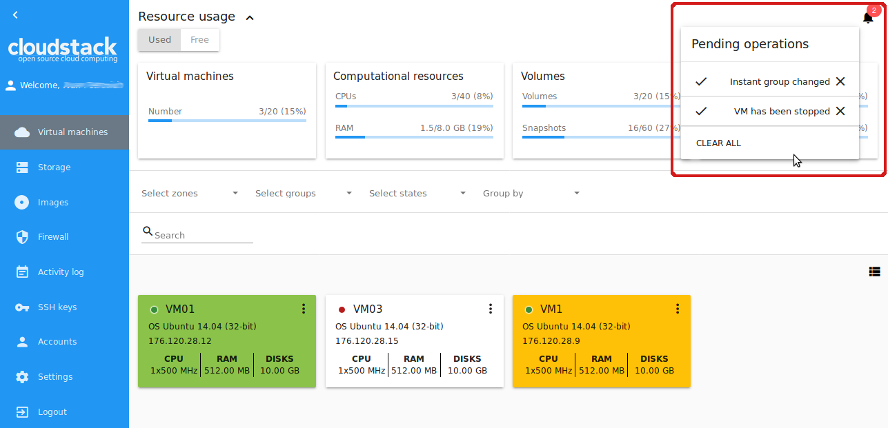

Virtual Machines
-------------------

It is the starting section. Here and in all other views we implemented the “one-step” approach, and we also made it work without moving from view to view. So all actions on VMs can be managed from one screen view.

At this page, you can see the list of your virtual machines available to your user only.


If you are a Domain Administrator you can see the virtual machines of all users in your account. Or select all accounts in the "Select accounts" option above the list to see the virtual machines for the whole domain.


   
You can change the data representation of existing virtual machines from "card" to "list". We have added the switch |view icon|/|box icon| in the upper-right corner of each section. This improvement gives a user an opportunity to work with data in each specific section in a more convenient way.

A list view can be switched to a box view:

.. figure:: _static/VMs_List.png

And vice versa, switch a list view to a box view:

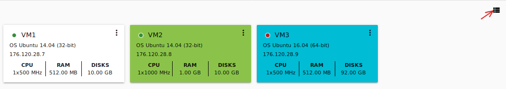

Filtering of Virtual Machines
~~~~~~~~~~~~~~~~~~~~~~~~~~~~~~~~

The filtering and search tool will help you to find a virtual machine in the list. 


   
You can filter the VM list by accounts (available for Domain Administrators) and/or zones and/or groups and/or states. In the drop-down lists tick the filtering parameters and see the immediate result.

Besides, VMs can be grouped by zones and/or groups and/or colors and/or accounts. Grouping makes it easier to identify necessary VMs on the list.

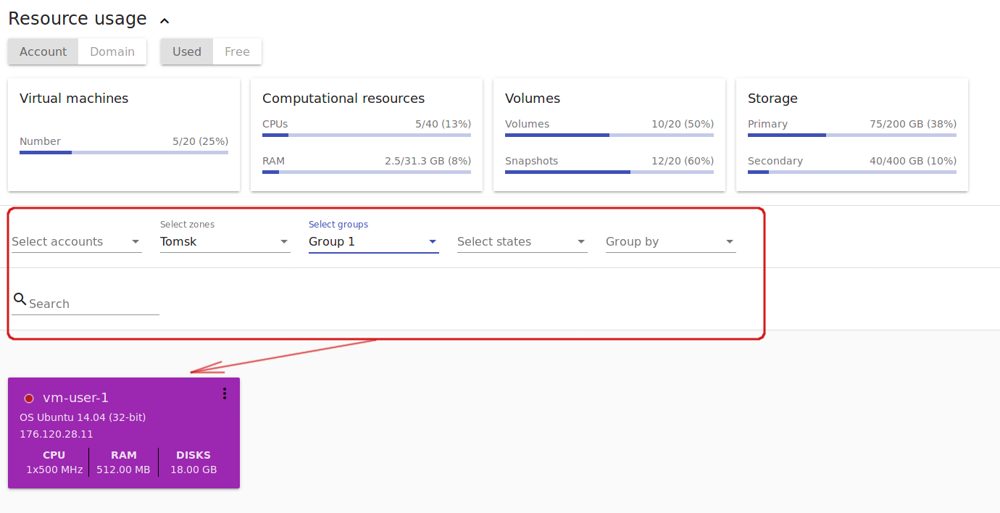
   
Use the search tool to find a virtual machine by its name or a part of the name.

Under the Virtual Machines section, you can open a form to create a new virtual machine.

.. _Create_VM:

Create a Virtual Machine 
~~~~~~~~~~~~~~~~~~~~~~~~~~~~~
Creating a new VM in CloudStack-UI is a one-step action. You can select options from one screen without additional steps.

To create a new VM click the "Create" button at the bottom-right corner. 


   
In the *Create VM* form fill in the following fields:

1. Name * - A name of VM. The system suggests a meaningful autogenerated name in the following form ``vm-<username>-<counter>``. You can enter any name you wish. It should start with a letter, contain figures and Latin letters and be unique within the domain.
2. Zone * - A zone of VM operation. Select a zone from the drop-down list. The list of available zones is managed by Root Administrator.
3. Service offerings * -  A set of options and resources that users can choose from, such as templates for creating virtual machines, disk storage, and more. The list of available service offerings is managed by Root Administrator. Now among other options there is *Custom offerings*. The Custom offerings option allows setting your own settings for:

    - CPU cores;
    - CPU (MHz);
    - Memory (MB).
    
.. figure:: _static/VMs_Create_SO_Custom.png   
   :scale: 70%
   
Click "Confirm" to set the custom service offerings. The custom settings will appear for the service offerings. You can change them by clicking "Change" next to the settings. Click "Cancel" to drop all the settings.
   

   
4. Installation source * - Click "Select" to choose an installation source. Traditionally, there are two options of the virtual machine creation:
    
    - From a Template. 
    - From an ISO file.
    
   The filtering tool allows finding a necessary option by selecting among templates/ISOs by OS families, types and groups, or search the source by a name or a part of its name. Tick the source in the list and click "Select" to implement the selected source.
   
   Click "Cancel" to drop selected options. No source will be selected then.   

.. figure:: _static/VMs_Create_IstallationSource1.png
   :scale: 80%
    
5. Disk offering * - Available if ISO is selected as a source. Select from the drop-down list the option on disk offerings. Change the disk size moving the slider up to the volume size you wish (if the selected disk offering has custom disk size).
6. Group - Select a group from the drop-down list. Or create a new group by typing its name right in the field.
7. Affinity group - Select an affinity group from the drop-down list. Or create a new group entering it right in this field. The name should contain letters, figures, start from the letter and should not contain spaces.
8. Firewall rules - Click "Edit" to specify a security group for the VM. In the appeared window choose between "Create new" or "Select Shared" options. 
  
**Create new security group**

A new security group is created on the base of selected templates. This security group will be created as a *private* group used for this VM only.

When creating a new security group, you can see all the templates are selected by default in the modal window. To form your custom security group, select a template in the "All templates" list at the left and move it to the "Selected templates" list at the right by clicking the arrow icon:
   
.. figure:: _static/VMs_Create_AddSecGr_New.png
   :scale: 80%
   
Click "Select All" to move all templates from left to right at once.

Click "Reset" to drop all selected templates.

In the list below you will see the rules corresponding to the selected templates. All of them are checked as selected. Uncheck those you do not wish to add to your VM as firewall rules.

Click "Save" to apply the selected rules to your virtual machine.

Click "Cancel" to drop the selected options. No rules will be assigned to the virtual machine. You will return to the "Create new virtual machine" window.
   
**Select Shared security group**
   
If you would like to select an existing group of firewall rules, you can click the "Select Shared" option and tick those groups in the list that you want to assign to your VM. The security groups in the *Shared* list are used by other VMs in the domain. That means you won't be able to uncheck some rules in the group that you do not want to include into the list (like at creating VM from a template). You can assign only the whole shared secutity group to your VM. 
   
.. figure:: _static/VMs_Create_AddSecGr_Shared.png
   :scale: 70%

You can edit a shared security group after VM is created. In the *Network* tab of the VM details sidebar the assigned shared security group(s) can be viewed and edited. Please, find more information on security group editing in the :ref:`VM_Network_Tab` section.

Click "Cancel" to drop the selected options. No rules will be assigned to the virtual machine. 
   
8. Keyboard layout * - (is prepopulated). Select a keyboard layout from the drop-down list.
9. SSH keypair - Select an SSH keypair. Find more information on the SSH key here (link to SSH keys section).
10. Start VM - Tick the box to start the VM right after its deployment. If this option is activated, the VM acquires an IP and a password (if required by the template). If it is not, the machine IP is not available till VM is started, no password is assigned to it.

.. note:: Required fields are marked with an asterisk (*).

Once all fields are filled in, click "Create".

For some templates/ISO used at VM creation you are offered to accept the "Template/ISO Terms and Conditions Agreement". An administrator is able to specify an agreement for a template or ISO. An agreement may determine, for example, software licensing terms or restrictions on the liability of the software template vendor. A user must confirm it to continue VM installation from a chosen source. 

If you are creating a virtual machine on the base of a template/ISO that requires an agreement, read the terms in the appeared window and click "Agree" to continue.

.. figure:: _static/VMs_Create_Agreement.png

Click "Cancel" to close the terms and move back to the creation form. Change the installation source.

After clicking "Create", a dialogue window will appear where you can monitor the VM creation process: security group creation, virtual machine deployment, template tags copying, etc. These procedures are fulfilled one by one. A procedure in progress is marked with a spinner in the message. In case of an error occurring at any VM creation step, a user can understand at what step it has happened.

.. figure:: _static/VMs_Create_Logger.png
   :scale: 70%

Once the VM creation process finishes, the success message will inform you of that. 

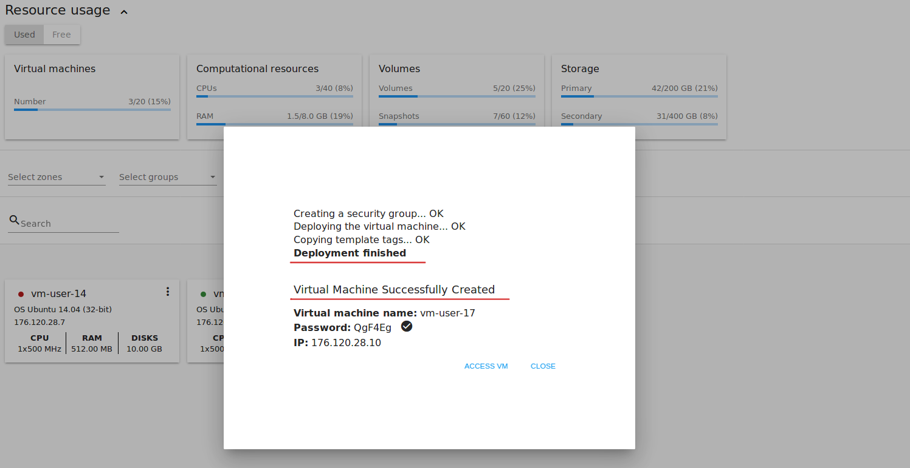
   
The message will show the list of all creation steps and the virtual machine information:

- VM name and IP (if it is available),
- VM Password - This field appears after the VM creation, if a password is enabled for the template used for creating this machine. A password is autogenerated. Click "Save" next to it in the dialogue window if you want to save it for this VM. The password will be saved to the VM tags. You can see the saved password later by clicking "Access VM" in the Actions box for this machine.

.. figure:: _static/VMs_Create_Dialogue_SavePass.png

The system will ask you if you wish to save passwords to VM tags by default for the virtual machines created in the future. Click "Yes" and the "Save VM password by default" option will be activated in the account settings:

.. figure:: _static/Settings_SavePass.png

It means the password will be saved to tags automatically for all created virtual machines.

From this window, you can access the VM opening VNC console.

.. API log 

Close the dialogue window and make sure the newly created VM is in the list of virtual machines.

Click "Cancel" to drop the VM creation.

Possible Issues When Creating a Virtual Machine
""""""""""""""""""""""""""""""""""""""""""""""""""""""""""

You can face the following issues when creating a virtual machine:

- Lack of resources.

An important thing in CloudStack-UI is that the system immediately checks that a user has the amount of resources required to create a virtual machine. It doesn’t allow launching the creation of a VM which will fail for sure because of the resource lack.

If you lack the required amount of resources, the message will appear when clicking "Create Virtual Machine":

 "Insufficient resources
 
 You ran out of Primary storage" 
 
No VM creation form is available.
 
.. If there are insufficient resources you will not be allowed to create a new VM and start it upon creation. You will be able to create a new VM with the unchecked "Start VM" option. No IP is assigned to the VM in this case.

- VM name is not unique.

If the name specified for the virtual machine is not unique within a domain, the dialogue window after VM creation will show an error. The VM will not be created. The creation form will be closed. You will have to open the VM creation form and fill it in again. You will have to specify another name for your VM.

Virtual Machines List
~~~~~~~~~~~~~~~~~~~~~~~~~~~~~

For each VM in the list you can see the following information: 

- VM name and IP;
- State - shows the VM state by color spot: green for Running, red for Stopped, yellow for changing status;
- OS family;
- CPU;
- RAM;
- Disks.

To the right the Actions button |actions icon| expands the list of actions available for the VM.

.. _VM_Actions:

VM Action Box
~~~~~~~~~~~~~~~~~~~~~~~~~~~~~~~~~~
Once a VM instance is created, you can stop, restart, or delete it as needed. These actions are available under the "Actions" button |actions icon| to the right from each virtual machine in the list. 


   
It allows performing the following actions with the VM:

- Start VM - Allows a user to launch a VM, 

- Stop VM - Allows a user to stop a running VM, 

- Reboot VM - Allows a user to restart a VM, 

- Reinstall VM - Allows a user to reinstall a VM, 

- Destroy VM - Allows a user to delete a VM. After deleting the virtual machine will remain in the system. It will look faded in the list and can be recocvered later. 

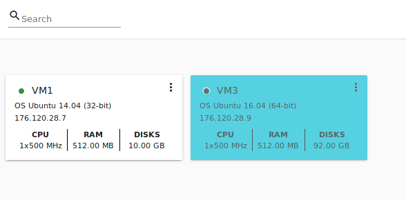

To recover a destroyed VM (which is not expunged) open the Actions list and click "Recover".

.. figure:: _static/VMs_RestoreDeletedVM.png

Click "Expunge" to completely destroy the VM. The VM will not be available for recovering anymore.

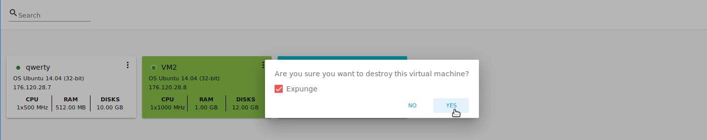
.. If the virtual machine has disks, the system will ask you in a dialogue window if these disks should be deleted. Confirm your intention to delete them clicking "Yes". Click "No" to cancel the disk deleting.
- Reset password - Allows a user to change the password for VM (available for started VMs only an in case the VM requires a password). The VM will be rebooted if you reset the password. 

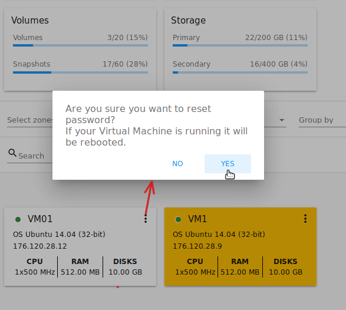

After clicking "Yes" the VM will be rebooted and a new password will be autogenerated for it. You will see the new password in the dialogue window. 

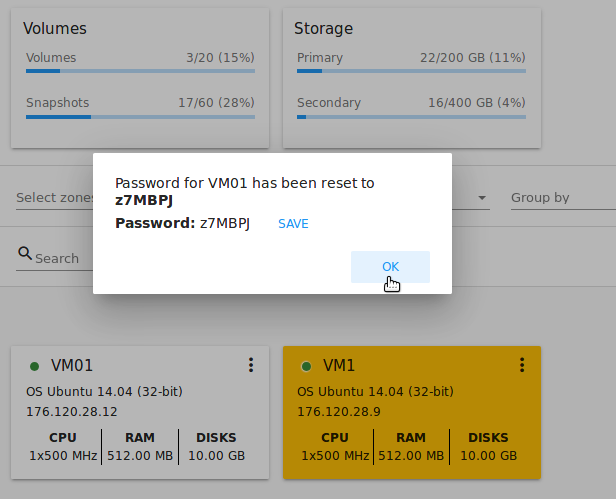

Click "Save" to save the password for this VM. It will activate the "Save VM passwords by default" option in the *Settings* section. In the future the password will be saved automatically right at VM creation. Click "OK" to close the dialogue window. 

- Access VM - Opens an "Access VM" dialog window which allows to view VM name and IP, view and save a password for the VM and access the VM via the VNC console. 


In the :ref:`VM_Access` section you can find more information on accessing a VM.

- Pulse - It is a new feature created in CloudStack-UI to visualize the VM performance statistics. By clicking "Pulse" at the Actions box you will open a modal window with 3 tabs: CPU/RAM, Network, Disk. There you can see the charts of resources statistics for the VM.

.. figure:: _static/Pulse.png

You can adjust the graphs by range, data aggregation period, shift interval and other parameters. 

This plugin is convenient for dynamic monitoring of VM performance. Find more information about it in the `official documentation <https://github.com/bwsw/cloudstack-ui/wiki/107-ReleaseNotes-En#pulse-plugin-experimental-function>`_. Pulse plugin deployment instructions can be found at the `page <https://github.com/bwsw/cloudstack-ui/wiki/Pulse-Plugin-Deployment>`_.

.. _VM_Info:

VM Details Sidebar
~~~~~~~~~~~~~~~~~~~~

For each virtual machine you can get the details.

By clicking a VM line or card you can open a sidebar to the right. 

.. figure:: _static/VMs_Details1.png
   :scale: 70%
   
There you will find the information on the selected virtual machine:

1. VM name.
2. Color-picker |color picker| - Allows marking a virtual machine by a color to distinguish it in the list. 
3. Actions on the VM. See the :ref:`VM_Actions` section below.

You will see four tabs in the sidebar. Let's describe what information on the virtual machine is presented in each tab.

Virtual Machine Tab
""""""""""""""""""""""""""
The Virtual Machine tab contains the general setting of the VM. Some settings can be edited here. At the bottom you can see the Statistics section which shows real-time data for the VM performance.

1. Description - A short description of the VM. Click the block to edit it. Enter a few words about the VM. Click "Save" to save the description. It is a custom description for your machine. It is saved to tags with ``csui.vm.description`` tag.

The description can be edited. Click "Edit" |edit icon| to change the description. 


It also can be edited from the Tags tab. Click "Edit" next to the ``csui.vm.description`` tag and change the description text in the appeared form.


2. Zone - A zone selected for the VM to be available in.

#. Group - A custom group assigned to the VM. Edit this field by clicking the "Edit" button |edit icon|. In the appeared dialogue window choose a group from the drop-down list. Click "Assign" to assign the chosen group to the VM. 

.. figure:: _static/VMs_Details_EditGroup.png
   :scale: 70%
   
Or you can create a new group right from this window selecting the "Create a new group" option. Click "Assign" to assign the created group to the VM. 

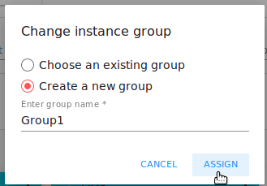
   
To remove the assigned group select the "Remove from the group" option and click "Remove" to eliminate the assigned group from the VM.

.. figure:: _static/VMs_Details_RemoveGroup.png
   :scale: 70%
   
The VM group is a custom group. It is saved to VM tags with ``csui.vm.group`` tag. From the Tags tab it also can be edited or deleted.

4. Service offering - The offerings of the VM. Expand the section to view the whole list of offerings. Edit this field by clicking the "Edit" button. In the appeared window select a new option. Click "Change" to implement the edits. The started virtual machine will be rebooted at editing service offering.

#. Affinity Group - The affinity group assigned to the virtual machine. Edit this field by clicking the "Edit" button. In the dialogue window, choose an existing group or create a new one right in the dialogue window. Click "Assign" to assign the group to the VM. 

.. figure:: _static/VMs_Details_CreateAffGroup.png
   :scale: 70%
   
When assigning an affinity group to the started virtual machine, the system will suggest you stopping the VM. Click "OK" in the dialogue window. Then the VM will be started again.

.. figure:: _static/VMs_Details_EditAffGroup.png
   :scale: 70%
   
The selected group can be removed by clicking "Edit" and choosing "Remove from the group" in the dialogue window.


   
5. Template - Shows the template used to create the virtual machine.

#. SSH key - Shows the SSH key of the virtual machine. Add the SHH key by clicking "+". In the appeared window select the SHH key form the drop-down list and click "Change":


   
At saving the new SSH key for a started VM you will see the warning: "You need to stop the virtual machine to reset SSH key." Click "OK" if you want to stop it right now. Click "Cancel" to drop the edits.

7. Statistics - shows VM statistics on CPU utilized, Network read, Network write, Disk read, Disk write, Disk read (IO), Disk write (IO). Refresh data by clicking the "Refresh" button |refresh icon| in the upper-right corner.
    
Storage Tab
"""""""""""""""""""""""""""
The second tab - Storage - contains the information on the volumes allocated to the virtual machine.

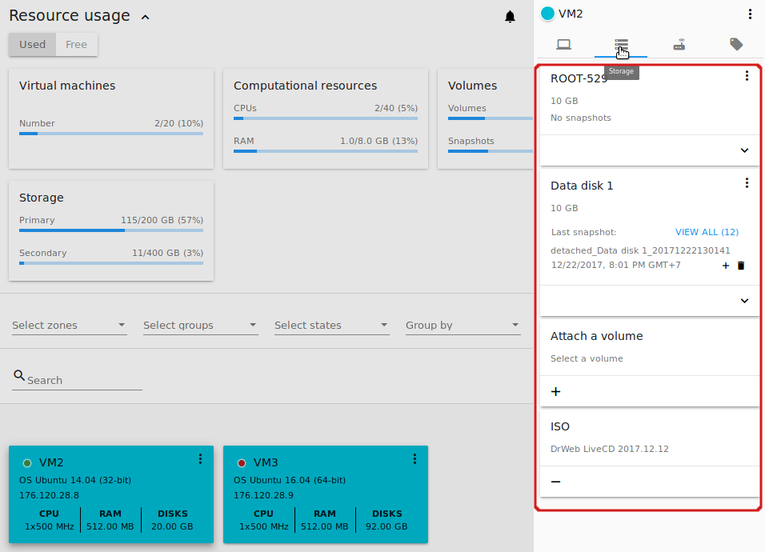
   
In this tab the following information is presented:

1. **Disk information** 

Each VM has a root disk. Besides, data disks can be added to the VM.

The following general information on a root disk is presented (expand the card to see the whole list):

- Name - The disk name.
- Size - The disk size.
- Creation Date and Time. 
- Storage Type (Shared/Local)
- Last Snapshot information. 

2. **Attach a volume** - Allows attaching a data disk to the VM.

Additional volume (a data disk) can be attached to the VM. Click "Select" to select a data disk. Select a disk in the drop-down list and click "Select". 

.. figure:: _static/VMs_AttachVolume_Select.png
   :scale: 70%
   
The chosen data disk will appear for the virtual machine with the "Attach" button. Click "Attach" to attach the selected disk to the virtual machine.


If there are no available spare drives yet, you can create one right from this panel. 

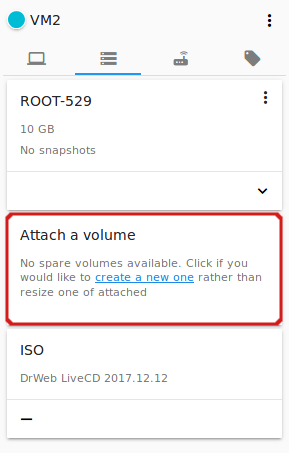

Click "Create new volume" and you will be moved to the Storage section. A "New volume" form will appear where you should specify the following information:

- Name * - Name of the new data disk.
- Zone * - Select a zone for it from the drop-down list.
- Disk offering * - Select a disk offering from the drop-down list. The disk offering list is managed by Root Administrator.
- Size - Set the disk size if it is available. Disk size can be changed if a custom disk offering is selected above.

.. note:: Required fields are marked with an asterisk (*).

Once all fields are filled in, click "Create" to save the new volume. 

Click "Cancel" to drop the new volume creation.

.. figure:: _static/VMs_AttachVolume_Create.png
   :scale: 70%
   
Move back to the virtual machine information sidebar. Under the "Storage" tab in the "Attach a volume" section click "+" to select an additional disk. Select a data disk in the drop-down list and click "Select" to add it to the "Attach a volume" section. To attach the volume press the "Attach" button.

.. _Disk_action_box:

Volume Action Box
''''''''''''''''''''''''''''''

For each volume the Actions list can be opened by clicking the actions icon |actions icon|.

The following actions on disks are available in this list:

For root disks:

 - Take a snapshot;
 - Set up snapshot schedule;
 - Resize the disk.
        
For data disks:
       
 - Take a snapshot;
 - Set up snapshot schedule;
 - Detach;
 - Resize the disk;
 - Delete.
  
**Take a snapshot**
  
You can take a VM snapshot to preserve all the VM’s data volumes as well as (optionally) its CPU/memory state. This is useful for quick restore of a VM.
  
Click "Take a snapshot" in the disk Actions list and in the dialogue window enter the following information:
  
 - Name of the snapshot * - Define a name for the snapshot. It is auto-generated in the form ``<date>-<time>``. But you can specify any name you wish.
 - Description - Add a description of the snapshot to know what it contains. 

.. note:: Required fields are marked with an asterisk (*).

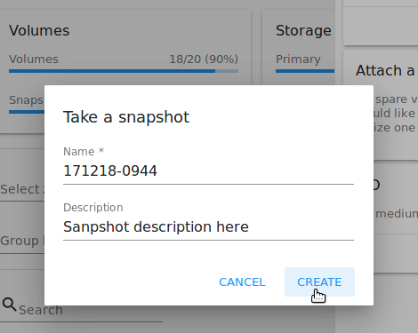

All snapshots are saved in the list of snapshots. In the disk information, you will see the name and time of the *last-taken snapshot*. For each snapshot the list of actions is available. Find more information on snapshot actions in the :ref:`Actions_on_Snapshots` sections below.

**Set up snapshot schedule**

You can schedule regular snapshotting by clicking "Set up snapshot schedule" in the Actions list.

In the appeared window set up the schedule for recurring snapshots:

 - Select the frequency of snapshotting - hourly, daily, weekly, monthly;
 - Select a minute (for hourly scheduling), the time (for daily scheduling), the day of week (for weekly scheduling) or the day of month (for monthly scheduling) when the snapshotting is to be done;
 - Select the timezone according to which the snapshotting is to be done at the specified time;
 - Set the number of snapshots to be made.

Click "+" to save the schedule. You can add more than one schedule but only one per each type (hourly, daily, weekly, monthly).

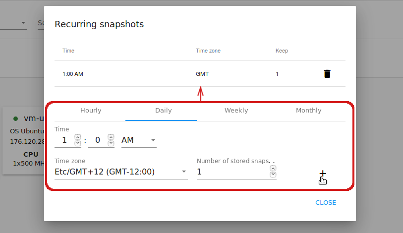

**Resize the disk**

.. note:: This action is available to data disks created on the base of disk offerings with a custom disk size. Disk offerings with custom disk size can be created by Root Administrators only.

Selecting "Resize the disk" option in the Actions list you are able to enlarge the disk size.

In the appeared window set up a new size using the slider and click "Resize" to save the edits.

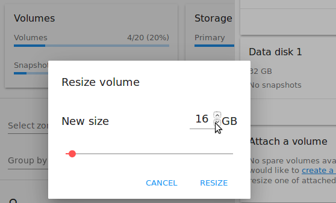

Click "Cancel" to drop the size changes.

**Detach**

This action can be applied to data disks. It allows detaching the data disk from the virtual machine.

Click "Detach" in the Actions list and confirm your action in the dialogue window.


   
The data disk will be detached. It will be in the list of **Spare** drives in the *Storage* section.

**Delete**

This action can be applied to data disks. It allows deleting a data disk from the system right in the *Storage* VM details sidebar.

Click "Delete" in the volume Actions list and confirm your action in the dialogue window. 


   
The data disk will be deleted from the system right at this moment.

.. _Actions_on_Snapshots:

Snapshot Action Box
`````````````````````````````````

For each snapshot the following actions are available:

- **Create a template** - Register a new template right from the disk information block of the sidebar. In the appeared window fill in the form:
     
    - Name * - Enter a name of the new template.
    - Description * - Provide a short description of the template.
    - OS type * - Select an OS type from the drop-down list.
    - Group - Select a group from the drop-down list.
    - Password enabled - Tick this option if your template has the CloudStack password change script installed. That means the VM created on the base of this template will be accessed by a password, and this password can be reset.
    - Dynamically scalable - Tick this option if the template contains XS/VM Ware tools to support dynamic scaling of VM CPU/memory.
 
.. note:: Required fields are marked with an asterisk (*).
 
Click "Show additional fields" to expand the list of optional settings. It allows creating a template that requires HVM. Tick this option in this case.
     
Once all fields are filled in click "Create" to create the new template.
 
.. figure:: _static/VMs_Info_Storage_Snapshot_CreateTemplate.png
 
- **Delete** - allows deleting the last-taken snapshot.
   
Besides, you can see all the snapshots in the list by clicking the "VIEW ALL" button. In the appeared window you will see the list of all snapshots. For each snapshot in the list, the same actions are available: you can create a template, or delete a snapshot.


3. **ISO** - Allows attaching ISO. 

Attach ISO by clicking the "Attach" button in the ISO card. In the dialogue window you will see the list of available ISO files. To easily find the ISO file you need, please, use the search tool above the list. Additionally, you can filter the list by OS family(-ies), by type(-s), by group(-s). Tick the ISO file you wish in the list and click "Attach". The ISO will be attached to the VM.


   
You can detach the ISO file by clicking the "Detach" button.


.. _VM_Network_Tab:

Network Tab
""""""""""""""""""""""""""
Under the Network tab the network configurations of the VM are presented.

.. figure:: _static/VMs_Details_Network.png
   :scale: 70%
   
1. **NIC information** - VM network details are shown here: Network namе, Netmask, Gateway, IP, Broadcast URI, Traffic Type, Type, Default, MAC address.

You can add a secondary IP for the VM from this tab. Click "+" next to the Secondary IP option and confirm your action in the dialogue window. The IP appears for the VM.

.. figure:: _static/VMs_Network_SecIP.png

You can delete the secondary IP by clicking the "Delete" button next to it.

2. **Firewall rules** - Allows viewing the security group assigned to the virtual machine. Click |view| to open the list of assigned security group(-s). 


You can filter the list by types and/or protocols. Or you can adjust the view by grouping the list by types and/or protocols.


In the modal window you can edit a security group. Click "Edit" to move to editing form. There you will be able to add rules, or delete the selected ones from the list.

To add rules, please, fill in the fields in the bar above the list and click "+":

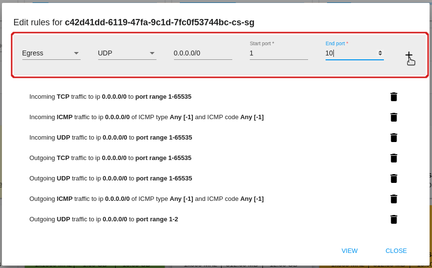
   
To delete rules, please, click Delete icon in the list. The rule will be deleted from the security group.

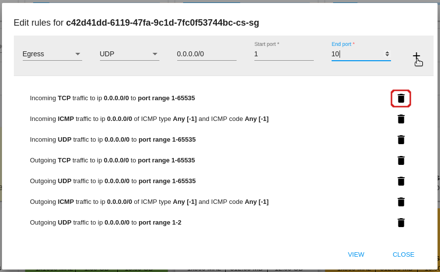
   
Then you can move back to the view mode, or close the window. 

Please, note, when editing shared security groups, a warning message appears:


Click "Yes" if you still want to edit a shared security group. You will be moved to the "Firewall" section where you can edit the security group. After editing, go back to the virtual machine that uses this group. You will see the rules are edited.

See the Firewall_ section for more information on firewall rules in the system.

Tags Tab
""""""""""""""""""""""""

Under this tab you can create and see the VM tags. 

.. figure:: _static/VMs_Details_Tags.png
   :scale: 70%
   
CloudStack-UI uses tags very extensively to provide additional UX capabilities. Tags are key-value pairs. So it makes a kind of a key-value storage for the meta-information - VM description or group, or a user language. The tags used by Cloudstack-UI are system tags. They are prefixed with ``csui``. You can find the full list of system tags supported by CloudStack-UI at the `page <https://github.com/bwsw/cloudstack-ui/wiki/Tags>`_.

System tags are used to provide functionality from the user interface perspective. Changing these tags affects the functionality of the application. The "Show system tags" checkbox allows to view or hide system tags of the virtual machine. Uncheck this box to hide system tags from the list. It helps to avoid accidental unwanted changes. If a user has disabled displaying of these tags, the system will remember it and next time tags will also be hidden. 

To find the tag you are interested in, please, use the search tool above the tag list. You can enter a name or a part of the tag name to distinguish it in the list.

.. figure:: _static/VMs_Tag_Search.png

The tags assigned to the virtual machine are presented in the list. System tags are presented in one card, other tags - in a separate card. For each tag in the list the following actions are available when hovering the mouse over the tag key:

 - Edit - Allows editing the tag. In the appeared form define a new key and/or value (both fields are required). Click "Edit" to save the edits. Click "Cancel" to drop the edits. The tag won't be changed then.
  
 - Delete - Allows deleting the tag. Click "Delete" and confirm your action in the dialogue window.


   
**Create Tags**

You can create a tag right from *Tags* tab. 

Click "Create" |create icon| and fill in the appeared form:

.. note:: Required fields are marked with an asterisk (*).

- Key * - Enter a key here. 
 
- Value * - Enter the value here.


When adding a system tag, click "+" in the card to open the creation form. You will see that the ``csui`` prefix is automatically prepopulated here. 


If you create a non-system tag, it will be saved in a new card. If you have entered a key in the format ``<prefix>.<example>``, a card will be named as "<prefix>". When creating a new tag from this card, click "+" in the card and in the tag creation form the *Key* field will be prepopulated with the <prefix>.


.. _VM_Access:

Access a Virtual Machine
~~~~~~~~~~~~~~~~~~~~~~~~~~~~~~~~~~~
Depending on the installation source (ISO or a Template) the system allows getting an access to the VM interaction interface. Currently, the following options are supported:

- Open VNC console - This button under the "Access VM" action allows opening a console.

.. figure:: _static/AccessVM_OpenConsole.png

- WebShell if VM has a ``csui.vm.auth-mode`` tag with SSH value. To find more information on accessing VM via WebShell, please, refer to the `page <https://github.com/bwsw/cloudstack-ui/wiki/107-ReleaseNotes-En#webshell-plugin-experimental-function>`_. See the detailed instructions on the deployment of WebShell Plugin `here <https://github.com/bwsw/cloudstack-ui/wiki/WebShell-Plugin-Deployment>`_.


- Access via HTTP if VM has a ``csui.vm.auth-mode`` tag with HTTP value. To configure access to VM via HTTP, please, refer to page (link to tags list).


.. _Storage:

Storage
----------

In this section, you can create and manage drives for virtual machines.

Drive list
~~~~~~~~~~~~

Here you can find a list of your disks existing for your user. 


   
Domain Administrator can see disks of all accounts in the domain.


   
Disks can be viewed as a list or as a grid of cards. Switch the view by clicking a view icon |view icon|/|box icon| in the upper-right corner.

.. note:: If you have just started working with CloudStack and you do not have virtual machines yet, you have no disks in the list. Once you create a VM, a root disk is created for it automatically. Creation of an additional disk takes resources and requires expenses. Please, make sure you definitely need an additional data disk.

Filtering of Drives
""""""""""""""""""""""""""
Root disks are visually distinguished from data disks in the list. There is an option to display only spare disks which allows saving user's time in certain cases. 

As in all lists, there is the filtering tool for selecting drives by zones and/or types. You also can apply the search tool selecting a drive by its name or a part of the name.


For better distinguising of drives in the list you can group them by zones and/or types, like in the figure below:


Domain Administrators can see the list of drives of all accounts in the domain. Filtering by accounts is available to Administrators.

.. figure:: _static/Storage_FilterAndSearch_Admin.png
   :scale: 70%
   
For each drive in the list the following information is presented:

- Drive name,
- Size,
- State - Ready or Allocated.

The Actions button |actions icon| is available to the right. It expands the list of actions for a disk. See the information on actions in the :ref:`Actions_on_Disks` section below.

Create New Volume
~~~~~~~~~~~~~~~~~~~

In the *Storage* section you can create new volumes.

By clicking the "Create" button |create icon| in the bottom-right corner you opens a creation form. 

If you have just started working with CloudStack and you do not have virtual machines yet, you have no disks in the list. Once you create a VM, a root disk is created for it automatically. Creation of an additional disk takes resources and requires expenses. Please, make sure you definitely need an additional disk. When clicking "Create", a dialogue window will ask you if you are sure you want to create a drive. Confirm your creation action by clicking "Yes":

.. figure:: _static/AdditionalDiskNotification.png
   :scale: 70%
   
To create a new volume fill in the fields:

- Name * - Enter a name of the volume. 
- Zone * - Select a zone from the drop-down list.
- Disk offering * - Select from the drop-down list. If the selected disk offering has a custom disk size (it is set by Administrator), you can change the disk size moving the slider up to the volume size you wish.

.. note:: Required fields are marked with an asterisk (*).


   
Click "Create" to save the settings and create the new volume. You will see the drive appears in the list.

.. figure:: _static/Storage_Created1.png

Click "Cancel" to drop all the settings. The drive will not be created then.

.. _Storage_Info:

Volume Details Sidebar
~~~~~~~~~~~~~~~~~~~~~~~~~~~~~

By clicking a disk in the list you can access the information on the volume. 


At the right sidebar you can find two tabs:

1. Volume tab - Provides the information on the disk volume:

- General information - Presents disk size, date and time of creation, the storage type (shared, local).
- Description - Allows entering a short description to the drive. Click at the Description card and enter a short description in the text block.
    


Click "Save" to save the description. 

You can edit the description by clicking the "Edit" button |edit icon| in the tab.


   
- Disk offering - Presents the information on the disk offering chosen at disk creation.
    
2. Snapshots tab - Allows creating disk snapshots. Snapshots can be taken for disks with the "Ready" status only.

   Click the "Add" button |create icon| and enter in the dialogue window:

    - Name - Define a name for the snapshot. It is auto-generated in the format ``<date>-<time>``. But you can specify any name you wish.
    - Description - Add a description of the snapshot to know what it contains.  
 
   Then click "Create" and see the snapshot has appeared in the list. 


      
Every snapshot is saved in a separate card. There you will see the name and time of the snapshot. 

For each snapshot the list of actions is available. Find more information on snapshot actions in the :ref:`Actions_on_Snapshot_Volume` section below.

.. _Actions_on_Snapshot_Volume:

Snapshots Action Box 
""""""""""""""""""""""""""""

Like in the Virtual Machine information tab the same actions are available for a snapshot:
     
- **Create a template** - Allows creating a template from the snapshot. This template can be used for VM creation.
  
   Fill in the form to register a new template:
     
    - Name * - Enter a name of the new template.
    - Description * - Provide a short description of the template.
    - OS type * - Select an OS type from the drop-down list.
    - Group - Select a group from the drop-won list.
    - Password enabled - Tick this option if the template has the password change script installed. That means the VM created on the base of this template will be accessed by a password, and this password can be reset.
    - Dynamically scalable - Tick this option if the template contains XS/VM Ware tools to support the dynamic scaling of VM CPU/memory.
 
.. note:: Required fields are marked with an asterisk (*).
 
Click "Show additional fields" to expand the list of optional settings. It allows creating a template that requires HVM.
     
Once all fields are filled in click "Create" to create the new template.


   
- **Delete** - Allows deleting the snapshot.

.. Find the detailed description in the :ref:`Actions_on_Snapshots` section.

.. _Actions_on_Disks:

Volume Action Box 
~~~~~~~~~~~~~~~~~~~

Action on drives are available under the Actions button |actions icon|.

The following actions are available on disk:

For root disks:

 - Take a snapshot;
 - Set up snapshot schedule;
 - Resize the disk.
        
For data disks:
       
 - Take a snapshot;
 - Set up snapshot schedule;
 - Detach;
 - Resize the disk;
 - Delete.

**Take a snapshot**
  
You can take a snapshot of the disk to preserve the data volumes. Snapshots can be taken for disks with the "Ready" status only.
  
Click "Take a snapshot" in the disk Actions list and in the dialogue window enter the following information:
  
 - Name of the snapshot * - Define a name for the snapshot. It is autogenerated in the form ``<date>-<time>``. But you can specify any name you wish.
 - Description - Add a description of the snapshot to know what it contains. 
 
.. note:: Required fields are marked with an asterisk (*).

All snapshots are saved in the list of snapshots. For a snapshot you can:
  
- Create a template;  
- Delete the snapshot.

See the :ref:`Actions_on_Snapshot_Volume` section for more information.
   
**Set up snapshot schedule**

This action is available for disks with the "Ready" status only.

You can schedule the regular snapshotting by clicking "Set up snapshot schedule" in the Actions list.

In the appeared window set up the schedule for recurring snapshots:

 - Select the frequency of snapshotting - hourly, daily, weekly, monthly;
 - Select a minute (for hourly scheduling), the time (for daily scheduling), the day of week (for weekly scheduling) or the day of month (for monthly scheduling) when the snapshotting is to be done;
 - Select the timezone according to which the snapshotting is to be done at the specified time;
 - Set the number of snapshots to be made.

Click "+" to save the schedule. You can add more than one schedule but only one per each type (hourly, daily, weekly, monthly).

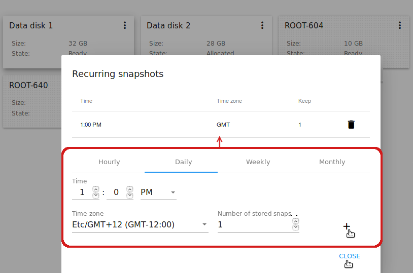
   
**Resize the disk**

.. note:: This action is available to data disks created on the base of disk offerings with a custom disk size. Disk offerings with custom disk size can be created by Root Administrators only.

You can change the disk size by selecting "Resize the disk" option in the Actions list. You are able to enlarge disk size only.

In the appeared window set up a new size and click "Resize" to save the edits.


Click "Cancel" to drop the size changes.

**Attach/Detach**

This action can be applied to data disks. It allows attaching/detaching the data disk to/from the virtual machine.

Click "Attach" in the Actions list and in the dialogue window select a virtual machine to attach the disk to. Click "Attach" to perform the attachment.

.. figure:: _static/Storage_AttachDisk1.png

An attached disk can be detached. Click "Detach" in the Actions list and confirm your action in the dialogue window. The data disk will be detached from the virtual machine.

**Delete**

This action can be applied to data disks. It allows deleting the data disk from the system.

Click "Delete" in the Actions list and confirm your action in the dialogue window. 

The data disk will be deleted from the system.

.. _Images:

Images
---------------
Under the "Images" section you can manage Templates and ISO files that are used as installation sources for VMs.

You can switch from Templates to ISO by selecting a corresponding option above:

.. figure:: _static/Images_TempISO.png

Manage Templates
~~~~~~~~~~~~~~~~~~~~~~~~

A template is a reusable configuration for virtual machines. When users launch VMs, they can choose from a list of templates. Administrators and users can create templates and add them to CloudStack.

There is a variety of ways to add more templates to the system. In the :ref:`VM_Info` section we have described one way of template creation from a VM volume snapshot under the "Storage" tab of the VM information sidebar. From under the :ref:`Storage_Info` sidebar of the "Storage" section you also can create a template on the base of the volume snapshot.

Another way is to create a new template filling in the form under the "Images" section. Read about it the next section.

Existing templates are presented in the list under the "Images" section. A user can see the templates belonging to his/her user only. Domain Administrator can see templates of all users in the domain but cannot perform actions on other users' templates.

You can switch the list view of templates to the box view using the view button |view box icon| in the upper-right corner. 

For each template in the list you can see its name, OS family, description.  Actions button |actions icon| expands the list of actions for it. Actions are available to those templates that belong to your user only (corresponding to "My" type). Administrators can see templates of all users in the domain, but cannot manage them.

Filtering of Templates
""""""""""""""""""""""""""""
The list of templates can be filtered using the filtering tool. The filtering parameters are as follows:

- Accounts (for Domain Administrators);
- OS families;
- Types;
- Zones;
- Groups.


Besides, adjust the list view using the grouping tool. Templates can be grouped by zones or/and groups.

.. figure:: _static/Images_Temp_Grouping.png

Use the search tool to easily find a template by its name or by a part of the name.

Create Template
""""""""""""""""""""""""""

We have mentioned template creation from a snapshot in the *Storage* tab of the VM details sidebar ( see :ref:`Actions_on_Snapshots`) and from the *Snapshot* tab of the Volume details sidebar (see :ref:`Actions_on_Snapshot_Volume`).

You also can create a new template in the *Images* section by clicking "Create" |create icon| in the bottom-right corner. 

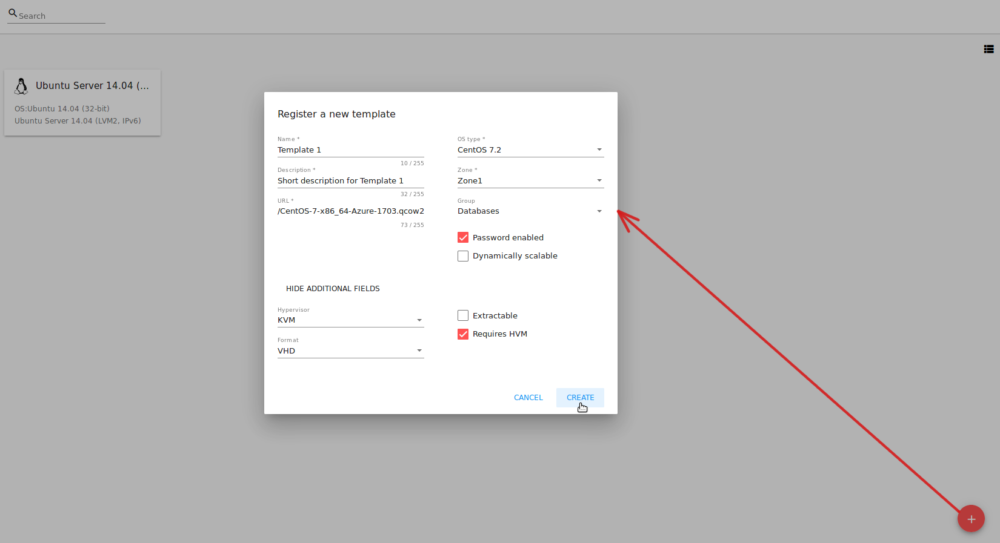

It will open a creation form where you should specify the following information:

1. Name * - Enter a name for the new template.

#. Description * - Provide a short description to have a general idea about the template.

#. URL * - Specify a valid URL to download the template file from. 

#. OS type * - This helps CloudStack and the hypervisor perform certain operations and make assumptions that improve the VM performance. Select from the drop-down list the necessary option, or select "Other" if there is no needed option in the list.

#. Zone * - Choose the zone where you want the template to be available.

#. Group - Select a group from the drop-down list.

#. Password enabled checkbox - Tick this option if your template has the CloudStack password change script installed. That means the VM created on the base of this template will be accessed by a password, and this password can be reset.

#. Dynamically scalable checkbox - Tick this option if the template contains XS/VM Ware tools to support dynamic scaling of VM CPU/memory.

.. note:: Required fields are marked with an asterisk (*).

9. "Show additional fields" allows expanding the form and set more settings:

   - Hypervisor - Select a hypervisor from the drop-down list.

   - Format - The format of the template upload file, e.g. VHD or RAW or VMDK.

   - Extractable - Tick this option if the template is available for extraction. If this option is selected, end-users can download a full image of a template.

   - Requires HVM - Tick this option for creating a template that requires HVM.

Once all fields are filled in, click "Create" to create the template with these settings. The created template will appear in the list.

Click "Cancel" to close the form without template creation. All fields will be cleared.

Template Details Sidebar
"""""""""""""""""""""""""""

The information on each template is presented in the right-side bar. It is opened by clicking the template card or line in the list. The information is presented here in 3 tabs. Above the tabs you can see the template general information: 

- Name - Template name and symbol, 
- Actions button - Actions list (Delete). 

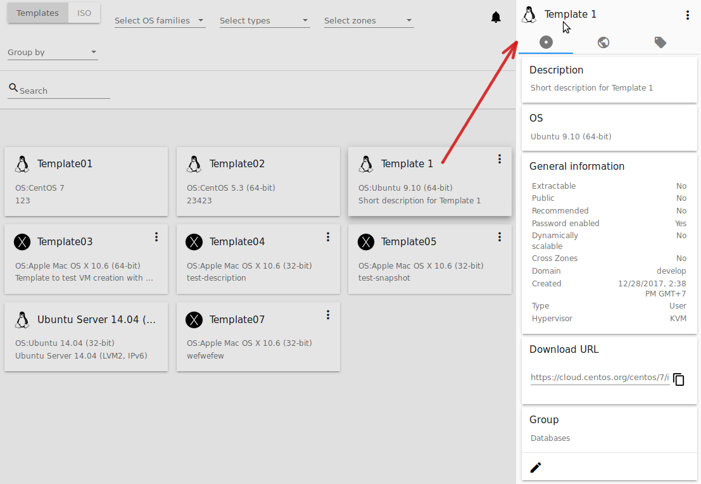

1. Template tab: 

   - Description - Template description provided at its creation. 
   - OS - The OS selected for this template. 
   - General Information - The settings saved for this template: size, creation date, type, hypervisor, other settings. 
   - URL - The URL provided for this template. Next to it you can see the "Copy" icon |copy icon|. Click it to copy the URL to clipboard and then paste it in the address line.
   - Group - Template group. Edit the group by clicking the "Edit" button "|edit icon|. Choose an existing group in the appeared window and click "Assign" to assign the selected group to the template.

2. Zones tab - Shows the zone where the template is available. 

.. figure:: _static/Images_Temp_Details_Zone.png

3. Tags tab - Presents the list of tags assigned to the template.


Tags can be system or non-system. System tags are used to provide the functionality from the user interface perspective. Changing these tags affects functionality of the application. The "Show system tags" checkbox allows to view or hide system tags of the template. Hiding system tags helps to avoid accidental unwanted changes. If a user has disabled displaying of these tags, the system will remember it and next time tags will also be hidden. Uncheck the "Show system tags" checkbox to hide system tags from the list.  

.. note:: Please, see the `list of tags <https://github.com/bwsw/cloudstack-ui/wiki/Tags>`_ to find system tags that can be used for a template.

To find the tag you are interested in, please, use the search tool above the tag list. You can enter a name or a part of the tag name to distinguish it in the list.

To add a tag for the template click "Create" |create icon|. In the appeared form enter:

- Key * 
- Value * 

.. note:: Required fields are marked with an asterisk (*).

Click "Create" to assign a new tag to the template. 


When adding a system tag, click "+" in the card to open the creation form. You will see that the ``csui`` prefix is automatically prepopulated here. 

.. figure:: _static/Images_SysTagCreate.png

If you create a non-system tag, it will be saved in a new card. If you have entered a key in the format ``<prefix>.<example>``, a card will be named as "<prefix>". When creating a new tag from this card, click "+" in the card and in the tag creation form the *Key* field will be prepopulated with the <prefix>.

.. figure:: _static/Images_OtherTagCreate.png

Tags can be edited or/and deleted. Mouse over the tag in the list and see "Edit" and "Delete" buttons.

.. figure:: _static/Images_TagActions.png

Click "Edit" to change the tag's key or value in the appeared form. Save the edits.

Click "Delete" to delete the tag from the list for this template. Confirm your action in the dialogue window. Make sure the tag disappeared from the list of assigned tags.

Template Action Box
"""""""""""""""""""""""""""""
By clicking "Actions" |actions icon| you can expand the list of actions for those templates that belong to your user only (corresponding to "My" type). Deleting action is available here.

.. figure:: _static/Images_Temp_ActionBox.png

Click "Delete" to delete the template and then confirm your action in the dialogue window. The template will be deleted. Click "Cancel" to close the window without deleting a template.

Manage ISO
~~~~~~~~~~~~~~~~~~~~~

ISO files are another installation source for virtual machines. 

Existing ISO files are presented in the list under the "Images" section. Switch the list from *Templates* to *ISO* in the filtering panel above.

.. figure:: _static/Images_ISOList.png

A user can see the ISO files belonging to his/her user only. Domain Administrators can see ISO files of all users in the domain but cannot perform actions on other users' ISO files.

You can switch the list view of ISO files to the box view using the view button |view box icon| in the upper-right corner. 

For each ISO file in the list you can see its name, OS family, description. Actions button |actions icon| expands the list of actions for it. Actions are available to those ISO files that belong to your user only (corresponding to "My" type). Administrators can see ISO files of all users in the domain but cannot manage them.

Filtering of ISOs
""""""""""""""""""""""""""""
The list of ISOs can be filtered using the filtering tool. The filtering parameters are as follows:

- OS families;
- Types;
- Zones;
- Groups.

.. figure:: _static/Images_ISO_Filter.png

Administrators can filter the list by accounts:

.. figure:: _static/Images_ISO_Filter_Admin.png

Besides, adjust the list view using the grouping tool. ISOs can be grouped by zones or/and groups.

.. figure:: _static/Images_ISO_Grouping.png

Use the search tool to easily find a template by its name or by a part of the name.


Create an ISO file
"""""""""""""""""""

You can create a new ISO file in the *Images* section by clicking "Create" |create icon| in the bottom-right corner. 

.. figure:: _static/Images_CreateISO.png

It will open a creation form where you should specify the following information:

1. Name * - Enter a name for the new ISO file.

#. Description * - Provide a short description to have a general idea about the ISO file.

#. URL * - Specify a valid URL to download the ISO file from. 

#. OS type * - This helps CloudStack and the hypervisor perform certain operations and make assumptions that improve the VM performance. Select from the drop-down list the necessary option, or select "Other" if there is no needed option in the list.

#. Zone * - Choose the zone where you want the ISO file to be available.

#. Group - Select a group from the drop-down list.

.. note:: Required fields are marked with an asterisk (*).

7. "Show additional fields" allows expanding the form and set more settings:

   - Extractable - Tick this option if the ISO file is available for extraction. If this option is selected, end-users can download a full image of an ISO file.

   - Bootable - Tick this option to indicate whether the machine can be booted using this ISO.

Once all fields are filled in, click "Create" to create the ISO file with these settings. The created ISO file will appear in the list.

Click "Cancel" to close the form without ISO creation. All fields will be cleared.

The created ISO will appear in the list.

ISO Details Sidebar
"""""""""""""""""""""""""

The information on each ISO file is presented in the right-side bar. It is opened by clicking the ISO card or line in the list. 


The information is presented here in 3 tabs. Above the tabs you can see the ISO general information: 

- Name - ISO name and symbol. 
- Actions button - Actions list (Delete). Actions are not available for those ISO files that your user is not permitted to manage within the account.

1. ISO tab: 

    - Description - ISO description provided at its creation. 
    - OS family - The OS selected for this ISO. 
    - General Information - The settings saved for this ISO: size, creation date, other settings. 
    - URL - The URL provided for this ISO. Next to it you can see the "Copy" icon |copy icon|. Click it to copy the URL to clipboard and then paste it in the address line.
    - Group - ISO group. Edit the group by clicking the "Edit" button "|edit icon|. Choose an existing group in the appeared window and click "Assign" to assign the selected group to the ISO.

2. Zones tab - Shows the zone where the ISO is available.


3. Tags tab - Presents the list of tags assigned to the ISO.


Tags can be system or non-system. System tags are used to provide functionality from the user interface perspective. Changing these tags affects the functionality of the application. The "Show system tags" checkbox allows to view or hide system tags of the template. Hiding system tags helps to avoid accidental unwanted changes. If a user has disabled displaying of these tags, the system will remember it and next time tags will also be hidden. Uncheck the "Show system tags" checkbox to hide system tags from the list.  

.. note:: Please, see the `list of tags <https://github.com/bwsw/cloudstack-ui/wiki/Tags>`_ to see the full list of system tags that can be used for an ISO.

To find the tag you are interested in, please, use the search tool above the tag list. You can enter a name or a part of the tag name to distinguish it in the list.

To add a tag for the ISO click "Create" |create icon|. In the appeared form enter:

- Key * 
- Value * 

.. note:: Required fields are marked with an asterisk (*).

Click "Create" to assign a new tag to the ISO. 


When adding a system tag, click "+" in the card to open the creation form. You will see that the ``csui.`` prefix is automatically prepopulated here. 

.. figure:: _static/Images_SysTagCreate.png

If you create a non-system tag, it will be saved in a new card. If you have entered a key in the format ``<prefix>.<example>``, a card will be named as "<prefix>". When creating a new tag from this card, click "+" in the card and in the tag creation form the *Key* field will be prepopulated with the <prefix>.

.. figure:: _static/Images_OtherTagCreate.png

Tags can be edited or/and deleted. Mouse over the tag in the list and see "Edit" and "Delete" buttons.

.. figure:: _static/Images_TagActions.png

Click "Edit" to change the tag's key or value in the appeared form. Save the edits.

Click "Delete" to delete the tag from the list for this ISO. Confirm your action in the dialogue window. Make sure the tag disappeared from the list of assigned tags.

ISO Actions Box
""""""""""""""""""""""""
By clicking "Actions" |actions icon| you can expand the list of actions for those ISO files that belong to your user only (corresponding to "My" type). Deleting action is available here.

.. figure:: _static/Images_ISO_ActionBox.png

Click "Delete" to delete the ISO and then confirm your action in the dialogue window. The ISO will be deleted. Click "Cancel" to close the window without deleting an ISO.

Firewall
--------------

The *Firewall* section contains templates to create a security group for a virtual machine, and shared security groups used for virtual machines of other users.

.. figure:: _static/Firewall_List.png

**Firewall templates** are presets of rules that can be system or developed by a user. Administrators can specify default presets during the interface deployment in the json configuration file (find more in `Configurations Guide <https://github.com/bwsw/cloudstack-ui/blob/master/ConfigGuide.md>`_). Now there are “TCP Permit All”, “UDP Permit All”, “ICMP Permit All” system firewall templates in the system. They just pass all the traffic. We offer them because we would like a user to make his virtual machines accessible without diving into technical details. 

Upon VM creation on the base of templates the system creates a new security group for a VM. This group is initially filled with all the rules from specified presets. Next, when the user changes the rules for a certain virtual machine, it does not affect other machines. These changed rules make a private security group used for that virtual machine only. 

The second way is to use a **shared security group** for your virtual machine. Shared groups are used by other VMs. Changes of rules in them may affect other VMs. 

Users can manage security group rules in two modes: a "view" mode with filtering by types and protocols and an “edit” mode. Security groups editing is available when switching from "view" mode to "editing" mode. If the group is shared, the user is warned that changes will affect other VMs using this group. This behavior allows avoiding undesirable changes for other VMs.

Templates and shared security groups are placed in different tabs of the *Firewall* section. You can switch from templates to shared security groups using the tool above the list. 

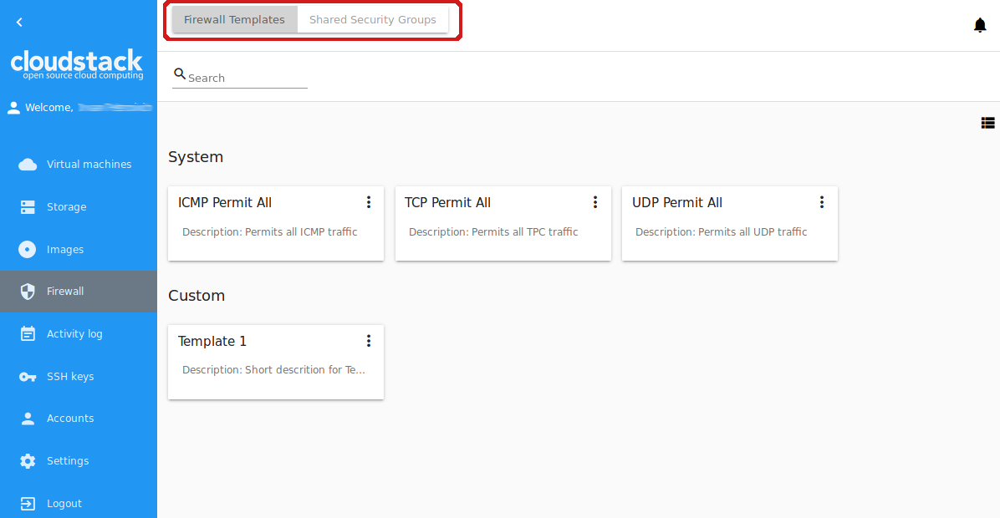

A user can see security groups of his/her user only. Administrator can observe security groups of all accounts in the domain.

The security groups are presented in a list format. You can change the view to cards clicking the switch view icon |view icon|/|box icon| in the upper-right corner.

To quickly find the security group you need, please, use the search tool above the list. Enter a name or a part of the name of the template/sequrity group and see the immediate result.

Administrators can filter the list of templates/shared groups by accounts.

.. figure:: _static/Firewall_Filter_Admin.png


Activity Log
-----------------

SSH Keys
------------

Accounts
--------------

Settings
-------------

Logout
----------


.. |bell icon| image:: _static/bell_icon.png
.. |refresh icon| image:: _static/refresh_icon.png
.. |view icon| image:: _static/view_list_icon.png
.. |view box icon| image:: _static/box_icon.png
.. |view| image:: _static/view_icon.png
.. |actions icon| image:: _static/actions_icon.png
.. |edit icon| image:: _static/edit_icon.png
.. |box icon| image:: _static/box_icon.png


.. |color picker| image:: _static/color-picker_icon.png
.. |adv icon| image:: _static/adv_icon.png

