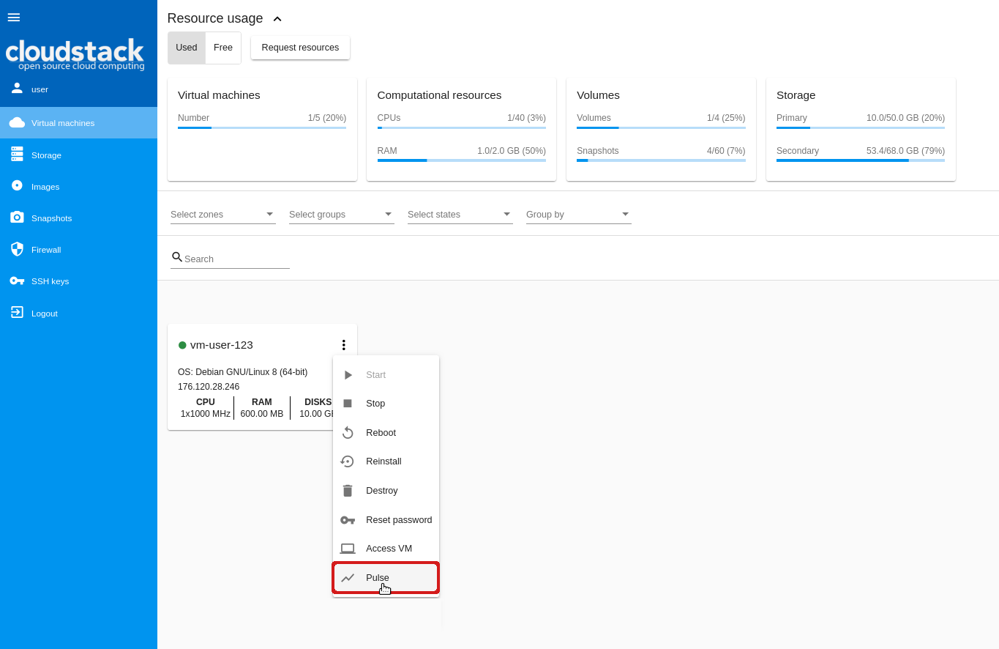

.. _Pulse_Plugin:

Pulse Plugin
======================

.. Contents::

Overview
--------------------

The Pulse plugin is designed for visualization of virtual machines performance statistics. Currently, this CloudStack-UI extension is only compatible with ACS clusters that use the KVM hypervisor. With help of sensors that collect virtual machines' performance statistics via the Libvirt API and store them to an InfluxDB datastore and RESTful statistics server, CloudStack-UI is able to display CPU, RAM, disk IO and network traffic utilization in the form of convenient visual charts.

Pulse allows users of Apache CloudStack to monitor current and previous operational states of virtual machines. The plugin supports various view scales like minutes, hours, days and enables data overlays to monitor peak and average values.

We consider this plugin very important for the CloudStack ecosystem as currently there is no built-in functionality to track VM operational states, although it is vital for system administrators to successfully operate virtual servers.

Plugin deployment and configuration Instructions can be found below.

.. _PulseDeployment:

Deployment Instructions
------------------------------

.. note:: The Pulse plugin works only for KVM hypervisor right now.

Please, make sure that you have `cs-pulse-server <https://github.com/bwsw/cs-pulse-server>`_ and `cs-pulse-sensor <https://github.com/bwsw/cs-pulse-sensor>`_ to be able to work with the Pulse plugin.

To enable the Pulse plugin you need:

1. Configure plugin in ``config.json``.
#. Run docker container with a correctly specified ``cs-pulse-server`` endpoint.

Pulse Configuration
-----------------------

Please, enable ``pulse`` in the extensions section of the ``config.json``::

 "extensions": {
   ...,
   "pulse": true
 }

Running Cloudstack-UI Docker Container
--------------------------------------------
::

 docker run -d -p 80:80 --name cloudstack-ui \
            ...
            -e PULSE_PLUGIN_ENDPOINT=http://url/to/cs-pulse-server \
            ...
            -v /path/to/config.json:/static/config/config.json \
            bwsw/cloudstack-ui

View VM Performance Statistics via UI
---------------------------------------

After the plugin is activated in the configuration file, you will see the "Pulse" option in the Action box. 

.. note:: The option is only available for machines in the Running status.

By selecting this option you open a modal window that shows the virtual machine performance statistics in graphs. In separate tabs, you can view statistics for the following metrics:

* CPU/Memory
* Network 
* Disk 

Reports are presented in a graphic form. The building of charts is based on the defined settings. By default, the first option in the list is selected for each setting. You can adjust settings to get statistics for the period you wish. Read more about the settings below.

.. figure:: _static/Pulse.png

General Settings
~~~~~~~~~~~~~~~~~~~~~~~~~

To get statistics for a virtual machine set up general settings:

* **Range** - Select the time interval to show the statistics for. The following options are currently available: 15m, 30m, 1h, 2h, 4h, 12h, 1d, 1w, 30d. 
* **Aggregation** - Select the interval(s) for data aggregation. Available options here depend on the selected range. This can be defined in the `configuration file <https://github.com/bwsw/cs-pulse-server/blob/master/config.md>`_. Aggregation value is always less than the range value. When several options are selected, graphs are marked with different colors and displayed as overlaid.
* **Shift** - Define a numeric value and select a measurement unit for the graph shift. You can shift the graphs manually by clicking at arrows </> to the right or left from the graph.

.. note:: All settings are required.

Options for all the settings should be defined in the `configuration file <https://github.com/bwsw/cs-pulse-server/blob/master/config.md>`_ on backend.

At the screenshot below, you can see statistics for the last day with 30-minute and 1-hour aggregation with the 2-hour shift.

The system saves defined settings. They are used in all other tabs, that means if you set CPU/memory report settings and then move to other tabs, you will see graphs for NIC and disks built with the same settings.

If you change settings, the graphs change immediately. You can refresh the graph reports as often as you wish by clicking at |refresh icon|.

When hovering on the graph, you can see details corresponding to this point: a date, a parameter and its value.

Statistic Metrics
~~~~~~~~~~~~~~~~~~~~~~~~~

**CPU/Memory**

This is the first tab that opens by default. In the CPU/Memory tab, you can view the statistics of CPU/Memory usage by the machine.

CPU and Memory usage statistics is presented in different graphs. To build graphs it is enough to define general settings.

.. figure:: _static/Pulse.png

**Network**

In this tab, you can view the statistics for network traffic usage. To build the graphs you should define general settings and select a NIC for which you want to get the report.

Network statistics displays in four graphs by the following metrics:

* Network read/Network write
* Network read packets/Network write packets
* Network write drops/Network read drops 
* Network write errors/Network read errors

**Disk** 

In this tab, you can view the statistics for disk space usage. To build the graphs you should define general settings and select a disk for which you want to get the report.

Disk statistics displays in three graphs by the following metrics:

* Disk read/Disk write
* Disk read/Disk write (IOPS)
* Disk IO errors 

.. |bell icon| image:: _static/bell_icon.png
.. |refresh icon| image:: _static/refresh_icon.png
.. |view icon| image:: _static/view_list_icon.png
.. |view box icon| image:: _static/box_icon.png
.. |view| image:: _static/view_icon.png
.. |actions icon| image:: _static/actions_icon.png
.. |edit icon| image:: _static/edit_icon.png
.. |box icon| image:: _static/box_icon.png
.. |create icon| image:: _static/create_icon.png
.. |copy icon| image:: _static/copy_icon.png
.. |color picker| image:: _static/color-picker_icon.png
.. |adv icon| image:: _static/adv_icon.png

 

