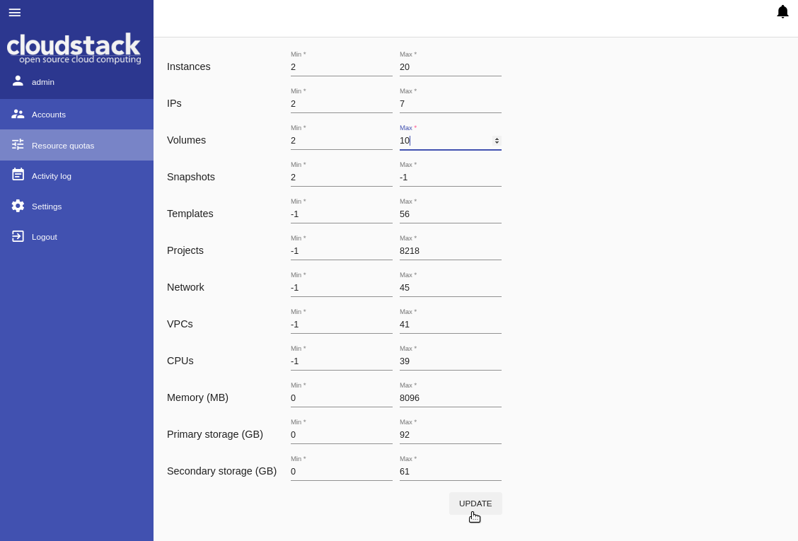
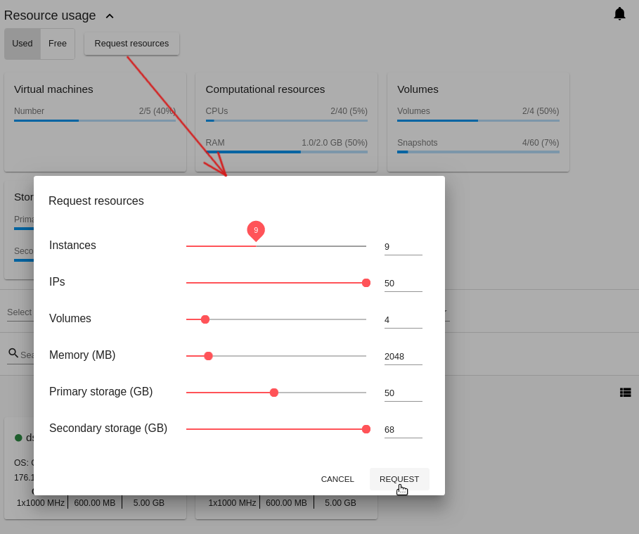

.. _Resources:

Resource Limits Management Plugin
========================================

.. contents::

Overview
---------------

We introduced a new plugin - *Resource Limits Management* - that allows Domain Administrators to manage resource quotas, and users to change resource limits. The extension helps to avoid such situations when a user has extra resources that are not used but accounted in billing. Or when a user has utilized all the available resources and now needs more. In either of these cases, a user would have to request Administrator to change the resource limits. With the new plugin a user gets access to resource limits, and Administrator can manage resoure quotas via UI.

The extension uses two backend plugins:

* the `µAPI Gateway plugin <https://bitworks.software/en/products/cloudstack-micro-api-gateway/>`_ developed by us to help developers to create extensions for CloudStack using any programming language. 

* the *Resource Limits Management* backend plugin that extends CloudStack API with additional endpoints.

After the backend plugins are deployed and configured the Resource Limits Management UI-plugin can be activated and configured via the configuration file (see the `configuration guide <https://github.com/bwsw/cloudstack-ui/blob/master/config-guide.md#resource-limits-plugin>`_). Once it is activated, users and administrators get access to resource limits and quotas management via UI.

Plugin Deployment
-------------------

The instructions on plugin deployment are presented at the `project wiki-page <https://github.com/bwsw/cloudstack-ui/wiki/Resource-Limits-Management-Plugin>`_.

To enable the Resource Limits Management UI-plugin you will need to:

1. Install and configure the *µAPI Gateway* backend plugin in CloudStack.
2. Deploy the *Resource Limits Management* backend plugin.
3. Enable and configure the *Resource Limits Management* UI extension via the `config.json` file.

Managing Resource Limits via UI
----------------------------------------

Resource limits management by Domain Administrators
~~~~~~~~~~~~~~~~~~~~~~~~~~~~~~~~~~~~~~~~~~~~~~~~~~~~~~~~~

After the plugin is enabled, Domain Administrator can open "Resource quotas" under the "Accounts" menu. In this section, Administrator can view and set resource quotas. To edit resource quotas Administrator enters desired minimum and maximum values for a resource parameter. 

[-1] stands for any value, that means a resource parameter with [-1] is unlimited. Such parameters are not available for users to change resource limits.

Administrator sets resource quotas for all accounts in the domain.

Changing resources by users
~~~~~~~~~~~~~~~~~~~~~~~~~~~~~~~~~~~~~~~~

After the plugin is enabled, a user can change resource limits in case of the lack of resources or, alternatively, nonuse of extra resources. To send a request a user goes to the Resource usage panel under the *Virtual Machine* section and clicks «Request resources».

In the appeared modal window, a user can see resource parameters and a slider for each parameter. The scales are limited in accordance with the quotas set by Administrator. A user can move a slider within the quotas to change a resource parameter value. Then click «Request» to change the resource limits.

Unlimited resources (set by Administrator as [-1]) are not listed among the resource parameters. That means they are not available for changing.

