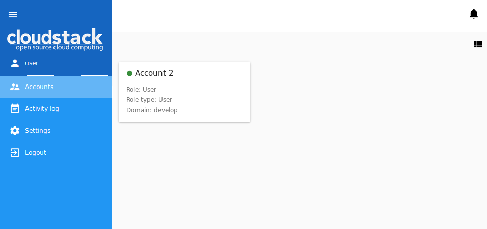
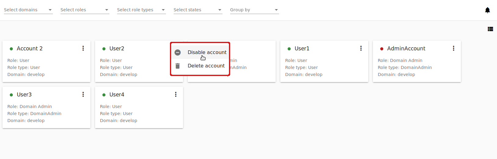

.. _Accounts:

Accounts
-----------------
.. Contents::

In the *Accounts* section Administrators can manage accounts and users in them, as well as user settings and activity logs. 
For an account, details and resource limits can be viewed. Please, note that the account limits are shared by all users in the account. 
If you are facing the problem of the lack of resources, contact your Administrator. Administrators are able to edit the limits of an account. 
Besides, they can monitor resource usage having access to the resource statistics for each account.

Administrators can see the list of accounts for the whole domain. They can create new users for an account, edit or delete a user. 

If you are a User, you can view but not manage your account and users in it. For each user in the account, you can see the settings. 

Account List
~~~~~~~~~~~~~~~~~~~~~~~

Clicking *Accounts* in the left-side navigation bar you open the *Accounts* section. It presents the list of accounts. Administrators can see accounts for the whole domain. A user can see his/her account only, that is the account his/her user belongs to.

You can switch the view from list to box using the switch tool |view icon|/|box icon| in the upper-right corner.

   
For each account in the list you can see the following information:

 - Account name;
 - State - Shows the account state by color spot: green for Enabled, red for Disabled statuses; 
 - Role - A role assigned to the account - Root Administrator, Resource Administrator, Domain Administrator, User. Find more information on roles in CloudStack in the `official documentation <http://docs.cloudstack.apache.org/en/4.11.1.0/adminguide/accounts.html#roles>`_.
 - Role type - A role type connected to the role.
 - Domain - The domain which the account belongs to.
 - Action list - Allows an Administrator to manage the account - to disable or delete it. Find more details at :ref:`Account_Action_Box`. 

Filtering of Accounts
"""""""""""""""""""""""""""

If you are an Administrator, filtering and search tools will help you to find an account in the list. 

You can filter the list by:

 - Domains - Select a domain/domains available to you from the drop-down list.
 - Roles - Select a role - Root Administrator, Resource Administrator, Domain Administrator and/or User -from the drop-down list.
 - Role types - Select a role type/types from the drop-down list.
 - States - Select a state/states - Enabled and/or Disabled - from the drop-down list.

Besides, accounts can be grouped by the parameters mentioned above.

Create an Account
~~~~~~~~~~~~~~~~~~~~~~~

An Administrator can create a new account in the domain.

By clicking "Create" |create icon| in the bottom-right corner you will open a form where the following fields should be completed:

.. note:: Required fields are marked with an asterisk (*).

- Name * - Enter any desired login ID for the account name. It should be unique within the domain.
- Email * - Enter the accounts email address.
- Password * - Enter any password you like. You can view the password that you are entering by clicking |view| to the right. Hide the password under dots by clicking |hide|. 
- First name * - Enter the first name of a person or the first part of the entity represented by the account. It can be a department or a customer.
- Last name * - Enter the last name of a person or the second part of the entity represented by the account (a customer or a department).
- Domain * - Select a domain in which the account is to be created.
- Role * - Select the role for the account.
- Time zone - Set the time zone that corresponds to the account locale.
- Network domain - If you want to assign a special domain name to the account's guest VM network, specify the DNS suffix. 

.. figure:: _static/Accounts_Create.png

Click "CREATE" to create the new account. Make sure it has appeared in the list of accounts.

A user is created automatically for the new account. User's name corresponds to the first and the last name specified in the account creation form. This user inherits account's email and time zone.

Click "CANCEL" to leave the account creation form. No account will be created then.

Account Details Sidebar
~~~~~~~~~~~~~~~~~~~~~~~~~~~

For each account, the information is available in the details sidebar to the right. Click the account in the list to open the sidebar:

.. figure:: _static/Accounts_Details1.png
   
There are two tabs in the sidebar: General and Users.

The *General* tab contains the general information on the account: details, limits for resources. 

Administrators can edit the limits. Click "Edit" |edit icon| in the Limits block and change the values right in the block.

   
Administrators can see the statistics on resource usage at the bottom. Refresh the data by clicking |refresh icon|.

The *Users* tab contains the list of users in the account. For each user you can expand the information card where the following information is listed:

 - Username;
 - First and Last name;
 - Timezone;
 - Email;
 - Secret key - The key generated for a user by clicking "Regenerate key" in the Action box. You can copy it to the buffer by clicking |copy icon|. 
 - API key - The key generated for a user by clicking "Regenerate key" in the Action box. You can copy it to the buffer by clicking |copy icon|. 

An Administrator has a list of actions available for each user. A user can manage his/her user only. A list of actions is available under the |actions icon| button. It contains the following actions:

- Edit user;
- Change password;
- Regenerate key;
- Delete user (available for Administrators).

Find more about actions for users in the :ref:`User_Action_Box` section.

Create a User
"""""""""""""""""""""
Administrators can create a new user from the *Users* tab of the Account Details sidebar by clicking "Create" |create icon|. 

.. figure:: _static/Accounts_CreateUser.png

In the appeared form fill in the following fields:

.. note:: Required fields are marked with asterisks (*).

- Username * - Enter any desired user ID. It should be unique within the domain.
- Password * - Enter any password you like. You can view the password that you are entering by clicking |view| to the right. Hide the password under dots by clicking |hide|. 
- First name * - User's first name.
- Last name * - User's last name.
- Email * - Enter the user's email address.
- Time zone * - Set the timezone that corresponds to the user's locale. Select an option from the drop-down list.

   
Click "CREATE" to create the new user. It will appear in the list of users for this account.

Click "CANCEL" to cancel the user creation.

.. _User_Action_Box:

User Action Box
"""""""""""""""""""
Administrators can manage a user via the Action box. 

The list of actions allows an Administrator to:

- Edit user - Opens a form to edit user's settings (name, email, timezone). Edit the information and click "SAVE" to save the edits.

   
- Change password - Opens a modal window with two fields for you to enter a new password and confirm it. Use the view tool |view| to view or hide a password while entering. Click "SAVE" to save the new password.

   
- Regenerate key - Allows changing the keys - secret and API - for the user. Confirm your action in the dialog window, and the keys will be changed.
 
- Delete a user - Allows deleting a user from the system. Confirm your action in the dialog window, and the user will be deleted.

.. _Account_Action_Box:

Account Action Box
~~~~~~~~~~~~~~~~~~~~~~~~~

Administrators can manage an account via the Action box under |actions icon|. 

   
The list of actions allows an Administrator to:

- Disable account - Allows disabling an account. By disabling the account all users for this account will no longer have access to their cloud resources. All running VMs will be immediately shut down. Click "Disable account" and confirm your action in the dialog window. The account will be inactive. 

- Enable account - Allows activating a disabled account. Click "Enable account" and confirm your action in the dialog window. The account will be activated.

- Delete account - Allows an Administrator to delete an account from the system. Confirm your action in the dialog window, and the account will be deleted.

.. - Lock account - Allows locking an account from its users. By locking the account all users for this account will no longer be able to manage their cloud resources. Existing resources can still be accessed. Click "Lock account" and confirm your action in the dialog window. The account will be locked.

.. |bell icon| image:: _static/bell_icon.png
.. |refresh icon| image:: _static/refresh_icon.png
.. |view icon| image:: _static/view_list_icon.png
.. |view box icon| image:: _static/box_icon.png
.. |view| image:: _static/view_icon.png
.. |actions icon| image:: _static/actions_icon.png
.. |edit icon| image:: _static/edit_icon.png
.. |box icon| image:: _static/box_icon.png
.. |create icon| image:: _static/create_icon.png
.. |copy icon| image:: _static/copy_icon.png
.. |color picker| image:: _static/color-picker_icon.png
.. |adv icon| image:: _static/adv_icon.png
.. |hide| image:: _static/hide_icon.png
