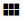

.. _SSH_Keys:

Activity Log
-----------------
.. Contents::

In the *Accounts* -> *Activity log* section you can see user activity in the account. Event search by main parameters - date and keywords - is supported to make it easier to find a necessary event for a specific date or type. 

Events List
~~~~~~~~~~~~~~~~
Events in the Activity log are listed in a chronological order from the latest till the earliest. It represents the full list of events for a selected day.

A user can view activities for his/her user only. An Administrator can see events for all accounts in the domain. 

The following information for each event is presented in the list:

- Event description.
- Level - A kind of a category the event belongs to. It can show: 

   - INFO - For regular activities, for example, logging in, creating a VM, attaching a disk.
   - WARN - For any warnings occurred.
   - ERROR - For any errors occurred, for example, an error while registering an SSH key pair. 

- Type - Displays in what aspect of the system the event has taken place, for example: ``USER.LOGIN`` - for events happened at user authentication to the system; ``VOLUME.RESIZE`` - for events at disk size change. 

- Time of the event.

Filtering of Events
"""""""""""""""""""""""""
To easily find an event in the list use the filtering tool above.

Any user can filter events by:

- Date - Allows selecting events for a specific date. By default, the today's date is selected. Click |date icon| and in the appeared calendar change the date for the day you wish to see activities for. 

Click "OK" to filter the list. The events will be selected in accordance with the chosen date.

Click "CANCEL" to drop the selection.

- Levels - Allows selecting events by levels. Choose the level/levels you with from the drop-down list.

- Types - Allows selecting events by types. Choose the type/types from the drop-down list.

An Administrator has an additional filtering parameter - accounts.

Use the search tool to find an event by keywords or a part of a word.

.. |bell icon| image:: _static/bell_icon.png
.. |refresh icon| image:: _static/refresh_icon.png
.. |view icon| image:: _static/view_list_icon.png
.. |view| image:: _static/view_icon.png
.. |actions icon| image:: _static/actions_icon.png
.. |edit icon| image:: _static/edit_icon.png

.. |create icon| image:: _static/create_icon.png
.. |copy icon| image:: _static/copy_icon.png
.. |color picker| image:: _static/color-picker_icon.png
.. |adv icon| image:: _static/adv_icon.png

