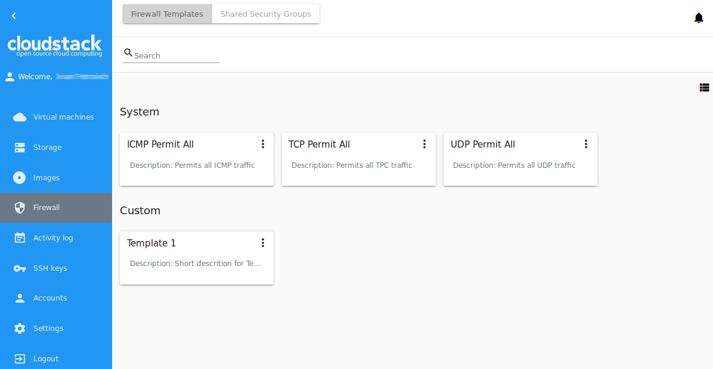
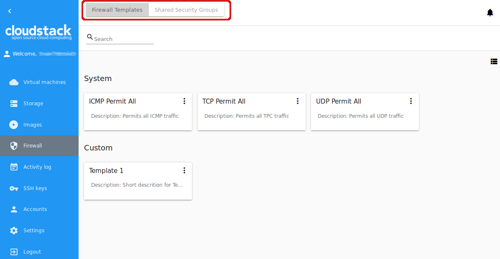
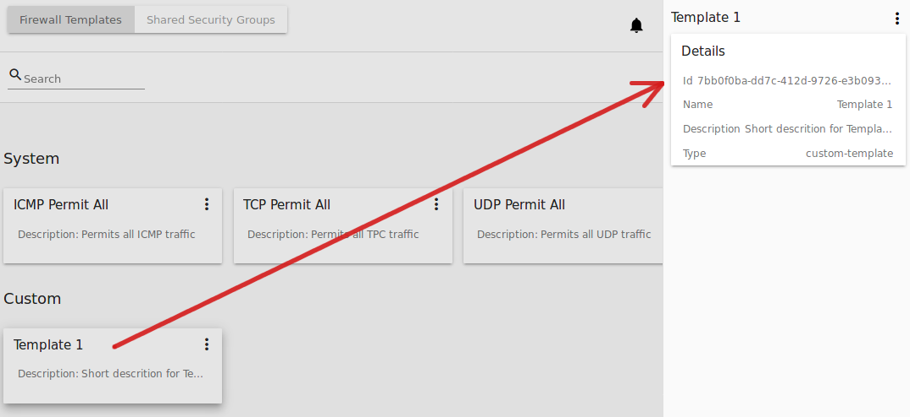
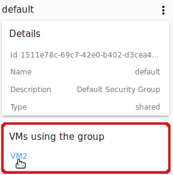
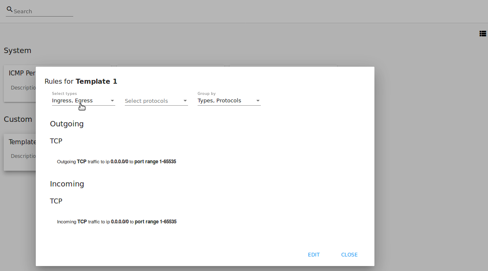
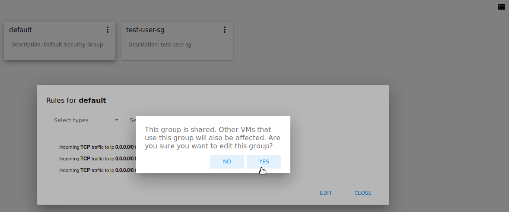

.. _Firewall:

Firewall
--------------
.. Contents::

The *Firewall* section contains templates to create a security group for a virtual machine and shared security groups used for virtual machines of other users.

**Firewall templates** are presets of rules that can be system or developed by a user (custom). Administrators can specify default presets during the interface deployment in the JSON configuration file (find more in `Configurations Guide <https://github.com/bwsw/cloudstack-ui/blob/master/ConfigGuide.md>`_). Now there are “TCP Permit All”, “UDP Permit All”, “ICMP Permit All” system firewall templates in the system. They just pass all the traffic. We offer them because we would like a user to make his virtual machines accessible without diving into technical details. If it is necessary, a custom firewall template can be created. Find more information on how to create a custom firewall template at :ref:`Create_FTemplate`.

Upon VM creation the system creates a new security group for a VM on the base of templates. This group is initially filled with all the rules from specified presets. Next, when the user changes the rules for a certain virtual machine, it does not affect other machines. These changed rules make a private security group used for that virtual machine only. 

The second way is to use a **shared security group** for your virtual machine. Shared groups are used by other VMs. Changes of rules in them may affect other VMs. 

Users can manage security group rules in two modes: a "view" mode with filtering by types and protocols and an “edit” mode. Security groups editing is available when switching from "view" mode to "editing" mode. If the group is shared, the user is warned that changes will affect other VMs using this group. This behavior allows avoiding undesirable changes for other VMs.

Templates and shared security groups are placed in different tabs of the *Firewall* section. You can switch from templates to shared security groups using the tool above the list. 

A user can see security groups of his/her user only. An Administrator can observe security groups of all accounts in the domain.

Firewall List
""""""""""""""""""""""""

The security groups are presented in a list format. You can change the view from list to cards clicking the switch view icon |view icon|/|box icon| in the upper-right corner.

To quickly find the security group you need, please, use the search tool above the list. Enter a name or a part of the name of the template/security group and see the immediate result.

Administrators can filter the list of templates/shared groups by accounts.

.. figure:: _static/Firewall_Filter_Admin.png

.. _Create_FTemplate:

Create a Security Group Template
""""""""""""""""""""""""""""""""""""""

You can create your own template. It will be available as a base at a new private security group creation for VM.

A new security group template is created on the base of existing templates. This security group will be created as a custom template (with a ``custom-template`` type).

If you would like to create a new security group template, click "Create" in the bottom-right corner and fill in the form:

.. figure:: _static/Firewall_CreateTemplate.png
   :scale: 70%

- Name * - Enter a name for the template.
- Description - Provide a short description for the firewall template.
- Basic rules - Click "ADD" to open the list of rules to assign them to the template. In the appeared window select a template in the “All templates” list at the left and move it to the “Selected templates” list at the right by clicking the arrow icon:
 
.. figure:: _static/Firewall_SelectRules.png
   :scale: 70%

Click “SELECT ALL” to move all templates from left to right at once.

Click “RESET” to drop all selected templates.

In the list below you will see the rules corresponding to the selected templates. All of them are checked as selected. Uncheck those you do not wish to add to your firewall template.

.. figure:: _static/Firewall_SelectRules2.png
   :scale: 70%

Click “SAVE” to apply the selected rules to your security group template.

Click “CANCEL” to drop the selected options. No rules will be assigned to the template. You will return to the “Create a new security group” window.

When all fields are completed, click "CREATE" to create the new firewall template. The template will appear in the list of firewall templates as *Custom*:

.. figure:: _static/Firewall_CreatedTemplate.png
   :scale: 70%
   
Click "CANCEL" to cancel the template creation process. No firewall templates will be created then. All fields will be cleared in the form.

Create a Shared Security Group
""""""""""""""""""""""""""""""""""""""
You can create a shared security group and it will be available for creating virtual machines of other users.

A new shared security group is created on the base of existing templates. This security group will be created with a ``shared`` type.

If you would like to create a new shared security group, click "Create" in the bottom-right corner and fill in the form:

 - Name * - Enter a name for the group.
 - Description - Provide a short description for the group.
 - Basic rules - Click "ADD" to open the list of rules to assign them to the group. In the appeared window select a template in the “All templates” list at the left and move it to the “Selected templates” list at the right by clicking the arrow icon:
 
.. figure:: _static/Firewall_SelectRules.png
   :scale: 70%
   
Click “SELECT ALL” to move all templates from left to right at once.

Click “RESET” to drop all selected templates.

In the list below you will see the rules corresponding to the selected templates. All of them are checked as selected. Uncheck those you do not wish to add to your shared security group.

.. figure:: _static/Firewall_SelectRules2.png
   :scale: 70%

Click “SAVE” to apply the selected rules to your security group template.

Click “CANCEL” to drop the selected options. No rules will be assigned to the security group. You will return to the “Create a new security group” window.

.. figure:: _static/Firewall_CreateSharedSG.png
   :scale: 70%
   
Click "CREATE" to create the new shared security group. The group will appear in the list of shared security groups.

.. figure:: _static/Firewall_CreatedSG.png

Click "CANCEL" to cancel the group creation process. No group will be created then. All fields will be cleared in the form.

Firewall Rules Details Sidebar
""""""""""""""""""""""""""""""""""""""
You can see the firewall rules details in the sidebar to the right. 

Click the template/shared security group in the list and open the sidebar. You will see the information there:

- Name of the security group;
- :ref:`SG_Action_Box` under |actions icon|;
- ID of the security group;
- Description giving an idea what the security group contains;
- Type - Defines the security group types. For firewall templates it can be ``custom-template`` for custom templates, or ``predefined-template`` for system templates. For shared security groups it is ``shared``.

 
For shared security groups you also can see what virtual machines this group is assigned to. The machine name in the list is active. You can move to the virtual machine details bar by clicking it.
 

.. _SG_Action_Box:

Security Group Action Box
""""""""""""""""""""""""""""""""""
Both firewall templates and shared security groups have an Action box with the following actions in it:

- View - Allows viewing the rules in the group/template. Click "Rules" |view| to open the rules implemented to the template. 

- Delete - Allows deleting the group or the template from the system. 

.. note:: A template/security group cannot be deleted if it is used for a virtual machine, or it belongs to another user. Deleting action is not available for system firewall templates.

Edit a Firewall Template/Security Group
''''''''''''''''''''''''''''''''''''''''''''

When clicking "Rules" |view| in the Action box you open a modal window where the rules of the template/security group are listed. The list of rules can be filtered by:

- Types - Ingress and/or Egress;
- Protocols - TCP and/or UDP and/or ICMP;

Besides, you can group the rules by types and/or protocols.

You can edit the implemented rules right in this modal window by clicking "EDIT" below the list. When switching to the edit mode you are enabled to add rules or delete the selected ones from the list. 

To add rules, please, fill in the fields in the panel above the list and click “+”:

.. figure:: _static/Firewall_AddRules.png
   :scale: 70%
   
To delete rules, please, click Delete icon in the list. The rule will be deleted from the security group.

.. figure:: _static/Firewall_DeleteRules.png
   :scale: 70%
   
Then you can move back to the view mode, or close the window. You will see the rules are edited.

Please, note, when editing shared security groups, a warning message appears:

Click “Yes” if you still want to edit a shared security group. You will be switched to the "Edit" mode. Change the security group as you need following the instructions above.

.. note:: Editing is not available for system firewall templates and security groups of other users. You can view the rules only.

.. |bell icon| image:: _static/bell_icon.png
.. |refresh icon| image:: _static/refresh_icon.png
.. |view icon| image:: _static/view_list_icon.png
.. |view box icon| image:: _static/box_icon.png
.. |view| image:: _static/view_icon.png
.. |actions icon| image:: _static/actions_icon.png
.. |edit icon| image:: _static/edit_icon.png
.. |box icon| image:: _static/box_icon.png
.. |create icon| image:: _static/create_icon.png
.. |copy icon| image:: _static/copy_icon.png
.. |color picker| image:: _static/color-picker_icon.png
.. |adv icon| image:: _static/adv_icon.png
