.. _Firewall:

Firewall
--------------
.. Contents::

The *Virtual Machines* -> *Firewall* section contains templates to create a security group for a virtual machine and shared security groups used for virtual machines of other users.

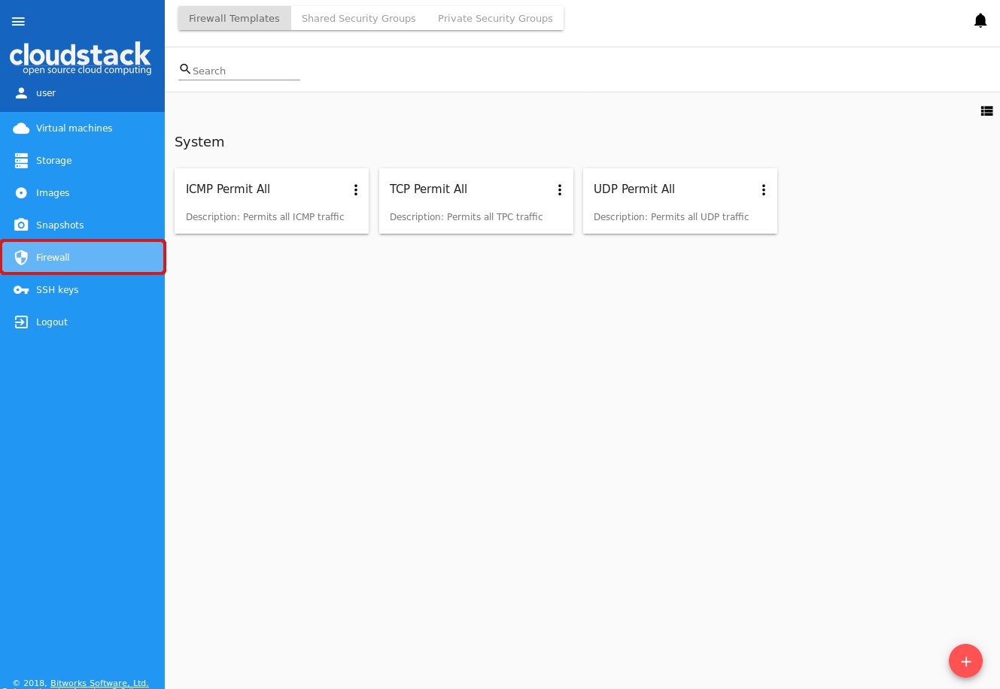

**Firewall templates** are presets of rules that can be system or developed by a user (custom). Administrators can specify default presets during the interface deployment via the JSON configuration file (find more in `configurations guide <https://github.com/bwsw/cloudstack-ui/blob/master/config-guide.md#security-group-templates>`_). These presets will be used when creating a new security group.

.. Now there are “TCP Permit All”, “UDP Permit All”, “ICMP Permit All” system firewall templates in the system. They just pass all the traffic. We offer them because we would like a user to make his virtual machines accessible without diving into technical details. 

A custom security group template can be created via the UI. Find more information on how to create a custom security group template at :ref:`Create_FTemplate`.

Upon VM creation the system creates a new security group for a VM on the base of templates (if they exist). Next, when the user changes the rules for a certain virtual machine, it does not affect other machines. These changed rules make a **private security group** used for that virtual machine only. 

The second way is to use a **shared security group** for your virtual machine. Shared groups are used by several VMs. Changes of rules in them may affect other VMs. 

Users can manage security group rules in two modes: a "view" mode with filtering by types and protocols and an “edit” mode. Security groups editing is available when switching from "view" mode to "editing" mode. If the group is shared, the user is warned that changes will affect other VMs using this group. This behavior allows avoiding undesirable changes for other VMs.

Templates, shared and private security groups are placed in different tabs of the *Firewall* section. You can switch from templates to shared or private security groups using the tool above the list. 

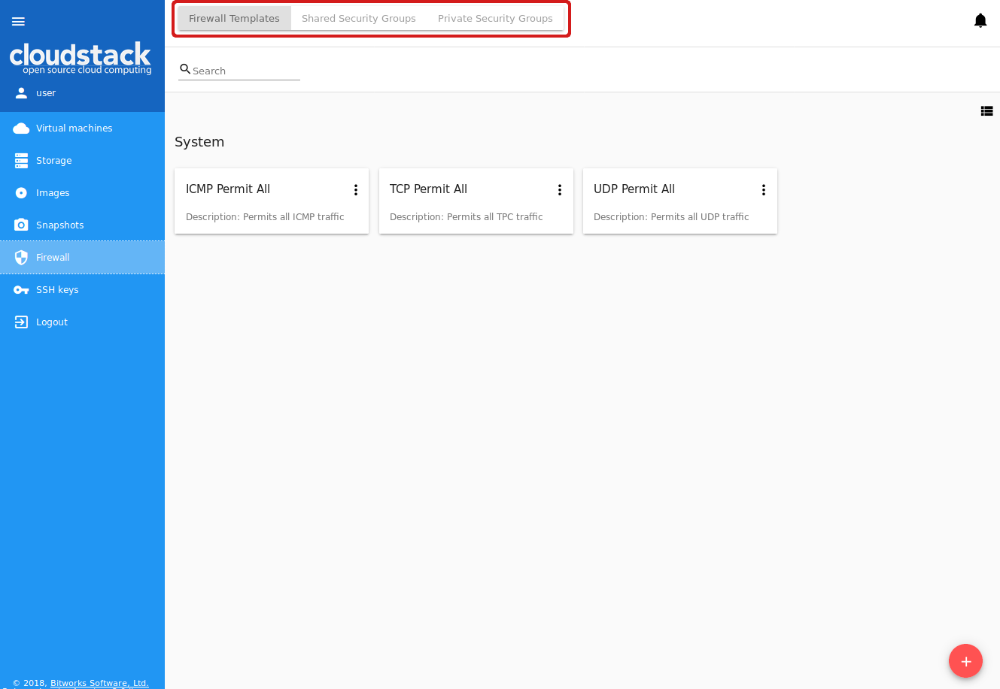
   
A user can see security groups of his/her user only. An Administrator can observe security groups of all accounts in the domain.

Firewall List
""""""""""""""""""""""""

The security groups are presented in a list format. You can change the view from list to cards clicking the switch view icon |view icon|/|box icon| in the upper-right corner.

To quickly find the security group you need, please, use the search tool above the list. Enter a name or a part of the name of the template/security group and see the immediate result.

Administrators can filter the list of templates/shared groups by accounts.

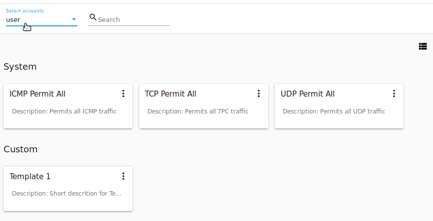

.. _Create_FTemplate:

Create a Security Group Template
""""""""""""""""""""""""""""""""""""""

You can create your own template. It will be available as a base at a new private security group creation for VM.

A new security group template is created on the base of existing templates. This security group will be created as a custom template (with a ``custom-template`` type).

If you would like to create a new security group template, click "Create" |create icon| in the bottom-right corner and fill in the form:

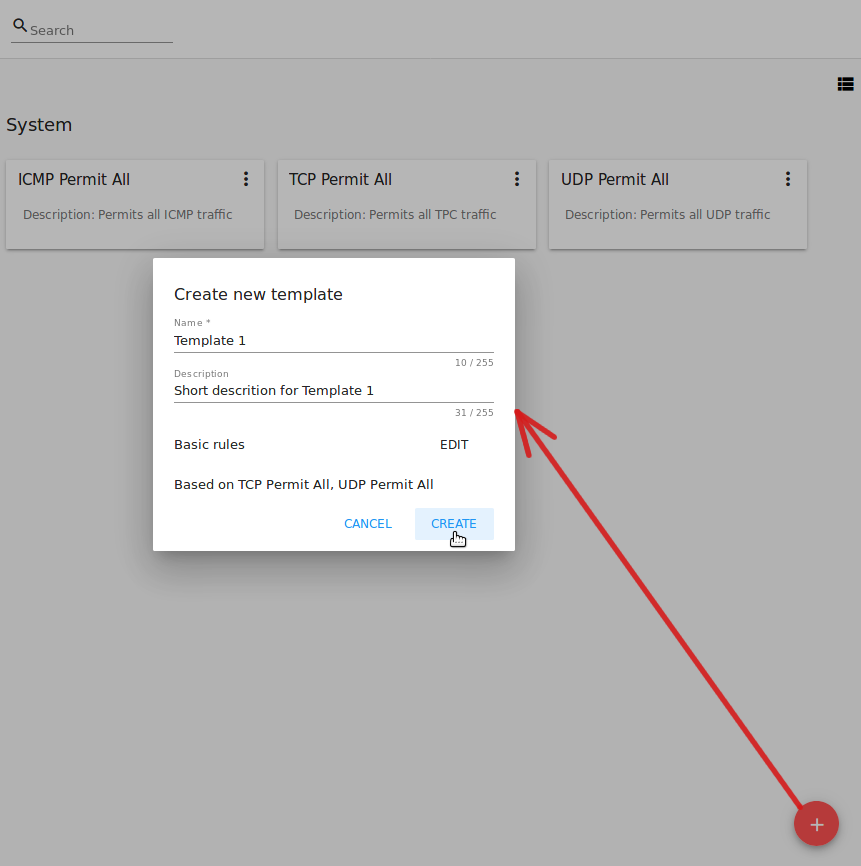

.. note:: Required fields are marked with an asterisk (*).

- Name * - Enter a name for the template.
- Description - Provide a short description for the firewall template.
- Basic rules - Click "ADD" to open the list of rules to assign them to the template. In the appeared window select a template in the “All templates” list at the left and move it to the “Selected templates” list at the right by clicking the arrow icon:
 
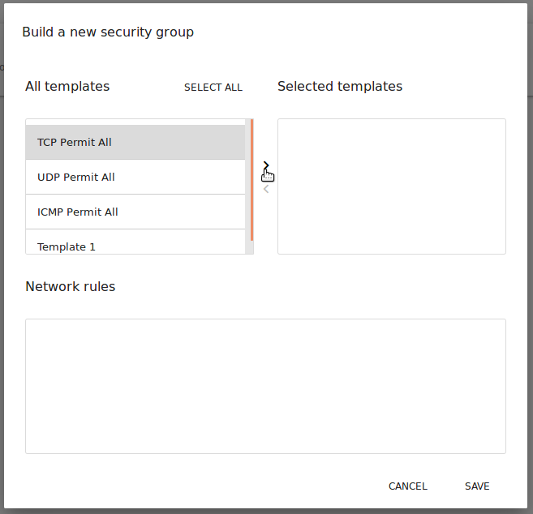

Click “SELECT ALL” to move all templates from left to right at once.

Click “RESET” to drop all selected templates.

In the list below you will see the rules corresponding to the selected templates. All of them are checked as selected. Uncheck those you do not wish to add to your firewall template.

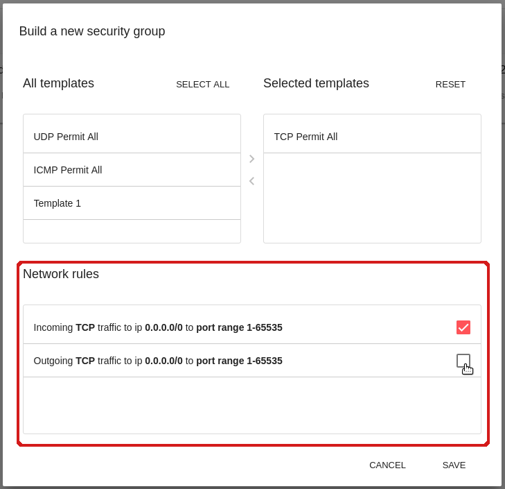

Click “SAVE” to apply the selected rules to your security group template.

Click “CANCEL” to drop the selected options. No rules will be assigned to the template. You will return to the “Create a new security group” window.

When all fields are completed, click "CREATE" to create the new firewall template. The template will appear in the list of firewall templates as *Custom*:

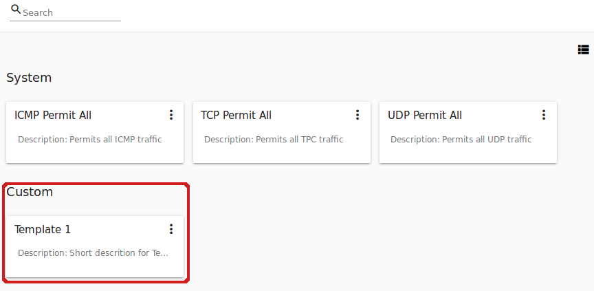
   
Click "CANCEL" to cancel the template creation process. No firewall templates will be created then. All fields will be cleared in the form.

Create a Shared Security Group
""""""""""""""""""""""""""""""""""""""
You can create a shared security group and it will be available for creating virtual machines of other users.

A new shared security group is created on the base of existing templates. This security group will be created with a ``shared`` type.

If you would like to create a new shared security group, navigate to the Shared Security Group section and click "Create" in the bottom-right corner. Then, fill in the form:

.. note:: Required fields are marked with an asterisk (*).

- Name * - Enter a name for the group.
- Description - Provide a short description for the group.
- Basic rules - Click "ADD" to open the list of rules to assign them to the group. In the appeared window select a template in the “All templates” list at the left and move it to the “Selected templates” list at the right by clicking the arrow icon:
 

   
Click “SELECT ALL” to move all templates from left to right at once.

Click “RESET” to drop all selected templates.

In the list below you will see the rules corresponding to the selected templates. Check those you wish to add to your shared security group.

Click “SAVE” to apply the selected rules to your security group template.

Click “CANCEL” to drop the selected options. No rules will be assigned to the security group. You will return to the “Create a new security group” window.

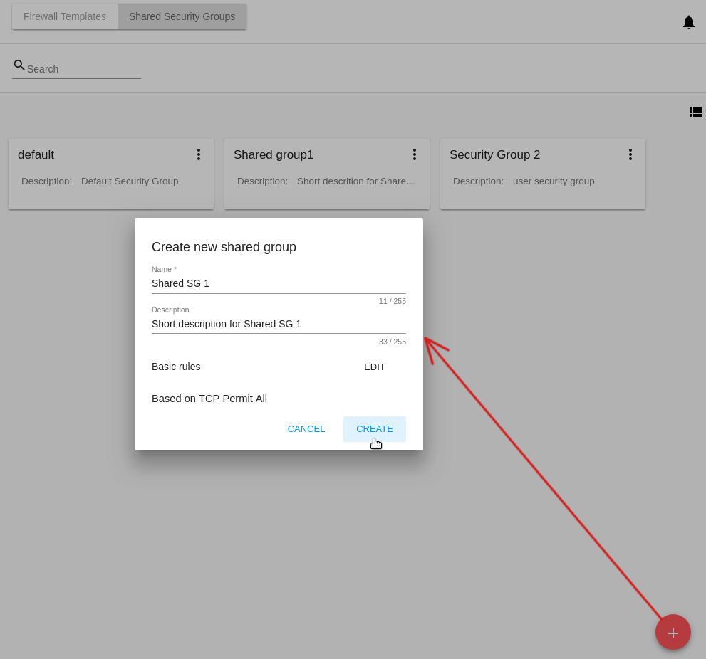
   
Click "CREATE" to create the new shared security group. The group will appear in the list of shared security groups.

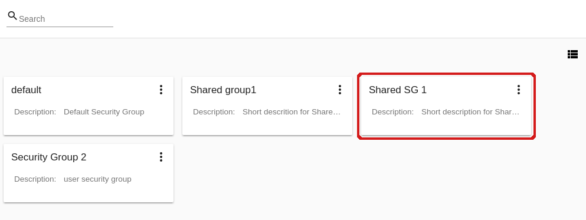

Click "CANCEL" to cancel the group creation process. No group will be created then. All fields will be cleared in the form.

Private Security Groups
""""""""""""""""""""""""""""
Private security groups are listed in the *Private Security Groups* section. 

Security groups appear in this section once they are created for a virtual machine (see :ref:`Create_VM`). A private security group name has the following format - ``sg-{{ virtual machine name }}`` - containing the name of the virtual machine it is created for. 

You can quickly find a group by its name or a part of the name using the searching tool above the list.

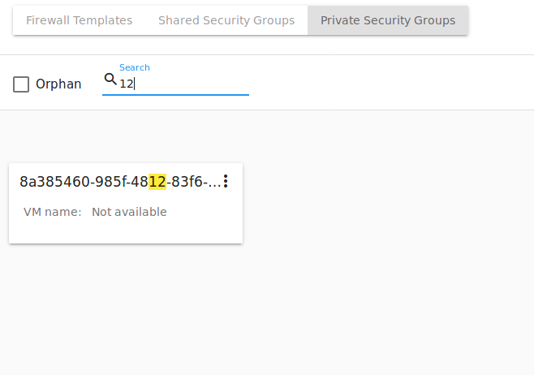

Besides, Administrators can filter the list by accounts.

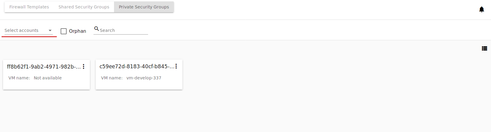

You can filter the list by ticking the "Orphan" checkbox above. It allows displaying only the security groups that are not used by any machine. 

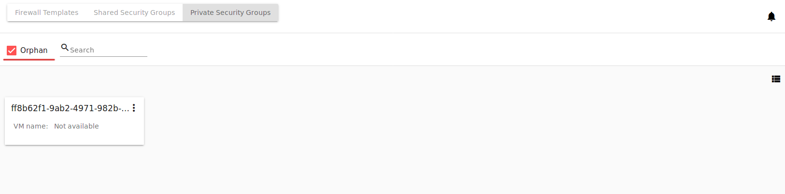

The "Orphan" option appears above the list in case the security groups that are not used by any VM exist in the list. This might happen in case a VM has been deleted but a group has been not (because of an error or incorrect behavior).

Security Group Details Sidebar
""""""""""""""""""""""""""""""""""""""
You can see the firewall rules details in the sidebar to the right. 

Click the template/shared/private security group in the list and open the sidebar. You will see two tabs there - Details and Tags. 

The **Details** tab contains the following information:

- Name of the security group;
- :ref:`SG_Action_Box` under |actions icon|;
- ID of the security group;
- Description giving an idea what the security group contains (not available for private security groups);
- Type - Defines the security group types. For firewall templates it can be ``custom-template`` for custom templates, or ``predefined-template`` for system templates. For shared security groups it is ``shared``. For private security groups you will see ``private``.

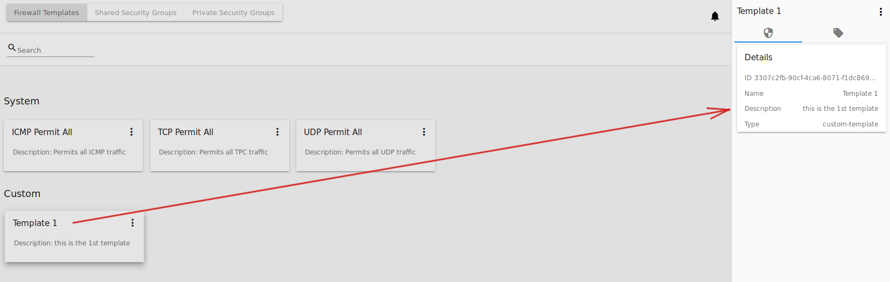
 
For shared security groups you also can see what virtual machines are assigned to this group. The machine name in the list is active. You can move to the virtual machine details bar by clicking it. 
 
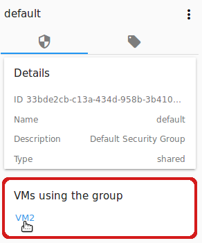

For private security groups a VM name is also displayed in the details sidebar, but it is not active.

The **Tags** tab presents the list of tags assigned to the security group. Using the search tool above you can quickly find a tag by its name. 

System tags are listed in a separate card.

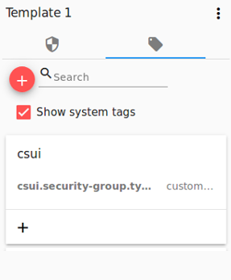

Сlick |create icon| to add a tag. Enter a key and a value. 

.. note:: Both fields are required. The input values for both fields cannot start with a space.

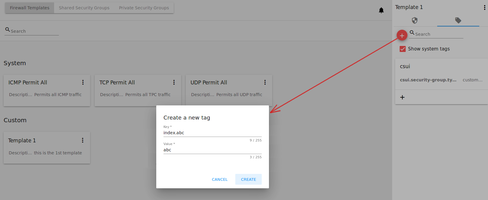

Click "CREATE" to create the new tag. It will be saved in a separate card.

An existing tag can be edited or deleted by clicking a correspondent icon next to the tag's name.

.. _SG_Action_Box:

Security Group Action Box
""""""""""""""""""""""""""""""""""
Firewall templates, shared and private security groups have an Action box with the following actions in it:

- View - Allows viewing the rules in the group/template. Click "Rules" |view| to open the rules implemented to the template. 

- Delete - Allows deleting the group or the template from the system. 

.. note:: A template/security group cannot be deleted if it is used for a virtual machine, or it belongs to another user. Deleting action is not available for system firewall templates.

Edit a Firewall Template/Security Group
''''''''''''''''''''''''''''''''''''''''''''

When clicking "Rules" |view| in the Action box you open a modal window where the rules of the template/security group are listed. The list of rules can be filtered by:

- IP versions - IPv4 and/or IPv6;
- Types - Ingress and/or Egress;
- Protocols - TCP and/or UDP and/or ICMP.

Besides, you can group the rules by types and/or protocols.

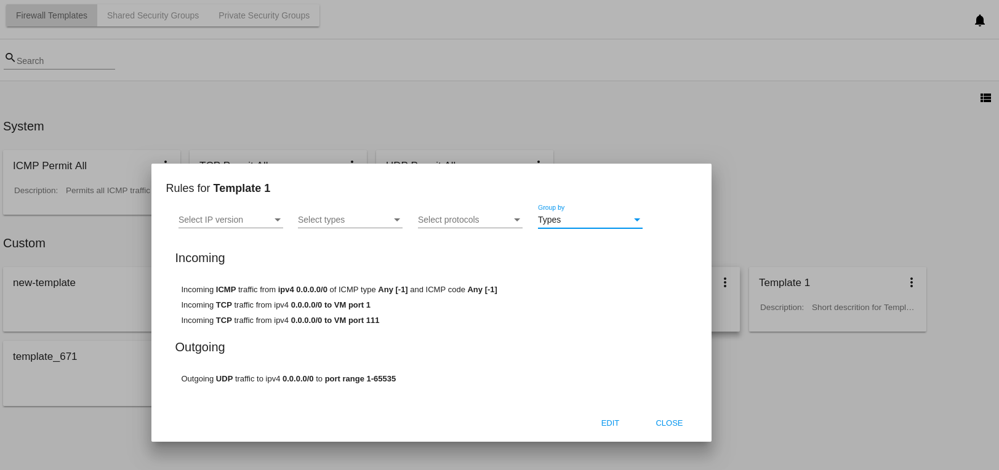

You can edit the implemented rules right in this modal window by clicking "EDIT" below the list. When switching to the edit mode you are enabled to add rules or delete the selected ones from the list. 

To add rules, please, fill in the fields in the panel above the list and click “+”:

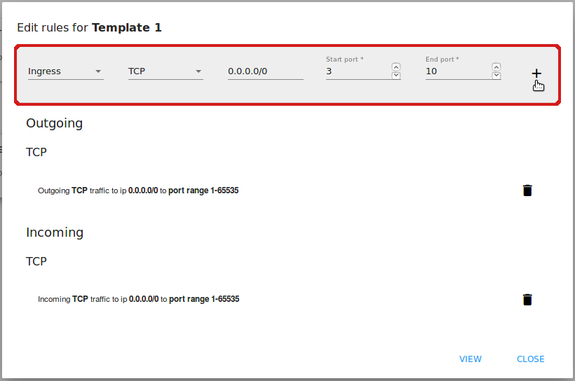

**Validation**

Please, make sure you enter valid values for Start and End ports:

* Start port can be less or equal to End port. For more convenience, we added the autocomplete, that is, when entering a Start port value, the End port field is prepopulated with an equal value.
* The values in these fields cannot be greater/less than maximum/minimum allowed values (for TCP/UDP max port is 65535, for ICMP - 255).
* The fields cannot be empty.

For ICMP type make sure you input a valid CIDR, ICMP type and code. 

* You will not be able to enter an ICMP type and a code until a valid CIDR is specified. Likewise, you will not be able to enter an ICMP code until a valid ICMP type is specified. 
* CIDR allows entering IP addresses in both IPv4 and IPv6 formats.
* ICMP IPv6 the "[-1] Any" value is supported for type and code.
* ICMP type and code fields cannot be empty. 

For invalid values the add button "+" is disabled.

To delete rules, please, click the Delete icon in the list. The rule will be deleted from the security group.

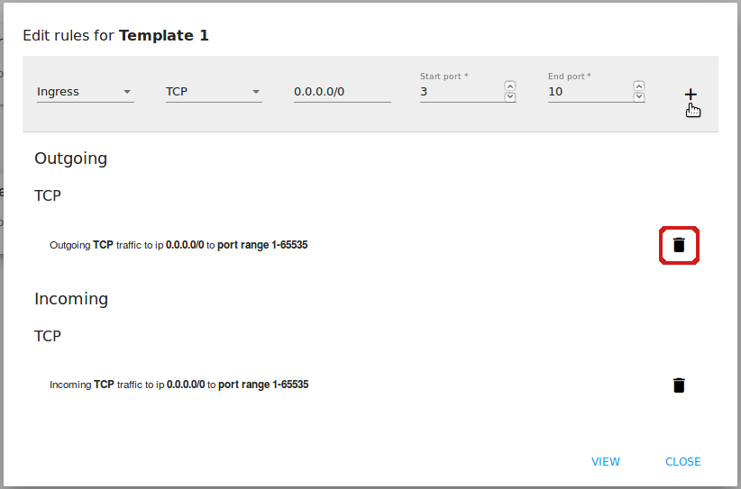
   
Then you can move back to the view mode, or close the window. You will see the rules are edited.

Please, note, when editing shared security groups, a warning message appears:

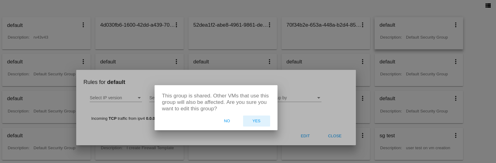

Click “Yes” if you still want to edit a shared security group. You will be switched to the "Edit" mode. Change the security group as you need following the instructions above.

.. note:: Editing is not available for system firewall templates and security groups of other users. You can view the rules only.

"Convert to Shared" Action for Private Security Groups
'''''''''''''''''''''''''''''''''''''''''''''''''''''''''''''

For private security groups you can find a "Convert to shared" action in the Action box. It allows making a shared SG from a private SG so that it can be used for VMs by other users.

To convert a private security group into a shared one, please, follow the steps:

1) Move to the list of Private Security groups,

2) Select "Convert to shared" option in action box for a security group,

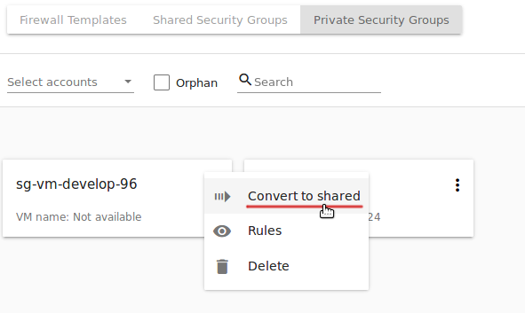

3) A warning dialog appears. Click "YES" to confirm your action. 

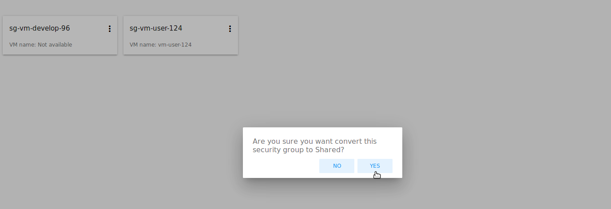

The security group will be moved to the list of "Shared Security Groups". The tag "is private" will be removed for this security group. 

Click "NO" to cancel the convertion, the security group will stay private.
  

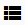
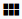

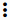

.. |copy icon| image:: _static/copy_icon.png
.. |color picker| image:: _static/color-picker_icon.png

