.. _Images:

Images
---------------
.. Contents::

In the *Virtual Machines* -> *Images* section, you can manage Templates and ISO files that are used as installation sources for VMs.

A template is a reusable configuration for virtual machines. When users create a VM, they can choose from a list of templates. Administrators and users can create new templates and add them to CloudStack.

ISO files are another installation source for virtual machines. 

You can switch from Templates to ISOs by selecting a corresponding option above:

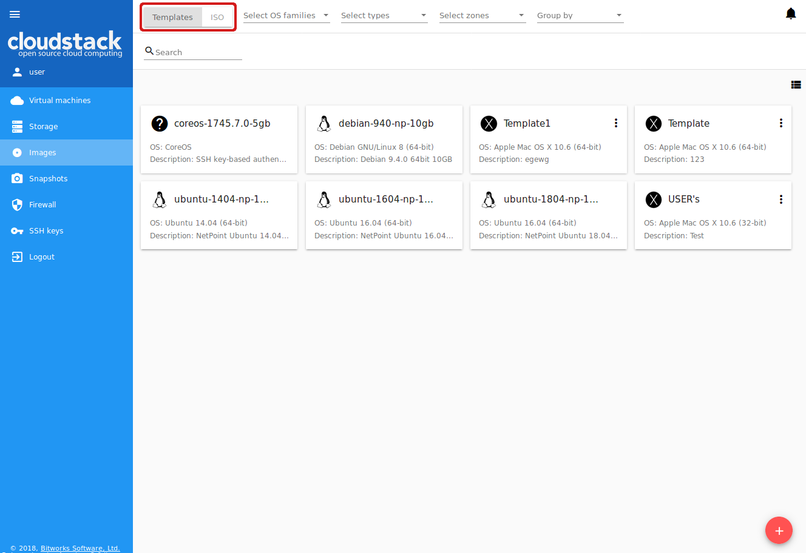

Images List
~~~~~~~~~~~~~~~~~~~~~~~~

Existing templates/ISOs are presented in the list in the "Images" section. A user can see the templates/ISOs belonging to his/her user only. Domain Administrator can see templates/ISOs of all users in the domain but cannot perform actions on other users' templates.

You can switch the list view of templates/ISOs to the box view using the view button |view box icon| in the upper-right corner. 

For each template/ISO in the list, you can see its name, OS family, description.  The Actions button |actions icon| expands the list of actions. Actions are available to those templates/ISOs that belong to your user only (corresponding to "My" type). Administrators can see templates/ISOs of all users in the domain, but cannot manage them.

Filtering of Images
""""""""""""""""""""""""""""
The list of templates/ISOs can be filtered using the filtering tool. The filtering parameters are as follows:

- Accounts (for Domain Administrators);
- OS families;
- Types of templates/ISO:

  - My - for user's templates or ISOs (Private), 
  - Featured - for templates marked by an Administrator as most prominent for users to select, 
  - Community - for templates accessible to all users of this CloudStack installation (Public);
  
- Zones.

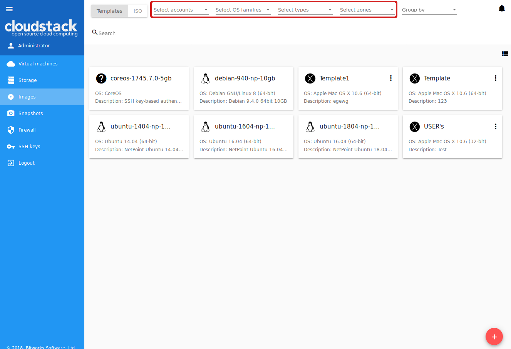

Besides, you can adjust the list view using the grouping tool. Templates/ISOs can be grouped by zones or/and groups. Administrators can group the list by accounts.

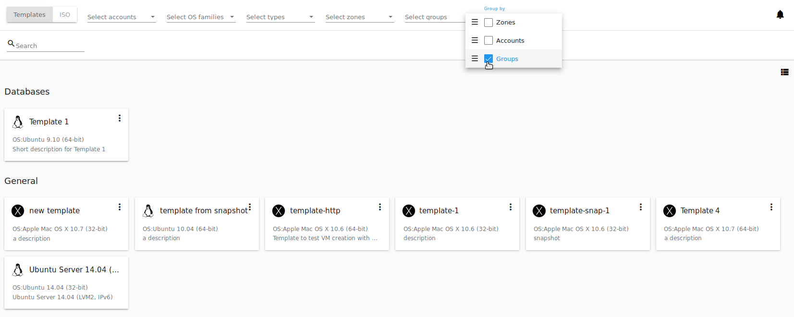

Use the search tool to easily find a template/ISO by its name or by a part of the name.

Create Template
~~~~~~~~~~~~~~~~~~~~

There is a variety of ways to add more templates to the system. In the :ref:`VM_Info` section, we have described one way of template creation from a VM volume snapshot in the "Storage" tab of the VM information sidebar (see :ref:`Actions_on_Snapshots`). From the :ref:`Storage_Info` of the "Storage" section, you also can create a template on the base of the volume snapshot (see :ref:`Actions_on_Snapshot_Volume`).

One more way to create a new template is filling in the form in the *Images* section by clicking "Create" |create icon| in the bottom-right corner. 

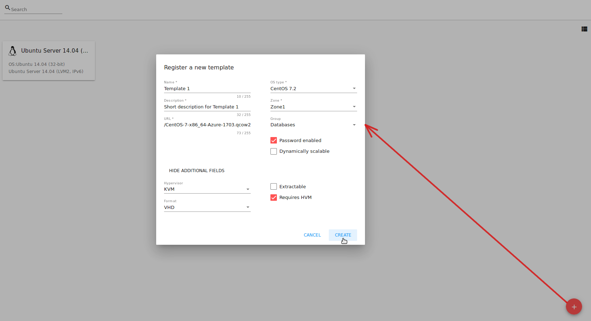

It will open a creation form where you should specify the following information:

.. note:: Required fields are marked with an asterisk (*).

1. Name * - Enter a name for the new template.

#. Description * - Provide a short description to have a general idea about the template.

#. URL * - Specify a valid URL of the template file. 

#. OS type * - This helps CloudStack and the hypervisor perform certain operations and make assumptions that improve the VM performance. Select from the drop-down list the necessary option, or select "Other" if there is no needed option in the list.

#. Zone * - Choose the zone where you want the template to be available.

#. Group - Select a group from the drop-down list. The list of groups is managed by Administrator in the `configuration file <https://github.com/bwsw/cloudstack-ui/blob/master/config-guide.md#image-groups>`_. The group assigned to a template is saved to template tags with the ``csui.template.group`` tag. The group can be edited or deleted from the :ref:`Image_Details` from the "Template" tab or by editing or deleting the corresponding tag in the "Tags" tab.

#. Password enabled checkbox - Tick this option if your template has the CloudStack password change script installed. That means the VM created on the base of this template will be accessed by a password, and this password can be reset.

#. Dynamically scalable checkbox - Tick this option if the template contains XS/VM Ware tools to support dynamic scaling of VM CPU/memory.

9. "Show additional fields" allows expanding the form and set more settings:

   - Hypervisor - Select a hypervisor from the drop-down list.

   - Format - The format of the template upload file, e.g. VHD or RAW or VMDK.

   - Extractable - Tick this option if the template is available for extraction. If this option is selected, end-users can download a full image of a template.

   - Requires HVM - Tick this option for creating a template that requires HVM.

Once all fields are filled in, click "Create" to create the template with these settings. The created template will appear in the list.

Click "Cancel" to close the form without template creation. All fields will be cleared.

Create ISO
~~~~~~~~~~~~~~~~~~~~

You can create a new ISO file in the *Images* section by clicking "Create" |create icon| in the bottom-right corner. 

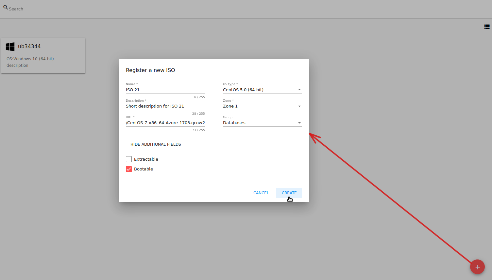

It will open a creation form where you should specify the following information:

.. note:: Required fields are marked with an asterisk (*).

1. Name * - Enter a name for the new ISO file.

#. Description * - Provide a short description to have a general idea about the ISO file.

#. URL * - Specify a valid URL of the ISO file. 

#. OS type * - This helps CloudStack and the hypervisor perform certain operations and make assumptions that improve the VM performance. Select from the drop-down list the necessary option, or select "Other" if there is no needed option in the list.

#. Zone * - Choose the zone where you want the ISO file to be available.

#. Group - Select a group from the drop-down list. The list of groups is managed by Administrator  in the `configuration file <https://github.com/bwsw/cloudstack-ui/blob/master/config-guide.md#image-groups>`_. The group assigned to ISO is saved to ISO tags with the ``csui.template.group`` tag. The group can be edited or deleted from the :ref:`Image_Details` from the "Template" tab or by editing or deleting the corresponding tag in the "Tags" tab.

7. "Show additional fields" allows expanding the form and set more settings:

   - Extractable - Tick this option if the ISO file is available for extraction. If this option is selected, end-users can download a full image of an ISO file.

   - Bootable - Tick this option to indicate whether the machine can be booted using this ISO.

Once all fields are filled in, click "CREATE" to create the ISO file with these settings. The created ISO file will appear in the list.

Click "CANCEL" to close the form without ISO creation. All fields will be cleared.

The created ISO will appear in the list.

.. _Image_Details:

Template/ISO Details Sidebar
~~~~~~~~~~~~~~~~~~~~~~~~~~~~~~~~

The information on each template/ISO is presented in the sidebar to the right. It is opened by clicking the template/ISO card or line in the list. The information is presented here in 3 tabs. Above the tabs you can see the template/ISO general information: 

- Name - Template/ISO name and symbol, 
- Actions button - Actions list allowing the Delete action. 

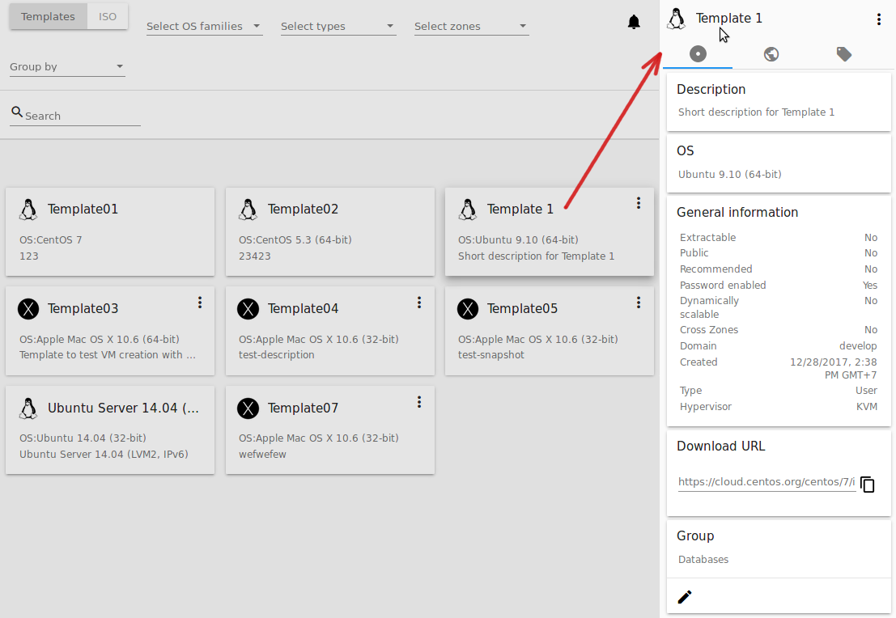

1. Template tab: 

   - Description - Template/ISO description provided at its creation. 
   - OS - The OS selected for this template/ISO. 
   - General Information - The settings saved for this template/ISO: size, creation date, type, hypervisor, other settings. 
   - Download URL - The URL provided for this template/ISO. Next to it you can see the "Copy" icon |copy icon|. Click it to copy the URL to clipboard and then paste it in the address line.
   - Group - Shows the template/ISO group if it is enabled via the `configuration file <https://github.com/bwsw/cloudstack-ui/blob/master/config-guide.md#image-groups>`_. You can change the group by clicking "Edit" |edit icon|. Choose an existing group in the appeared window and click "ASSIGN" to assign the template/ISO to the selected group. 
     You can remove the template/ISO from the group. Select the "Remove from the group <group name>" option and click "REMOVE". 
    
.. _static/Images_Temp_Details_GroupEdit1.png
.. _static/Images_Temp_Details_GroupRemove1.png

2. Zones tab - Shows the zone where the template/ISO is available. If the zone has "Yes" for the *Ready* status, the template/ISO can be used for VM creation. 

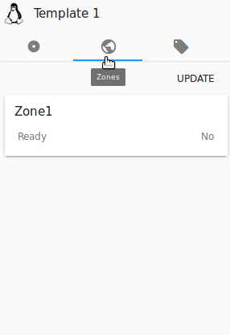

3. Tags tab - Presents the list of tags assigned to the template/ISO.

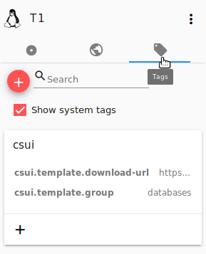

Tags can be system or non-system. System tags are used to provide the functionality from the user interface perspective. Changing these tags affects the functionality of the application. The "Show system tags" checkbox allows to view or hide system tags of the template. Hiding system tags helps to avoid accidental unwanted changes. If a user has disabled displaying of these tags, the system will remember it and next time tags will also be hidden. Uncheck the "Show system tags" checkbox to hide system tags from the list. 

The following system tags can be used for templates/ISOs:

- ``csui.template.group`` - Used to assign a template/ISO to a group.
- ``csui.template.download-url`` - Used for URL, if any provided for the template/ISO.

.. note:: Please, see the `list of tags <https://github.com/bwsw/cloudstack-ui/wiki/Tags>`_ to find system tags that can be used for a template/ISO.

To find the tag you are interested in, please, use the search tool above the tag list. You can enter a name or a part of the tag name to distinguish it in the list.

To add a tag for the template/ISO click "Create" |create icon|. In the appeared form enter:

- Key * 
- Value * 

.. note:: Required fields are marked with an asterisk (*). The values in the fields cannot start with a space.

Click "Create" to assign a new tag to the template/ISO. 

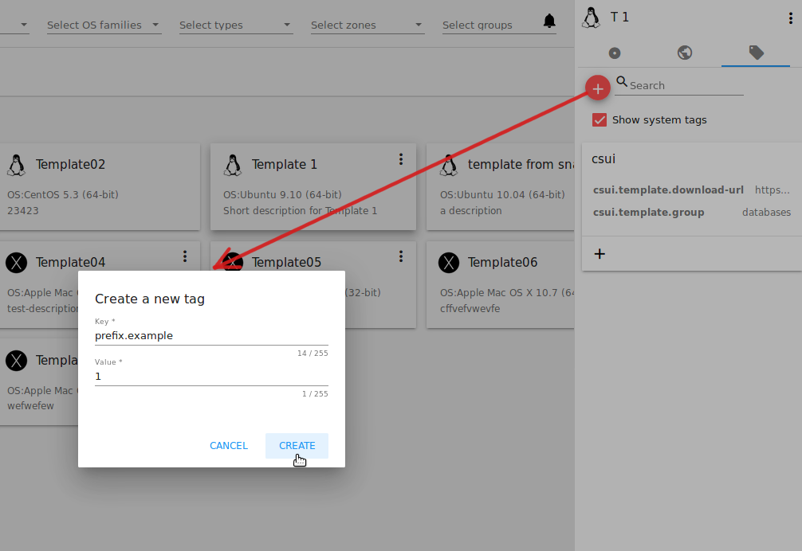

When adding a system tag, click "+" in the card to open the creation form. You will see that the ``csui`` prefix is automatically prepopulated here. 

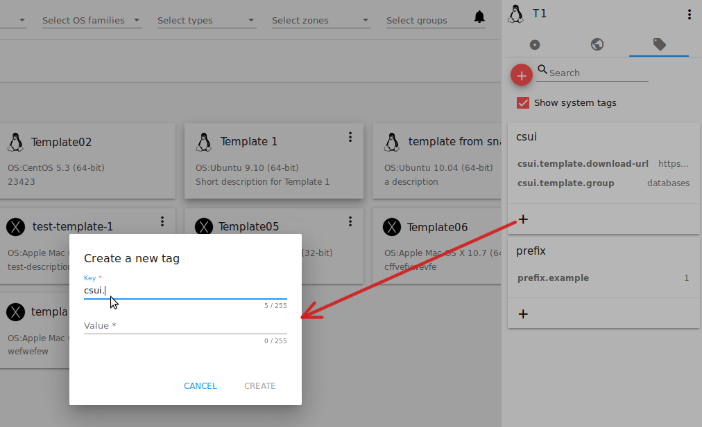

If you create a non-system tag, it will be saved in a new card. If you have entered a key in the format ``<prefix>.<example>``, a card will be named as "<prefix>". When creating a new tag from this card, click "+" in the card and in the tag creation form the *Key* field will be prepopulated with the <prefix>.

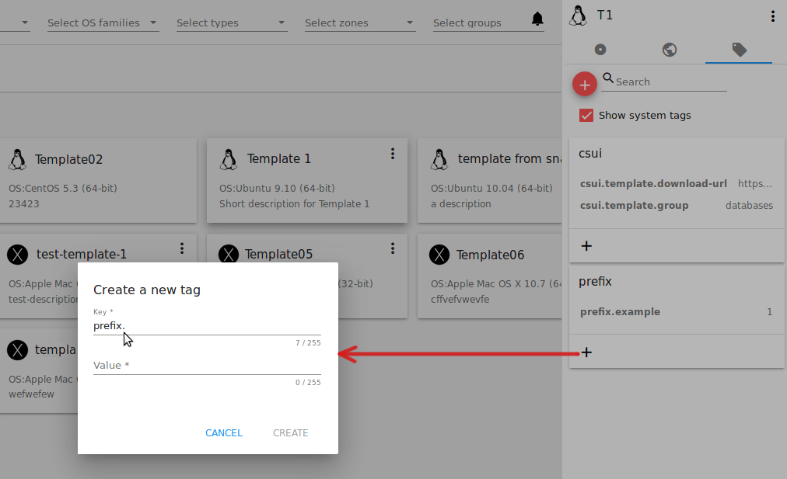

Tags can be edited or/and deleted. Mouse over the tag in the list and see "Edit" and "Delete" buttons.

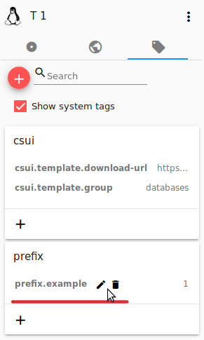

Click "Edit" to change the tag's key or value in the appeared form. Save the edits.

Click "Delete" to delete the tag from the list for this template. Confirm your action in the dialog window. Make sure the tag disappeared from the list of assigned tags.

Template/ISO Action Box
~~~~~~~~~~~~~~~~~~~~~~~~~~~~~~~

By clicking "Actions" |actions icon| you can expand the list of actions for those templates/ISO that are in the account your user belongs to (corresponding to "My" type). The deleting action is available here.

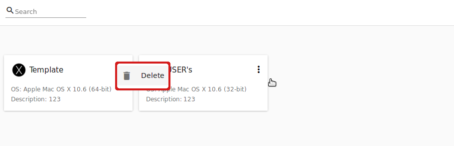

Click "Delete" to delete the template/ISO and then confirm your action in the dialog window. The template/ISO will be deleted. 

Click "Cancel" to close the window without deleting a template/ISO.

.. |bell icon| image:: _static/bell_icon.png
.. |refresh icon| image:: _static/refresh_icon.png
.. |view icon| image:: _static/view_list_icon.png
.. |view box icon| image:: _static/box_icon.png
.. |view| image:: _static/view_icon.png
.. |actions icon| image:: _static/actions_icon.png
.. |edit icon| image:: _static/edit_icon.png
.. |box icon| image:: _static/box_icon.png
.. |create icon| image:: _static/create_icon.png
.. |copy icon| image:: _static/copy_icon.png
.. |color picker| image:: _static/color-picker_icon.png
.. |adv icon| image:: _static/adv_icon.png

