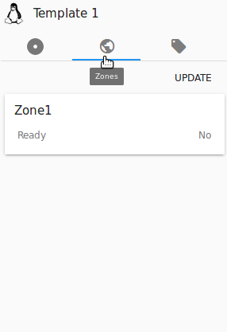
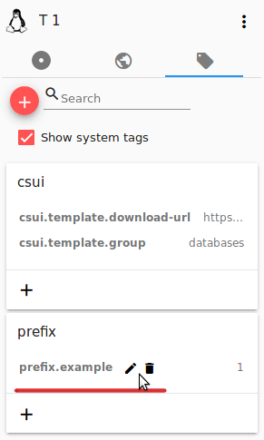
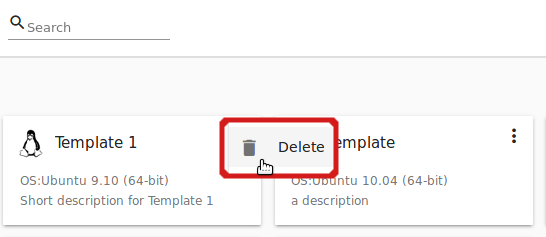
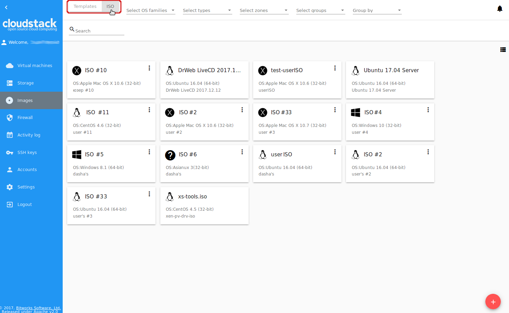
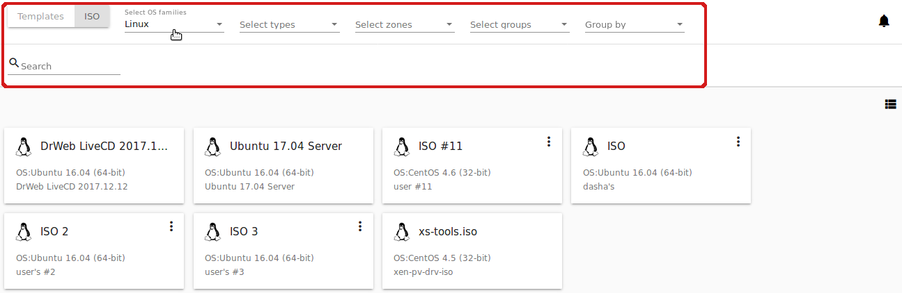
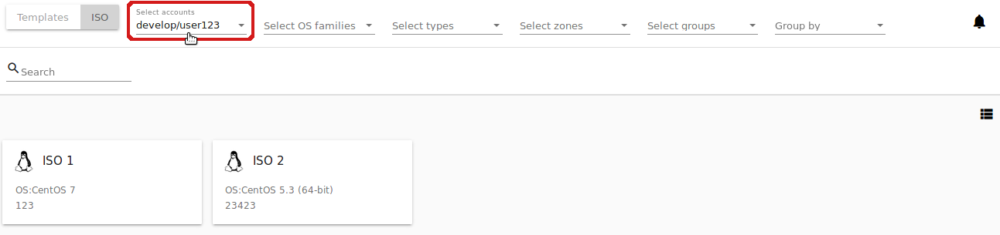
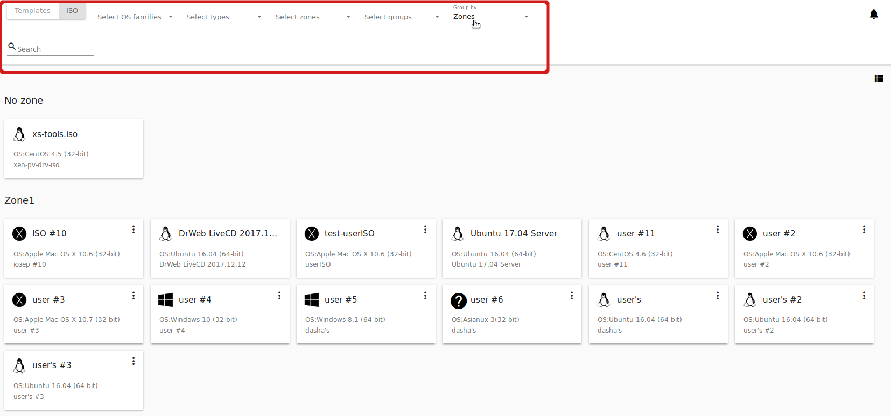
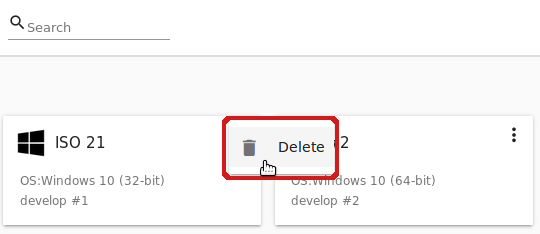

.. _Images:

Images
---------------
.. Contents::

Under the "Images" section you can manage Templates and ISO files that are used as installation sources for VMs.

You can switch from Templates to ISO by selecting a corresponding option above:

.. figure:: _static/Images_TempISO.png

Manage Templates
~~~~~~~~~~~~~~~~~~~~~~~~

A template is a reusable configuration for virtual machines. When users launch VMs, they can choose from a list of templates. Administrators and users can create templates and add them to CloudStack.

There is a variety of ways to add more templates to the system. In the :ref:`VM_Info` section we have described one way of template creation from a VM volume snapshot under the "Storage" tab of the VM information sidebar. From under the :ref:`Storage_Info` sidebar of the "Storage" section you also can create a template on the base of the volume snapshot.

Another way is to create a new template filling in the form under the "Images" section. Read about it the next section.

Existing templates are presented in the list under the "Images" section. A user can see the templates belonging to his/her user only. Domain Administrator can see templates of all users in the domain but cannot perform actions on other users' templates.

You can switch the list view of templates to the box view using the view button |view box icon| in the upper-right corner. 

For each template in the list you can see its name, OS family, description.  Actions button |actions icon| expands the list of actions for it. Actions are available to those templates that belong to your user only (corresponding to "My" type). Administrators can see templates of all users in the domain, but cannot manage them.

Filtering of Templates
""""""""""""""""""""""""""""
The list of templates can be filtered using the filtering tool. The filtering parameters are as follows:

- Accounts (for Domain Administrators);
- OS families;
- Types;
- Zones;
- Groups.

.. figure:: _static/Images_TempList_Admin.png

Besides, adjust the list view using the grouping tool. Templates can be grouped by zones or/and groups.

.. figure:: _static/Images_Temp_Grouping.png

Use the search tool to easily find a template by its name or by a part of the name.

Create Template
""""""""""""""""""""""""""

We have mentioned template creation from a snapshot in the *Storage* tab of the VM details sidebar ( see :ref:`Actions_on_Snapshots`) and from the *Snapshot* tab of the Volume details sidebar (see :ref:`Actions_on_Snapshot_Volume`).

You also can create a new template in the *Images* section by clicking "Create" |create icon| in the bottom-right corner. 

.. figure:: _static/Images_Temp_Create.png

It will open a creation form where you should specify the following information:

1. Name * - Enter a name for the new template.

#. Description * - Provide a short description to have a general idea about the template.

#. URL * - Specify a valid URL to download the template file from. 

#. OS type * - This helps CloudStack and the hypervisor perform certain operations and make assumptions that improve the VM performance. Select from the drop-down list the necessary option, or select "Other" if there is no needed option in the list.

#. Zone * - Choose the zone where you want the template to be available.

#. Group - Select a group from the drop-down list.

#. Password enabled checkbox - Tick this option if your template has the CloudStack password change script installed. That means the VM created on the base of this template will be accessed by a password, and this password can be reset.

#. Dynamically scalable checkbox - Tick this option if the template contains XS/VM Ware tools to support dynamic scaling of VM CPU/memory.

.. note:: Required fields are marked with an asterisk (*).

9. "Show additional fields" allows expanding the form and set more settings:

   - Hypervisor - Select a hypervisor from the drop-down list.

   - Format - The format of the template upload file, e.g. VHD or RAW or VMDK.

   - Extractable - Tick this option if the template is available for extraction. If this option is selected, end-users can download a full image of a template.

   - Requires HVM - Tick this option for creating a template that requires HVM.

Once all fields are filled in, click "Create" to create the template with these settings. The created template will appear in the list.

Click "Cancel" to close the form without template creation. All fields will be cleared.

Template Details Sidebar
"""""""""""""""""""""""""""

The information on each template is presented in the right-side bar. It is opened by clicking the template card or line in the list. The information is presented here in 3 tabs. Above the tabs you can see the template general information: 

- Name - Template name and symbol, 
- Actions button - Actions list (Delete). 

.. figure:: _static/Images_Temp_Details.png

1. Template tab: 

   - Description - Template description provided at its creation. 
   - OS - The OS selected for this template. 
   - General Information - The settings saved for this template: size, creation date, type, hypervisor, other settings. 
   - URL - The URL provided for this template. Next to it you can see the "Copy" icon |copy icon|. Click it to copy the URL to clipboard and then paste it in the address line.
   - Group - Template group. Edit the group by clicking the "Edit" button "|edit icon|. Choose an existing group in the appeared window and click "Assign" to assign the selected group to the template.

2. Zones tab - Shows the zone where the template is available. 

3. Tags tab - Presents the list of tags assigned to the template.

.. figure:: _static/Images_Details_Tags.png

Tags can be system or non-system. System tags are used to provide the functionality from the user interface perspective. Changing these tags affects functionality of the application. The "Show system tags" checkbox allows to view or hide system tags of the template. Hiding system tags helps to avoid accidental unwanted changes. If a user has disabled displaying of these tags, the system will remember it and next time tags will also be hidden. Uncheck the "Show system tags" checkbox to hide system tags from the list.  

.. note:: Please, see the `list of tags <https://github.com/bwsw/cloudstack-ui/wiki/Tags>`_ to find system tags that can be used for a template.

To find the tag you are interested in, please, use the search tool above the tag list. You can enter a name or a part of the tag name to distinguish it in the list.

To add a tag for the template click "Create" |create icon|. In the appeared form enter:

- Key * 
- Value * 

.. note:: Required fields are marked with an asterisk (*).

Click "Create" to assign a new tag to the template. 

.. figure:: _static/Images_TagCreate.png

When adding a system tag, click "+" in the card to open the creation form. You will see that the ``csui`` prefix is automatically prepopulated here. 

If you create a non-system tag, it will be saved in a new card. If you have entered a key in the format ``<prefix>.<example>``, a card will be named as "<prefix>". When creating a new tag from this card, click "+" in the card and in the tag creation form the *Key* field will be prepopulated with the <prefix>.

Tags can be edited or/and deleted. Mouse over the tag in the list and see "Edit" and "Delete" buttons.

Click "Edit" to change the tag's key or value in the appeared form. Save the edits.

Click "Delete" to delete the tag from the list for this template. Confirm your action in the dialogue window. Make sure the tag disappeared from the list of assigned tags.

Template Action Box
"""""""""""""""""""""""""""""
By clicking "Actions" |actions icon| you can expand the list of actions for those templates that belong to your user only (corresponding to "My" type). Deleting action is available here.

Click "Delete" to delete the template and then confirm your action in the dialogue window. The template will be deleted. Click "Cancel" to close the window without deleting a template.

Manage ISO
~~~~~~~~~~~~~~~~~~~~~

ISO files are another installation source for virtual machines. 

Existing ISO files are presented in the list under the "Images" section. Switch the list from *Templates* to *ISO* in the filtering panel above.

A user can see the ISO files belonging to his/her user only. Domain Administrators can see ISO files of all users in the domain but cannot perform actions on other users' ISO files.

You can switch the list view of ISO files to the box view using the view button |view box icon| in the upper-right corner. 

For each ISO file in the list you can see its name, OS family, description. Actions button |actions icon| expands the list of actions for it. Actions are available to those ISO files that belong to your user only (corresponding to "My" type). Administrators can see ISO files of all users in the domain but cannot manage them.

Filtering of ISOs
""""""""""""""""""""""""""""
The list of ISOs can be filtered using the filtering tool. The filtering parameters are as follows:

- OS families;
- Types;
- Zones;
- Groups.

Administrators can filter the list by accounts:

Besides, adjust the list view using the grouping tool. ISOs can be grouped by zones or/and groups.

Use the search tool to easily find a template by its name or by a part of the name.

Create an ISO file
"""""""""""""""""""

You can create a new ISO file in the *Images* section by clicking "Create" |create icon| in the bottom-right corner. 

.. figure:: _static/Images_CreateISO.png

It will open a creation form where you should specify the following information:

1. Name * - Enter a name for the new ISO file.

#. Description * - Provide a short description to have a general idea about the ISO file.

#. URL * - Specify a valid URL to download the ISO file from. 

#. OS type * - This helps CloudStack and the hypervisor perform certain operations and make assumptions that improve the VM performance. Select from the drop-down list the necessary option, or select "Other" if there is no needed option in the list.

#. Zone * - Choose the zone where you want the ISO file to be available.

#. Group - Select a group from the drop-down list.

.. note:: Required fields are marked with an asterisk (*).

7. "Show additional fields" allows expanding the form and set more settings:

   - Extractable - Tick this option if the ISO file is available for extraction. If this option is selected, end-users can download a full image of an ISO file.

   - Bootable - Tick this option to indicate whether the machine can be booted using this ISO.

Once all fields are filled in, click "Create" to create the ISO file with these settings. The created ISO file will appear in the list.

Click "Cancel" to close the form without ISO creation. All fields will be cleared.

The created ISO will appear in the list.

ISO Details Sidebar
"""""""""""""""""""""""""

The information on each ISO file is presented in the right-side bar. It is opened by clicking the ISO card or line in the list. 

.. figure:: _static/Images_ISO_Details.png

The information is presented here in 3 tabs. Above the tabs you can see the ISO general information: 

- Name - ISO name and symbol. 
- Actions button - Actions list (Delete). Actions are not available for those ISO files that your user is not permitted to manage within the account.

1. ISO tab: 

    - Description - ISO description provided at its creation. 
    - OS family - The OS selected for this ISO. 
    - General Information - The settings saved for this ISO: size, creation date, other settings. 
    - URL - The URL provided for this ISO. Next to it you can see the "Copy" icon |copy icon|. Click it to copy the URL to clipboard and then paste it in the address line.
    - Group - ISO group. Edit the group by clicking the "Edit" button "|edit icon|. Choose an existing group in the appeared window and click "Assign" to assign the selected group to the ISO.

2. Zones tab - Shows the zone where the ISO is available.

.. figure:: _static/Images_ISO_Details_Zone.png

3. Tags tab - Presents the list of tags assigned to the ISO.

.. figure:: _static/Images_Details_Tags.png

Tags can be system or non-system. System tags are used to provide functionality from the user interface perspective. Changing these tags affects the functionality of the application. The "Show system tags" checkbox allows to view or hide system tags of the template. Hiding system tags helps to avoid accidental unwanted changes. If a user has disabled displaying of these tags, the system will remember it and next time tags will also be hidden. Uncheck the "Show system tags" checkbox to hide system tags from the list.  

.. note:: Please, see the `list of tags <https://github.com/bwsw/cloudstack-ui/wiki/Tags>`_ to see the full list of system tags that can be used for an ISO.

To find the tag you are interested in, please, use the search tool above the tag list. You can enter a name or a part of the tag name to distinguish it in the list.

To add a tag for the ISO click "Create" |create icon|. In the appeared form enter:

- Key * 
- Value * 

.. note:: Required fields are marked with an asterisk (*).

Click "Create" to assign a new tag to the ISO. 

.. figure:: _static/Images_TagCreate.png

When adding a system tag, click "+" in the card to open the creation form. You will see that the ``csui.`` prefix is automatically prepopulated here. 

If you create a non-system tag, it will be saved in a new card. If you have entered a key in the format ``<prefix>.<example>``, a card will be named as "<prefix>". When creating a new tag from this card, click "+" in the card and in the tag creation form the *Key* field will be prepopulated with the <prefix>.

Tags can be edited or/and deleted. Mouse over the tag in the list and see "Edit" and "Delete" buttons.

Click "Edit" to change the tag's key or value in the appeared form. Save the edits.

Click "Delete" to delete the tag from the list for this ISO. Confirm your action in the dialogue window. Make sure the tag disappeared from the list of assigned tags.

ISO Actions Box
""""""""""""""""""""""""
By clicking "Actions" |actions icon| you can expand the list of actions for those ISO files that belong to your user only (corresponding to "My" type). Deleting action is available here.

Click "Delete" to delete the ISO and then confirm your action in the dialogue window. The ISO will be deleted. Click "Cancel" to close the window without deleting an ISO.

.. |bell icon| image:: _static/bell_icon.png
.. |refresh icon| image:: _static/refresh_icon.png
.. |view icon| image:: _static/view_list_icon.png
.. |view box icon| image:: _static/box_icon.png
.. |view| image:: _static/view_icon.png
.. |actions icon| image:: _static/actions_icon.png
.. |edit icon| image:: _static/edit_icon.png
.. |box icon| image:: _static/box_icon.png
.. |create icon| image:: _static/create_icon.png
.. |copy icon| image:: _static/copy_icon.png
.. |color picker| image:: _static/color-picker_icon.png
.. |adv icon| image:: _static/adv_icon.png

