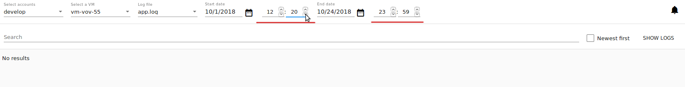
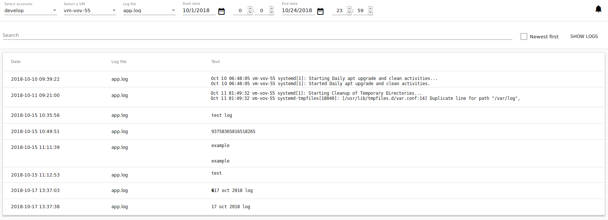
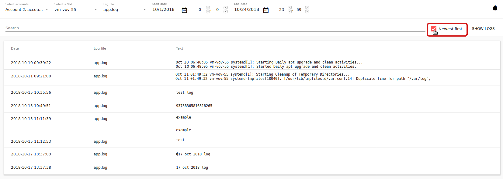
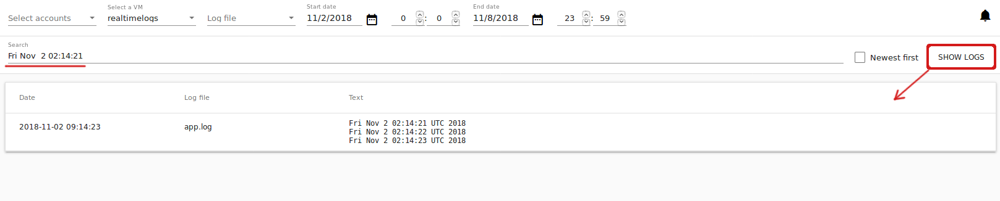
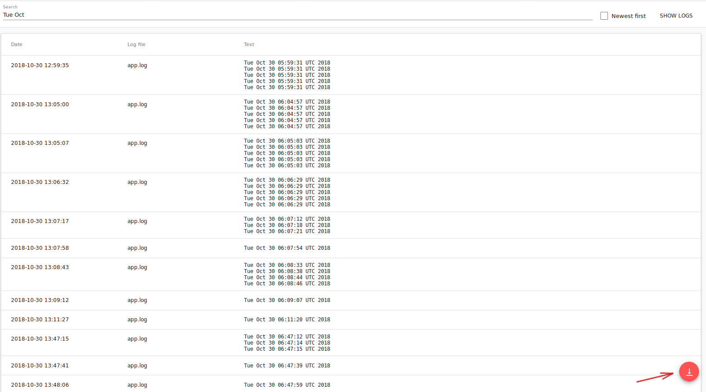
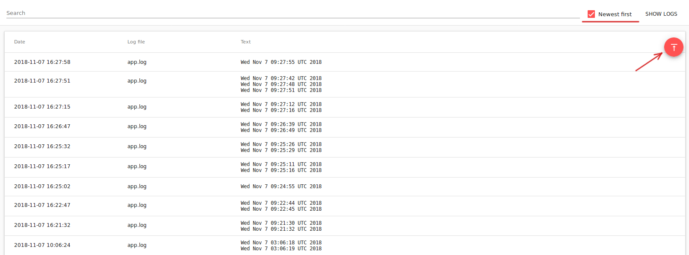
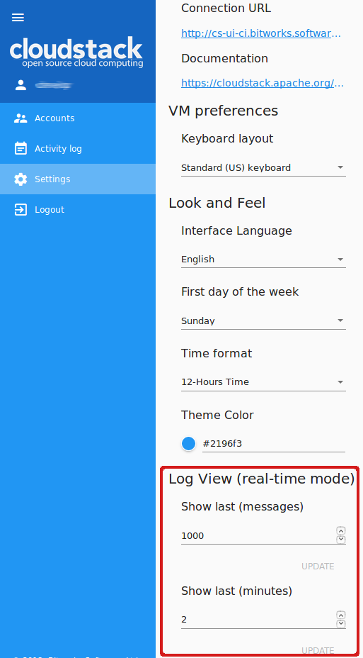

.. _Log_View:

Log View Plugin
===================

.. Contents::

Overview
----------------

In the *Virtual Machines*-*View Logs* section a user can see VM logs. This section appears if the UI-plugin - Log View - is activated. This UI-plugin works together with the backend API plugin developed to process and view virtual machine logs which are handled by ELK and delivered to the storage by Filebeat. The version of the backend API plugin matches Apache CloudStack version that it is built for. The plugin is tested with Apache CloudStack 4.11.2.0.

To make the *View logs* section available, first deploy the backend API plugin and then activate the Log View UI-plugin via the ``config.json`` file. See deployment instructions below.

Deployment Instructions
-------------------------

Full instructions on the Log View plugin deployment is presented at the `plugin page <https://github.com/bwsw/cloudstack-ui/wiki/Log-View-Plugin>`_. 

To enable the Log View plugin you need to:

1. Install the backend API plugin into CloudStack.
2. Deploy the necessary components: ElasticSearch, Filebeat, Logstash, Curator.
3. Enable the UI extension via the ``config.json`` file.

View Logs 
-------------------------

After successful deployment you can see the *View logs* section under the *Virtual Machines* menu in UI. In this section you can view the log files for a defined period of time or in a real-time mode. To view logs you should specify an account (for Administrators), a VM for which you wish to see the logs, and a log file to view the logs from. More details are provided below.

Filtering Logs
'''''''''''''''''''''''''
To view logs in the list, please, set up the filtering parameters.

Select the following parameters in the provided order from drop-down lists:

.. note:: Required fields are marked with an asterisk (*).

- Accounts * - Allows Administrators to further select a VM in a specific account/accounts. Select an account or a number of accounts in the drop-down list.

- VM * - Allows selecting logs for a specific VM. Choose a machine you wish in the drop-down list. The list of available VMs is determined by the account(s) selected at the previous step, if you are an Administrator. If you are a user, you can see the machines belonging to your user only.
 
- Log file - Allows viewing logs by a log file available for the selected VM. Choose a log file in the drop-down list. If no log file selected, all machine logs will display in the list.

- Date * - Allows selecting logs for a specific period. Click |date icon| and in the appeared calendar choose the start and end dates to see the logs for. By default, the system shows logs for the last day.

.. figure:: _static/Logs_Datepicker.png 

- Time - Allows filtering logs for a specific time period within the selected dates. The time format is determined by the time format setting specified under the "Settings" section.  Enter start and end time you wish into the fields to set a custom time period. 

Click "Show logs" to implement the filtering settings. 

The logs will be displayed in accordance with the chosen period.

You can change filtering parameters and refresh the list of logs by clicking "SHOW LOGS".

The set filtering parameters are saved to user tags. That means, if you log out of the system and then login again, you will continue to view logs with the previously set filtering parameters.

View Logs List
''''''''''''''''''''''''
By clicking "SHOW LOGS", a user can view log files corresponding to the filtering parameters. Logs are listed in a chronological order from the earliest till the latest. 

By default, the system shows logs for the last day. 

A user can view logs for his/her VMs only. An Administrator can see logs for all accounts in the domain. 

The following information for each log file is presented in the list:

- Date
- File 
- Text

You can change filtering parameters and refresh the list of logs by clicking "SHOW LOGS".

Sorting Logs
~~~~~~~~~~~~~~~~~~~~~~
The sorting tool allows viewing the newest logs first in the list. Enable the checkbox to the right and click on "Show logs" to refresh the list.

Searching Logs
~~~~~~~~~~~~~~~~~~~~~~~~~
Use the search tool to find logs by a word or a text. Enter the text in the search field above the list and click on "Show logs" to refresh the list.

Following Logs
'''''''''''''''''''''''''
After setting filtering parameters and clicking "Show logs", a user can start following logs, in other words, start monitoring logs online.

When the "Follow logs" option is activated, the Log View UI-plugin sends requests to get the latest logs with the defined frequency and for a period, defined in the configuration file. By default, once per 1 second the system requests logs for the last 30 seconds. A user can customize these parameters via the configuration file (see `details <https://github.com/bwsw/cloudstack-ui/blob/master/config-guide.md#log-view-plugin>`_).

To view logs in a real time-mode, click "Follow logs" |follow icon|. This button is available right after selecting a virtual machine in the filtering parameters or after setting all necessary filtering parameters and clicking "Show logs". You will see the filtering options are got disabled and the log list is automatically getting refreshed per every second. 

The "Follow logs" button changes its position depending on the applied sorting mode. If the "Newest first" option is disabled the button stands in the bottom-right corner, like at the screenshot above. If "Newest first" is enabled, the button goes to the upper-right corner and the latest logs will be displayed at the top of the list.

By default, the list contains up to 1000 log records showing logs for the last minute.

If too many entries are to be displayed in the list, the system loads them by parts when a user scrolls the list down.

You can set up parameters of log following in the "Log View Plugin Settings" section:

- **Show last (minutes)** - allows viewing logs for the last set period. You can set the number of minutes from 1 (default) to 10.
- **Show last (messages)** - allows setting a maximum amount of logs to display. You can set from 1 to any number of log records. By default, 1000 messages are shown.

Click "Update" to apply the settings.

To stop following logs click on |unfollow icon|.

.. |bell icon| image:: _static/bell_icon.png
.. |refresh icon| image:: _static/refresh_icon.png
.. |view icon| image:: _static/view_list_icon.png
.. |view| image:: _static/view_icon.png
.. |actions icon| image:: _static/actions_icon.png
.. |edit icon| image:: _static/edit_icon.png
.. |box icon| image:: _static/box_icon.png
.. |create icon| image:: _static/create_icon.png
.. |copy icon| image:: _static/copy_icon.png
.. |color picker| image:: _static/color-picker_icon.png
.. |adv icon| image:: _static/adv_icon.png
.. |date icon| image:: _static/date_icon.png
.. |remove icon| image:: _static/remove_icon.png

