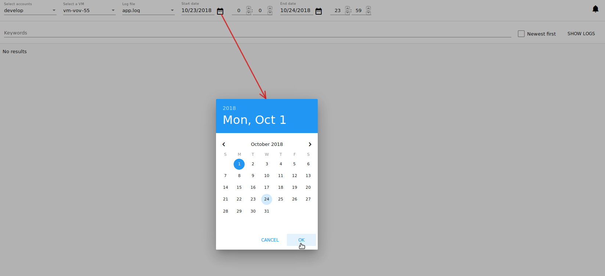
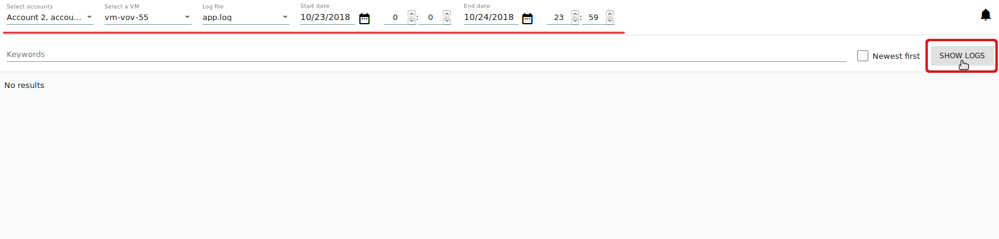
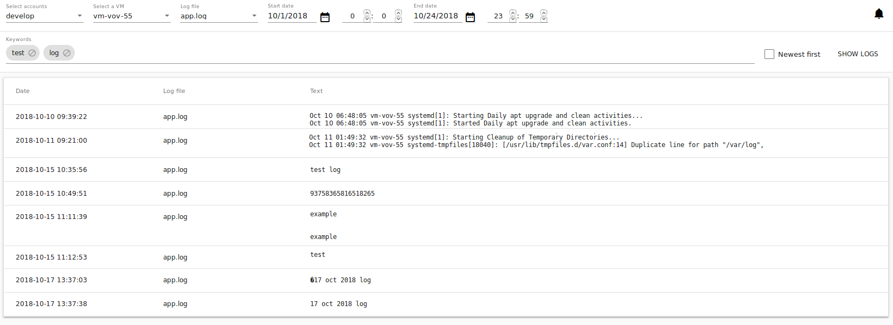
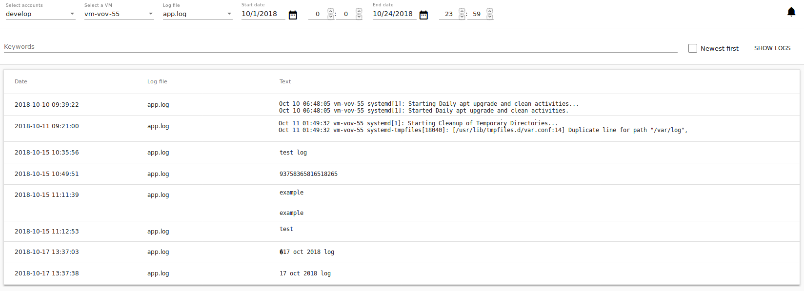

.. _Log_View:

View Logs Plugin
===================

.. warning:: The section is under development!

.. Contents::

Overview
----------------

In the *Virtual Machines*-*View Logs* section a user can see VM logs. This is a UI for the API plugin our team has developed to process and view virtual machine logs which are handled by ELK and delivered by Filebeat. The version of the plugin matches Apache CloudStack version that it is built for. The plugin is developed and tested only with Apache CloudStack 4.11.1
 
Under this UI section you can select the log files to display by setting up main parameters - a virtual machine and a date for which a user wishes to see the logs. Optionally, you can specify a time period and keywords to filter the log files.

To make the *View logs* section available, first deploy the View Logs plugin and then activate it via the ```config.json``` file. 

Deployment Instructions
-------------------------

Full instructions on the View Logs plugin deployment is presented at the `plugin page <https://github.com/bwsw/cloudstack-ui/wiki/View-Logs-Plugin>`_. 

To enable the View Logs plugin you need to:

1. Install the plugin into CloudStack.
2. Deploy necessary components: ElasticSearch, Filebeat, Logstash, Curator.
3. Enable the extension via the ```config.json``` file.

View Logs UI
-------------------------

After successful deployment you can see the *View logs* section under the *Virtual Machines* menu in UI. In this section you can view the log files and sort the logs by keywords. To view logs you should specify an account (for Administrators), a VM for which you wish to see the logs, and a log file to view the logs from. More details are provided below.

Filtering of Logs
-----------------------
To view logs in the list, please, set up the filtering parameters.

Select the following parameters in the provided order from drop-down lists:

- Accounts * - Allows Administrators to further select a VM in a specific account/accounts. Select in the drop-down list an account or a number of accounts.

- VM * - Allows selecting logs for a specific VM. Choose a VM you wish in the drop-down list. The list of available VMs is determined by the account(s) selected at the previous step, if you are an Administrator. If you are a user, you can see the machines belonging to your user only.
 
- Log file * - Allows viewing logs by a log file available for the selected VM. Choose a log file in the drop-down list.

- Date - Allows selecting logs for a specific period. Click |date icon| and in the appeared calendar choose the start and end dates to see the logs for. By default, the system shows logs for the last day.



- Time - Allows selecting logs for a specific time period within the selected dates. By default, the current time is active for start and end time. Enter start and end time in the fields to set a custom time period. 


Click "Show logs" to implement the filtering settings. 



The logs will be displayed in accordance with the chosen period.

You can change filtering parameters and refresh the list of logs by clicking "SHOW LOGS".

Sorting of Logs
---------------------------
The sorting tool allows viewing the newest logs first in the list. Enable the checkbox to the right.


Use the search tool to find logs by keywords. Enter keywords one by one delimiting them by a space or by pushing "Enter".



To delete any word in the list click |remove icon| next to it.

View Logs List
--------------------------
By clicking "SHOW LOGS", a user can view log files corresponding to the filtering parameters. Logs in the *View Logs* are listed in a chronological order from the earliest till the latest. 

By default, the system shows logs for the last day. 

A user can view logs for his/her VMs only. An Administrator can see logs for all accounts in the domain. 



The following information for each log file is presented in the list:

- Date
- File 
- Text

You can change filtering parameters and refresh the list of logs by clicking "SHOW LOGS".

.. Refresh the List of Logs - To update the list of logs click "Refresh" to see the latest logs for the selected filtering parameters.

.. Follow Logs
.. """"""""""""""""""

.. After setting filtering parameters and clicking "Show logs", a user can set up log tracing, that is monitoring the logs online.

.. Click "Follow logs", you will see the list is getting refreshed every minute automatically.

.. By default, the list contains up to 1000 log records showing logs for the last minute.

.. You can set parameters of log tracing in the "Log View Plugin Settings" section:

.. - set the number of minutes from 1 (default) to 10.
.. - set the number of log records (up to 1000).

.. |bell icon| image:: _static/bell_icon.png
.. |refresh icon| image:: _static/refresh_icon.png
.. |view icon| image:: _static/view_list_icon.png
.. |view| image:: _static/view_icon.png
.. |actions icon| image:: _static/actions_icon.png
.. |edit icon| image:: _static/edit_icon.png
.. |box icon| image:: _static/box_icon.png
.. |create icon| image:: _static/create_icon.png
.. |copy icon| image:: _static/copy_icon.png
.. |color picker| image:: _static/color-picker_icon.png
.. |adv icon| image:: _static/adv_icon.png
.. |date icon| image:: _static/date_icon.png


