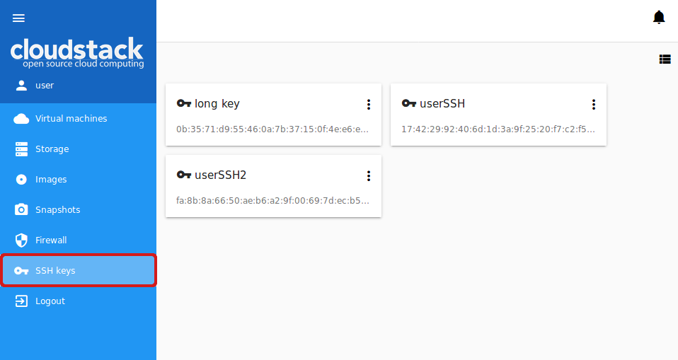
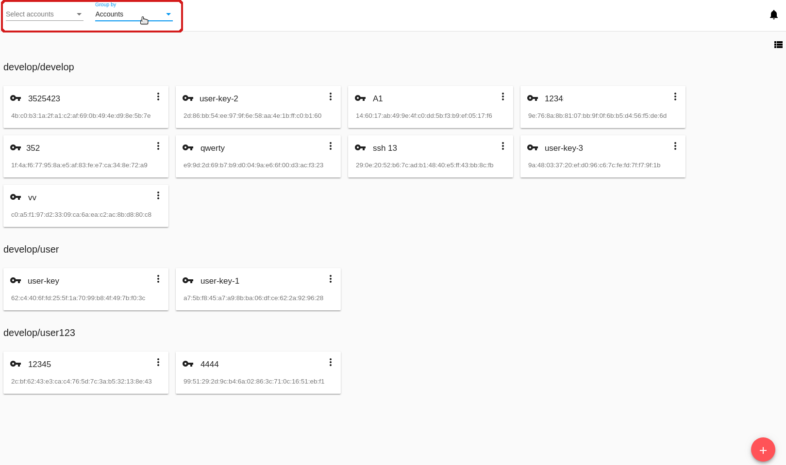
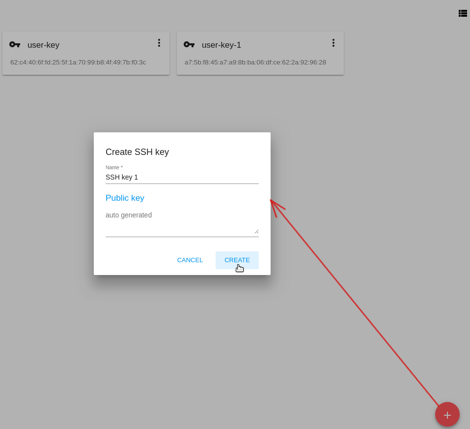
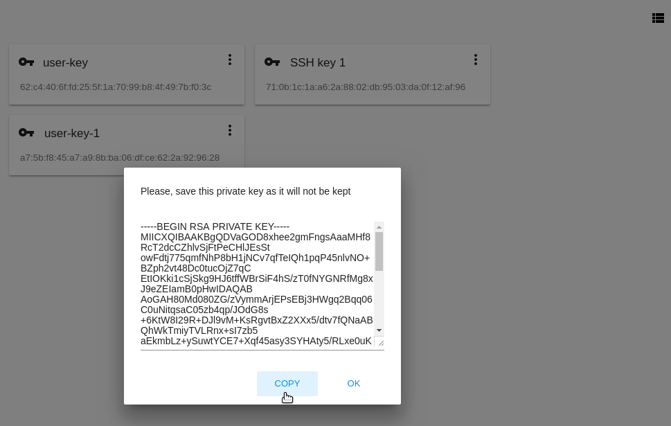
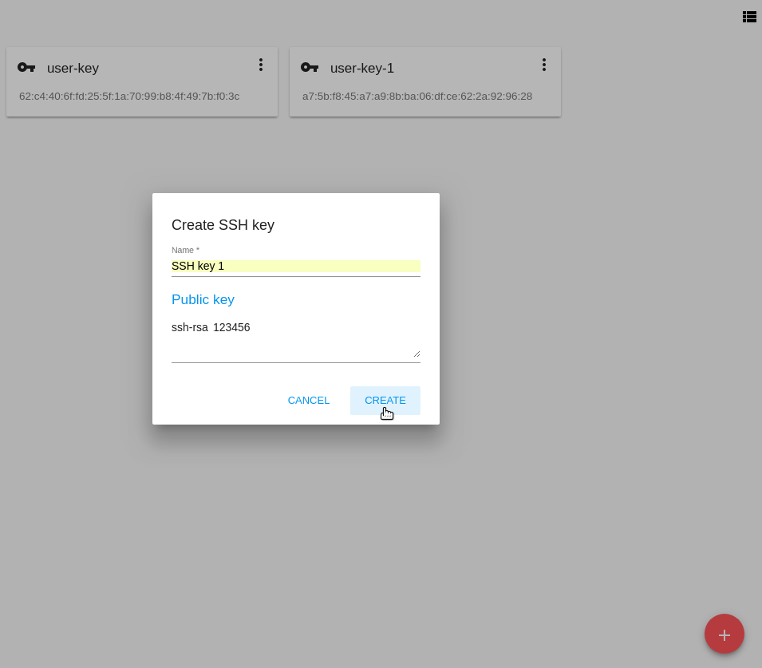
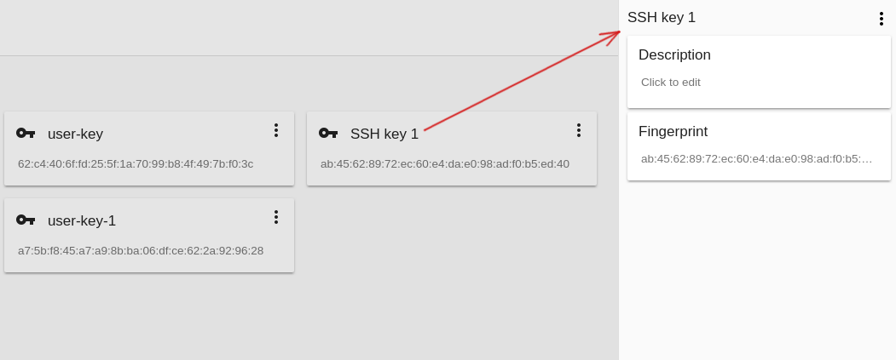
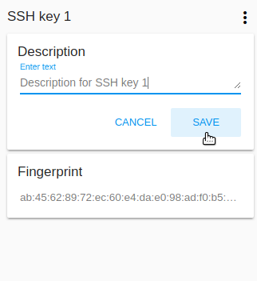
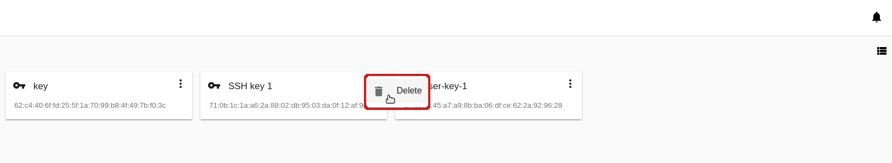

.. _SSH_Keys:

SSH Keys
-----------------
.. Contents::

In the *Virtual Machines* -> *SSH keys* section you can create and manage SSH keys. 

In addition to the username and password authentication, CloudStack supports using SSH keys to log in to the cloud infrastructure for additional security. Find more information in the `official documentation <http://docs.cloudstack.apache.org/projects/cloudstack-administration/en/latest/virtual_machines.html?highlight=keys#using-ssh-keys-for-authentication>`_.

CloudStack-UI allows managing SSH key in a separate section which is more convenient for a user.

SSH Key List
~~~~~~~~~~~~~~~~

SSH keys existing in the account are presented in this section. A user can see and manage SSH keys for his/her user only. 

Administrators can see and manage keys for all accounts in the domain.

You can switch the view from a list mode to a card mode using the switch tool |view icon|/|box icon| in the upper-right corner.

For every key the following information is displayed:

- Key name;  
- SSH public key;
- Action box - Allows deleting a key from the system.

Filtering of SSH Keys
"""""""""""""""""""""""""

The filtering tool is available to Administrators. It is placed above the list of keys and allows filtering keys by accounts.

Besides, the keys can be grouped by accounts that may be convenient for list viewing.

Create an SSH Key
~~~~~~~~~~~~~~~~~
You can generate a new SSH key to use for authentication.

By clicking “Create” |create icon| in the bottom-right corner you will open a form where you should specify a key name:

Then click “CREATE”. The SSH key will be auto-generated. The public key will appear in the list of SSH keys with a fingerprint. In the modal window, you will see the private key. This private key is not saved in the system. You should save it for yourself. Click "COPY" to correctly copy it and save it locally.

Then click “OK” to close the window. 

You can specify an SSH public key entering its value in the field. It should start from ``ssh-rsa`` followed by one space and at least one symbol. Then click “CREATE”. The key will be saved. No private key is required in this case.

The created SSH key is available to assign to VMs now.

SSH Key Details Sidebar
~~~~~~~~~~~~~~~~~~~~~~~~~

By clicking an SSH key in the list you will open a details sidebar to the right. 

It contains the following information:

- SSH key name;
- Key action box allowing key deleting;
- SSH public key fingerprint;
- SSH key description - In this block a description can be added to understand better what this key is for. Click the block and enter a short description in the text field. Then click "SAVE" to save it.

Click "CANCEL" to drop adding a description.

You can edit the description of an SSH key by clicking |edit icon|. Change the existing description in the text field and save the edits. The description is saved to account tags.

SSH Key Action Box
~~~~~~~~~~~~~~~~~~~~
By clicking "Actions" |actions icon| you can expand the list of actions for those SSH keys that belong to your user only. The deleting action is available here.

Click "Delete" to delete a key and then confirm your action in the dialog box. The key will be deleted. Click "Cancel" to close the window without deleting a key.

.. |bell icon| image:: _static/bell_icon.png
.. |refresh icon| image:: _static/refresh_icon.png
.. |view icon| image:: _static/view_list_icon.png
.. |view| image:: _static/view_icon.png
.. |actions icon| image:: _static/actions_icon.png
.. |edit icon| image:: _static/edit_icon.png
.. |box icon| image:: _static/box_icon.png
.. |create icon| image:: _static/create_icon.png
.. |copy icon| image:: _static/copy_icon.png
.. |color picker| image:: _static/color-picker_icon.png
.. |adv icon| image:: _static/adv_icon.png

