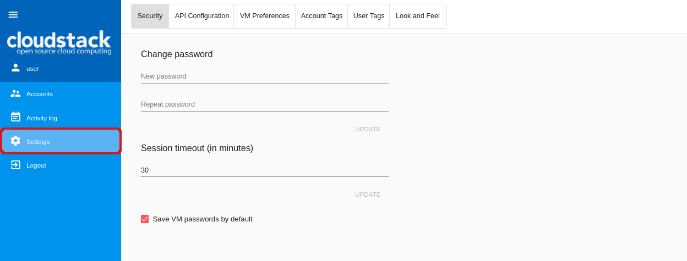
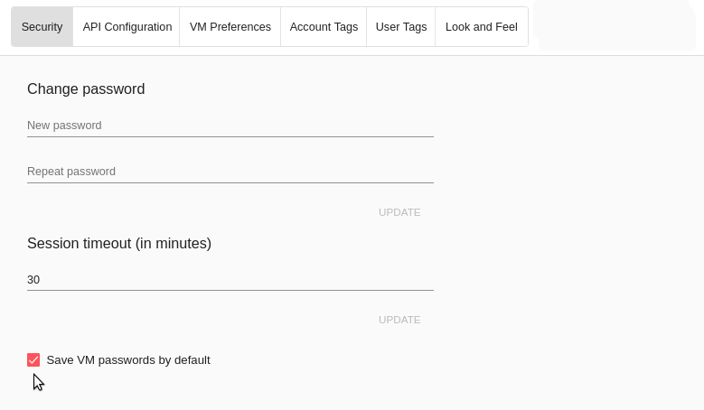
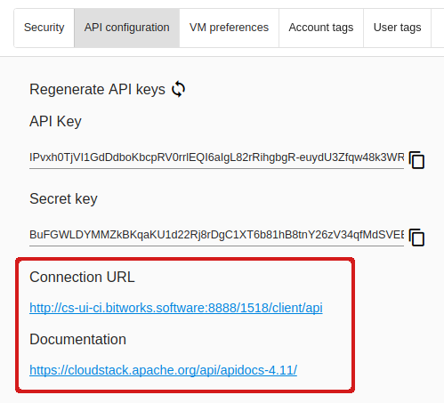
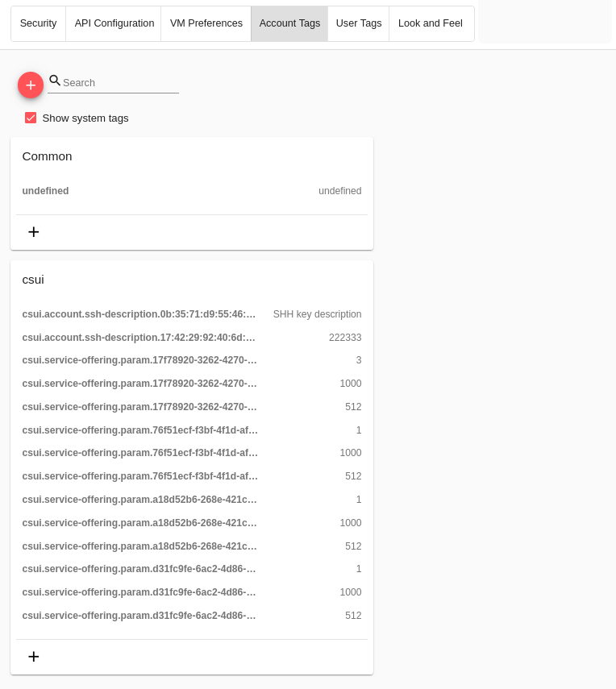
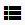

.. _Settings:

Settings
-------------
.. Contents::

In the *Accounts* -> *Settings* section a user can modify the interface by changing settings. The interface settings are presented in separate sections: *Security, API configurations, VM preferences, Look and Feel*. Moving between sections is possible using the switcher above.

   
Security
~~~~~~~~~~~~~~~~~~
In this section a user can manage the following security settings:

- Change password;
- Set the session timeout interval;
- the "Save VM passwords by default" option.

Change Password
""""""""""""""""""
Here you can change the password provided by your Administrator to the one you like. This will improve the account security.

Enter a new password and re-enter it in the next field to confirm it:

.. figure:: _static/Settings_EditPass.png

Click "UPDATE" to save the new password.

In case you have lost or forgotten your password, contact your Administrator.

Session Timeout
"""""""""""""""""""

Here you can specify the maximum amount of time that an active session can be idle (without user activity) before it automatically closes. The default interval is 30 minutes. 

Set the desired time limit in minutes using the switch button |switch icon| to the right or typing it just into the field. Then click "UPDATE" to save the changes.

The value is stored in user’s tags.

The maximum allowed value is 300 minutes. Please, note that a long time period of an idle session decreases the account security.

The session timeout can be set in the configuration file. You will find more information in the  `configuration guide <https://github.com/bwsw/cloudstack-ui/blob/master/config-guide.md#session-timeout>`_.

.. _Settings_VMPass:

Save VM passwords by default
"""""""""""""""""""""""""""""""
This checkbox allows saving passwords to VM tags automatically for all created virtual machines requiring passwords.

Tick this option here. The passwords will be saved to VM tags right at the moment VMs are created. You will see a password (if it is required for the VM) is marked as saved in a dialog window after the new VM is deployed:

.. figure:: _static/VMs_Create_Dialogue_SavedPass.png

If this option is not activated, every time when creating a machine the system will ask you to save the password by clicking "SAVE" next to it:

.. figure:: _static/VMs_Create_Dialogue_SavePass.png

Then the system will ask you if you wish to save passwords to VM tags automatically. If you click "Yes", the "Save VM passwords by default" option will be activated in *Settings*. You will find more information about VM creation in the :ref:`Create_VM` section.

API Configuration
~~~~~~~~~~~~~~~~~~~~

In this block of settings you can see and manage the API configurations: regenerate API keys, see the connection URL, get the link to the Apache CloudStack API documentation.

For users with no API keys, the system autogenerates the keys when a user logs in if this option is enabled in the configuration file. Find more information in `the configuration guide <https://github.com/bwsw/cloudstack-ui/blob/master/config-guide.md#automatically-generate-secret-key-and-api-key-for-users>`_. 

You can see an API key and a Secret key in corresponding fields. You can copy any of them clicking |copy icon| to the right. 

Regenerate the keys by clicking |refresh icon| above the fields. New keys will be generated.

Below you can view a connection URL which is used to send requests to CloudStack API. All requests are listed in the Apache CloudStack documentation available by the link.

VM preferences
~~~~~~~~~~~~~~~~~~~~~~~~
In this block you may set up the keyboard layout.

Keyboard layout
""""""""""""""""""""
Select a keyboard layout in the drop-down list.

The following options are available:

- Standard US keyboard (default value)
- UK keyboard
- Japanese keyboard
- Simplified Chinese keyboard.

.. figure:: _static/Settings_KeyboardLayout1.png

The selected option will appear in the VNC console kayboard layout parameter when accessing a VM via concole. The selected option is also saved to user tags.

Account tags
~~~~~~~~~~~~~~~~~~~~~~
In this section, you can view and manage account tags. 

Tags can be system or non-system. System tags are used to provide the functionality from the user interface perspective. Changing these tags affects the functionality of the application. The “Show system tags” checkbox allows to view or hide system tags of an account. Hiding system tags helps to avoid accidental unwanted changes. If a user has disabled displaying of such tags, the system will remember it and next time tags will also be hidden. Uncheck the “Show system tags” checkbox to hide system tags from the list.

The following system tags can be used for accounts:

* ``csui.account.ssh-description`` - Used to provide an SSH description. 
 
To find the tag you are interested in, please, use the search tool above the tag list. You can enter a name or a part of the tag name to distinguish it in the list.

To add an account tag click “Create” |create icon|. In the appeared form enter:

* Key *
* Value *

.. note:: Required fields are marked with an asterisk (*). The values in the fields cannot start with a space.

Click “Create” to assign a new tag to the account.

User tags
~~~~~~~~~~~~~~~~~~~~~~

In this section, you can view and manage user tags. 

Tags can be system or non-system. System tags are used to provide the functionality from the user interface perspective. Changing these tags affects the functionality of the application. The “Show system tags” checkbox allows to view or hide system tags of a user. Hiding system tags helps to avoid accidental unwanted changes. If a user has disabled displaying of such tags, the system will remember it and next time tags will also be hidden. Uncheck the “Show system tags” checkbox to hide system tags from the list.

User system tags has the format of ``csui.user.<tag_name>``. You can view a full list of user tags at the `wiki-page <https://github.com/bwsw/cloudstack-ui/wiki/Tags>`_.

To find the tag you are interested in, please, use the search tool above the tag list. You can enter a name or a part of the tag name to distinguish it in the list.

To add a user tag click “Create” |create icon|. In the appeared form enter:

* Key *
* Value *

.. note:: Required fields are marked with an asterisk (*). The values in the fields cannot start with a space.

Click “Create” to assign a new tag to the user.

Look and Feel
~~~~~~~~~~~~~~~~~~~~~~
In this section, you can adjust the interface look.

Interface Language
"""""""""""""""""""
Select the language of your interface. Currently two options are available in the drop-down list:
Russian and English.

.. figure:: _static/Settings_Lang.png

First Day of Week
"""""""""""""""""""
In this block, you have the opportunity to choose between two types of weeks: Sunday - Saturday or Monday - Sunday. 

From the drop-down list select the day when a week starts: Monday or Sanday.

.. The first day of week can be set in the configuration JSON file. You will find more information in the `Config Guide <https://github.com/bwsw/cloudstack-ui/blob/master/config-guide.md>`_. 

Time Format
"""""""""""""
Here you have the opportunity to switch the time format from AM/PM to 24H. You can set it to "Auto" and the time format will be set in correspondence to the interface language: AM/PM if you select English and 24H if you select Russian.

.. figure:: _static/Settings_TimeFormat.png

.. The time format can be set in the configuration JSON file. You will find more information in the `Config Guide <https://github.com/bwsw/cloudstack-ui/blob/master/config-guide.md>`_. 

Theme Color
"""""""""""""""""""
Select a preferred theme color. Currently two options are available: "blue-red" and "indigo-pink". The blue-red one is used by default.

Click the field and select another color if you wish.

A theme color can be set in the configuration JSON file. You will find more information in the `configuration guide <https://github.com/bwsw/cloudstack-ui/blob/master/config-guide.md#default-theme-name>`_. 

Log View (real-time mode) 
~~~~~~~~~~~~~~~~~~~~~~~~~~~~~
This section is available if the LogView UI-plugin is activated. See the `plugin page <https://github.com/bwsw/cloudstack-ui/wiki/Log-View-Plugin>`_ for installation instructions.

In this settings block you can configure viewing VM logs in a real-time mode. The following parameters can be set:

* Show last (minutes) - allows viewing logs for the last set period. You can set the number of minutes from 1 (default) to 10.
* Show last (messages) - allows setting a maximum amount of logs to display. You can set from 1 to any number of log records. By default, 1000 messages are shown.

Click "Update" to apply the set parameters.

.. figure:: _static/Settings_LogView.png

.. |bell icon| image:: _static/bell_icon.png
.. |refresh icon| image:: _static/refresh_icon.png

.. |view box icon| image:: _static/box_icon.png
.. |view| image:: _static/view_icon.png
.. |actions icon| image:: _static/actions_icon.png
.. |edit icon| image:: _static/edit_icon.png
.. |box icon| image:: _static/box_icon.png
.. |create icon| image:: _static/create_icon.png
.. |copy icon| image:: _static/copy_icon.png
.. |color picker| image:: _static/color-picker_icon.png
.. |adv icon| image:: _static/adv_icon.png
.. |switch icon| image:: _static/switch_icon.png

