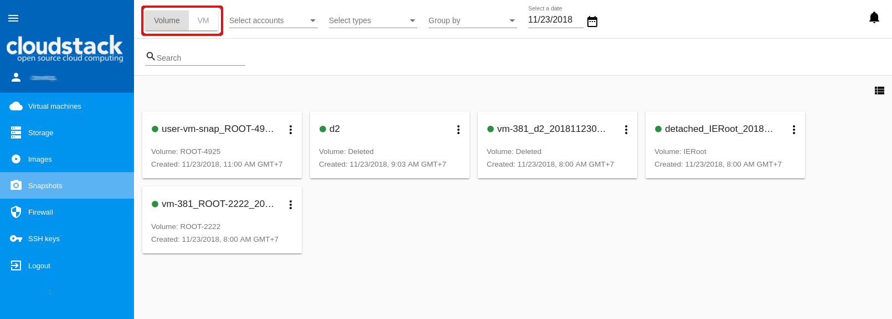
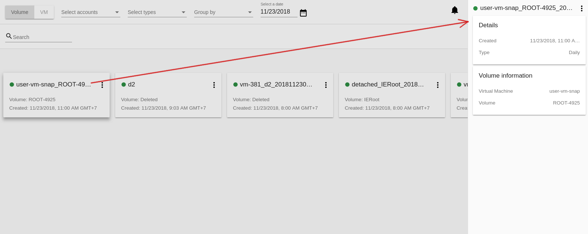

.. _Snapshots:

Snapshots
=============
.. Contents::

The *Virtual Machines* -> *Snapshots* section contains the information on snapshots - Volume snapshots and Virtual Machine snapshots - existing in the system.

A Volume snapshot is a capture of virtual machine disks. You can find more information on volume snapshots in the Apache CloudStack `documentation <http://docs.cloudstack.apache.org/en/4.11.1.0/adminguide/storage.html#working-with-volume-snapshots>`_.

Virtual Machine snapshots allow users to preserve the VM data volumes and its CPU/memory state. Currently we support VM snapshots for the KVM hypervisor only. For more information about Virtual Machine snapshots check out the `official documentation <http://docs.cloudstack.apache.org/en/4.11.1.0/adminguide/virtual_machines.html?highlight=snapshots#virtual-machine-snapshots>`_.

.. warning:: Virtual Machine snapshots are currently under development!

Snapshots List
-------------------

All snapshots existing in the system are presented in the list format. There are two lists in the section - Volume snapshots and Virtual Machine snapshots. To move between lists use the switch button at the top.

 
The list of snapshots can be presented in the box view or in the list view. Change the view using |view icon|/|box icon| button.

For each snapshot in the list the following information is presented:

- State bullet - green for a backed up snapshot, red for any error behavior, yellow for a snapshot being created, grey for allocated.
- Name of the snapshot.
- Volume/VM name the snapshot is created for.
- Date and time of creation.
- Actions button |actions icon|.

Filtering of Snapshots
~~~~~~~~~~~~~~~~~~~~~~~~~~~~
Filtering of snapshots is available above the list. 

You can filter the list by the following parameters:

- by Accounts (available to Administrators).
- by Type - Hourly, Daily, Weekly, Monthly, Manual depending on the schedule of snapshotting (available for Volume snapshots).
- by Virtual Machine (available for VM snapshots).
- by creation date - Select a date using a date picker to filter the list for the snapshots created within the specified period.

You can group snapshots:

- by Accounts (available for Administrators) and/or 
- by Type (for Volume snapshots) or
- by VM (for VM snapshots).

The searching tool allows to find a snapshot by:

- its name or a part of the name;
- snapshot description.

Snapshot Details Sidebar
-----------------------------------
A details sidebar presents the information on a snapshot. It appears to the right by clicking a snapshot in the list. 

For a Volume snapshot the following information is presented in the details sidebar:

- Snapshot name and Actions under the |actions icon| button;
- Date and time of creation;
- Type - Presents the snapshot type - Hourly, Daily, Weekly, Monthly, Manual;
- Volume information and a virtual machine it is assigned to.
 

Snapshot Actions Box
-----------------------------------

The following actions are available for Volume snapshots:

- Create template;
- Create volume;
- Revert volume to snapshot;
- Delete. 

The following actions are available for Virtual Machine snapshots:

- Revert VM to snapshot; 
- Delete.

.. note:: For a newly created snapshot the "Delete" action is available only till the snapshot is backed up to the Secondary Storage that may take some time. Once it is backed up (marked with a green state icon), a full range of actions is available to a user.

Below you will find details for each action.

**Create Template**

Open a creation form to register a new template from a Volume snapshot.

Fill in the fields:

.. note:: Required fields are marked with an asterisk (*).

- Name * - Enter a name of the new template.
- Description * - Provide a short description of the template.
- OS type * - Select an OS type from the drop-down list.
- Group - Select a group from the drop-down list.
- Password enabled - Tick this option if your template has the CloudStack password change script installed. That means the VM created on the base of this template will be accessed by a password, and this password can be reset.
- Dynamically scalable - Tick this option if the template contains XS/VM Ware tools to support dynamic scaling of VM CPU/memory.

Click “Show additional fields” to expand the list of optional settings. It allows creating a template that requires HVM. Tick this option in this case.

Once all fields are filled in click "Create" to create the new template.

.. figure:: _static/Snapshots_CreateTemplate2.png

Click "Cancel" to cancel the template creation.

**Create Volume**

This action allows creating a volume from a Volume snapshot.

Type a name for a new volume into the Name field in the modal window. Click "CREATE" to register a new volume.

Click "CANCEL" to cancel the volume creation.

**Revert Volume to Snapshot**

This action is available for Volume snapshots. It allows turning the volume back to the state of the snapshot. It is available to those snapshots that have a volume.

In the dialog window confirm your action. Please, note, the virtual machine the volume is assigned to will be rebooted.

**Revert VM to Snapshot**

This action is available for Virtual Machine snapshots. It allows turning the VM back to the state of the snapshot. It is useful if you implemented any changes to the VM and they went wrong so this action allows quick restoring of a VM to its previous state.

Select "Revert VM to Snapshot" from the actions list and confirm your action in the dialog window. The VM state will be reverted to the snapshot.

**Delete**

This action allows deleting a snapshot from the system.

Click "Delete" in the Action box and confirm your action in modal window. The snapshot will be deleted.

Click "NO" to cancel the snapshot deleting.

.. |bell icon| image:: _static/bell_icon.png
.. |refresh icon| image:: _static/refresh_icon.png
.. |view icon| image:: _static/view_list_icon.png
.. |view box icon| image:: _static/box_icon.png
.. |view| image:: _static/view_icon.png
.. |actions icon| image:: _static/actions_icon.png
.. |edit icon| image:: _static/edit_icon.png
.. |box icon| image:: _static/box_icon.png
.. |create icon| image:: _static/create_icon.png
.. |copy icon| image:: _static/copy_icon.png
.. |color picker| image:: _static/color-picker_icon.png
.. |adv icon| image:: _static/adv_icon.png
