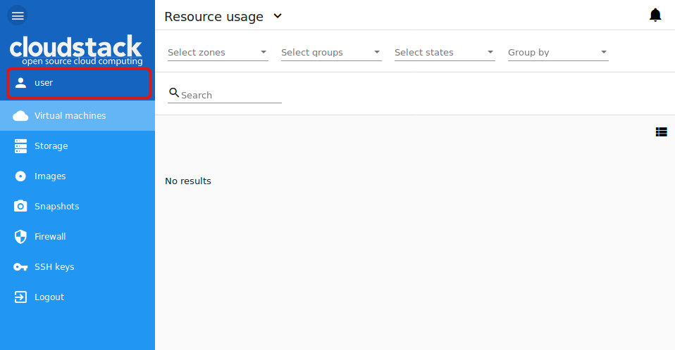
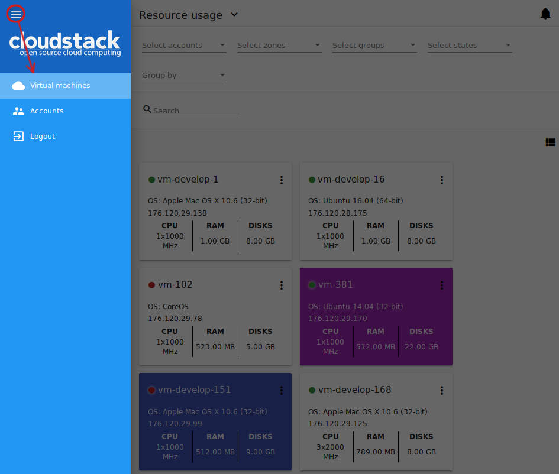
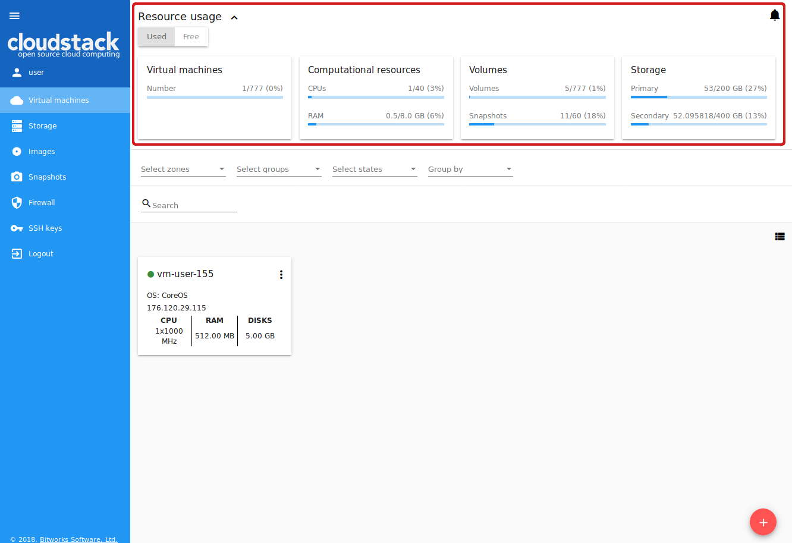
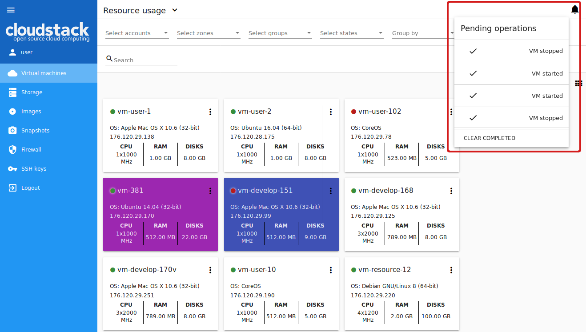
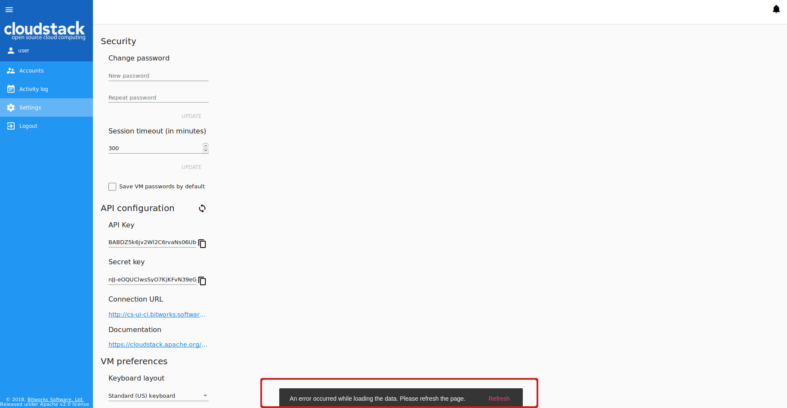

.. _CSUI-Start:

Start Working With CloudStack-UI
==================================

.. Contents::

This page is aimed to help you to make first steps at CloudStack-UI. If you have never worked with CloudStack before, you should start with installing the CloudStack platform. Follow the instruction in `the official documentation <http://docs.cloudstack.apache.org/en/4.11.1.0/installguide/index.html>`_.

Then deploy CloudStack-UI (see the `instructions for deployment <https://github.com/bwsw/cloudstack-ui#deployment>`_).

Logging In 
-------------

To enter the platform use your credentials provided by an administrator:

.. note:: Required fields are marked with asterisks (*).

- User name * -   The user ID of your account. 
- Password * - The password associated with the user ID.
- Domain - Specify domain when you log in. CloudStak-UI supports three ways to do it. Choose the one which is more convenient for you:
  
   1) Enter a domain in the field under the "Show advanced options" button |adv icon|.
   
   2) Administrator can set a domain in configurations. Domain field will be prepopulated with the specified value. It is more convenient for a user as he/she does not need to enter the domain every time at logging in. In this case the domain field can be hidden by clicking |adv icon|. Find more information on the feature configuration at the `configuration guide <https://github.com/bwsw/cloudstack-ui/blob/master/config-guide.md#default-domain-url>`_.

   3) Other way to log in is to enter a URL in the format ``http://<ip-address>/login?domain=<domain>``. The domain will be prepopulated in the logging in form with the value that is specified in the URL. Please, note, the domain value in URL will override the domain set in the configurations by Administrator.

.. figure:: _static/LoginScreen.png

Push "Login" to proceed to CloudStack. You will see the first section - *Virtual Machines*. 

To the left you can see the main navigation bar. It shows the user name and allows moving from section to section. 

When entering the system, a user sees the *Virtual Machines* section at the second level of the menu. 
At the first level, the main navigation bar has two expandable sections with the following nested menu items:

- *Virtual Machines*
    - Virtual machines
    - Storage
    - Images
    - Snapshots
    - Firewall
    - SSH keys
    - Logout
- *Accounts*
    - Accounts
    - Activity log
    - Settings
    - Logout

.. note:: The Logout section is placed at both levels.

To move between levels, click |menu icon| and then one of the two levels.

.. _Resource_Usage:

Resource Usage
-------------------------
In this section you can see the resource statistics: used and free VMs, computational resources, volumes and storage space. 

Unfold *Resource Usage* panel in the upper part of the screen. It provides information on the following resources:

1) Virtual machines;
2) Computational resources - CPU, RAM;
3) Volumes and snapshots;
4) Storage - primary and secondary.

You can switch between used or free resources by clicking the option you need above the resource data list.

A user can see the resource usage statistics for his/her user only.

   
A Domain Administrator can view resources for his/her account and for the whole domain.
 
Notifications on Pending Operations 
-----------------------------------------

In the upper-right corner of the screen, you can see the list of pending operations by clicking a bell button |bell icon|. It informs you of the latest operations in the system. You can clear the list after its reviewing by deleting every notification one by one or by clicking "CLEAR ALL" at the list bottom.

Alongside with the notification panel, the action completion confirmation additionally appears in the snackbar notification at the page bottom.

.. figure:: _static/Snackbar.png

In case of errors at data loading the snackbar also notifies of them. In this case it has a refresh button that refreshes the whole app.

.. |bell icon| image:: _static/bell_icon.png
.. |refresh icon| image:: _static/refresh_icon.png
.. |view icon| image:: _static/view_list_icon.png
.. |view box icon| image:: _static/box_icon.png
.. |view| image:: _static/view_icon.png
.. |actions icon| image:: _static/actions_icon.png
.. |edit icon| image:: _static/edit_icon.png
.. |box icon| image:: _static/box_icon.png
.. |create icon| image:: _static/create_icon.png
.. |copy icon| image:: _static/copy_icon.png
.. |color picker| image:: _static/color-picker_icon.png
.. |adv icon| image:: _static/adv_icon.png
.. |lock| image:: _static/NavBar_Locked.png
.. |hide menu| image:: _static/NavBar_HideIcon.png

