.. _Storage:

Storage
----------
.. Contents::

In the *Storage* section, you can create and manage drives for virtual machines.

Drive list
~~~~~~~~~~~~

Here you can find a list of your disks existing for your user. 

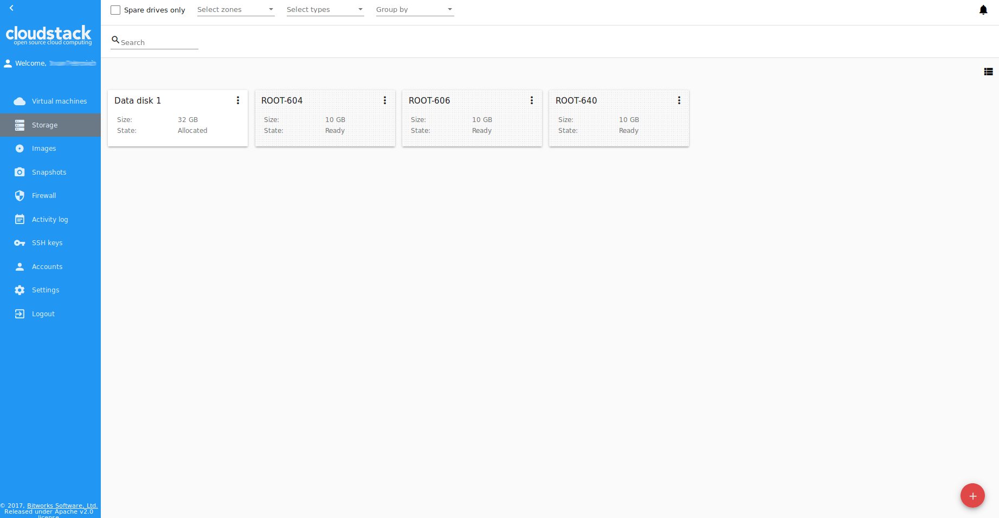
   
Domain Administrator can see disks of all accounts in the domain.

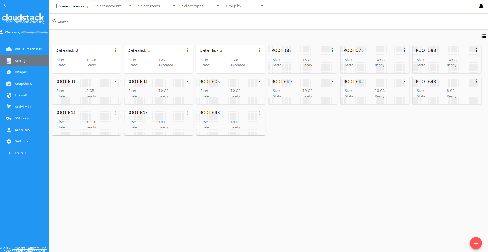
   
Disks can be viewed as a list or as a grid of cards. Switch the view by clicking a view icon |view icon|/|box icon| in the upper-right corner.

.. note:: If you have just started working with CloudStack and you do not have virtual machines yet, you have no disks in the list. Once you create a VM, a root disk is created for it automatically. Creation of an additional disk takes resources and requires expenses. Please, make sure you definitely need an additional data disk.

Filtering of Drives
""""""""""""""""""""""""""
Root disks are visually distinguished from data disks in the list. There is an option to display only spare disks which allows saving user's time in certain cases. 

As in all lists, there is the filtering tool for selecting drives by zones and/or types. You also can apply the search tool selecting a drive by its name or a part of the name.

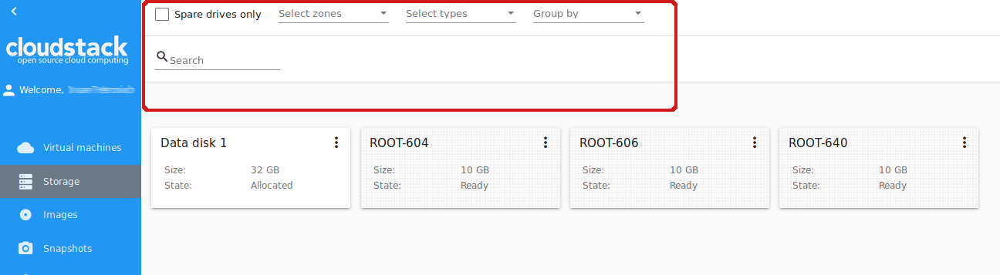

For better distinguising of drives in the list you can group them by zones and/or types, like in the figure below:

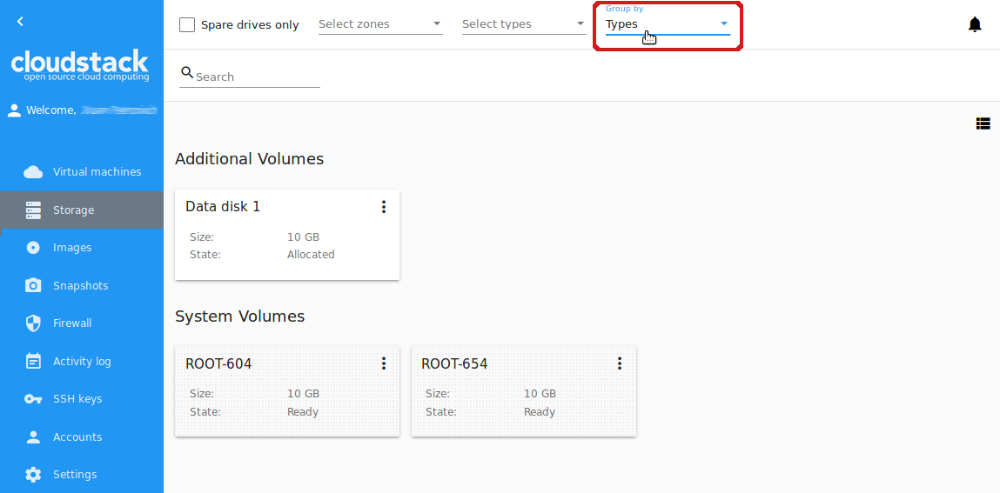

Domain Administrators can see the list of drives of all accounts in the domain. Filtering by accounts is available to Administrators.

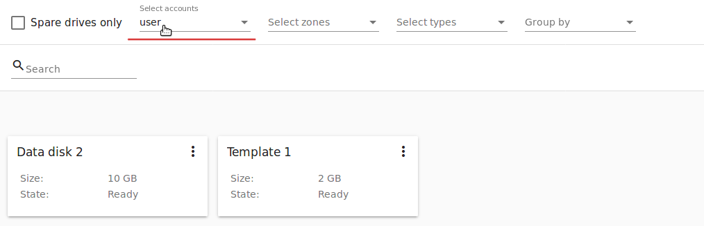
   
For each drive in the list the following information is presented:

- Drive name,
- Size,
- State - Ready or Allocated.

The Actions button |actions icon| is available to the right. It expands the list of actions for a disk. See the information on actions in the :ref:`Actions_on_Disks` section below.

Create New Volume
~~~~~~~~~~~~~~~~~~~

In the *Storage* section you can create new volumes.

By clicking the "Create" button |create icon| in the bottom-right corner you will open a creation form. 

If you have just started working with CloudStack and you do not have virtual machines yet, you have no disks in the list. At creating a VM, a root disk is added for it automatically. Creation of an additional disk takes resources and requires expenses. Please, make sure you definitely need an additional disk. When clicking "Create", a dialogue window will ask you if you are surely want to create a drive. Confirm your creation action by clicking "Yes":

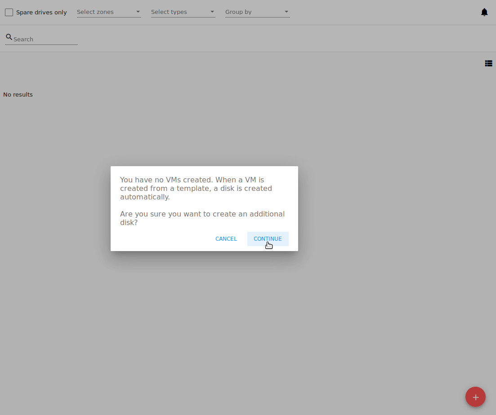
   
A creation form will appear.

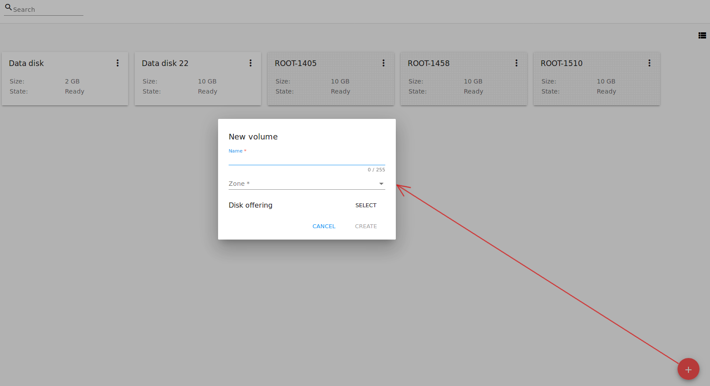

To create a new volume fill in the fields:

.. note:: Required fields are marked with an asterisk (*).

- Name * - Enter a name of the volume. 
- Zone * - Select a zone from the drop-down list.
- Disk offering * - Select from the list of available offerings opening it in a modal window by clicking "Select". For each disk offering you will see a range of parameters. The following parameters are shown by default:

- Read rate (MB/s);
- Write rate (MB/s);
- Read rate (IO/s);
- Write rate (IO/s).

More parameters can be added via the `configuration file <https://github.com/bwsw/cloudstack-ui/blob/master/config-guide.md#disk-offering-parameters>`_ by an Administrator.

Select a disk offering in the list and click "SELECT".

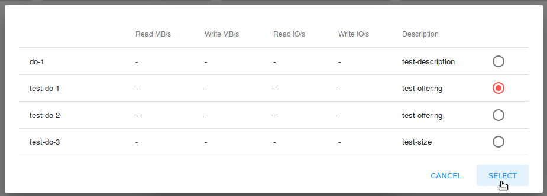

If the selected disk offering has a custom disk size (it is set by Administrator), you can change the disk size moving the slider to the volume size you wish.

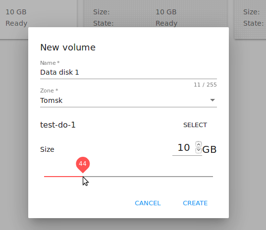
   
Click "Create" to save the settings and create the new volume. You will see the drive appears in the list.

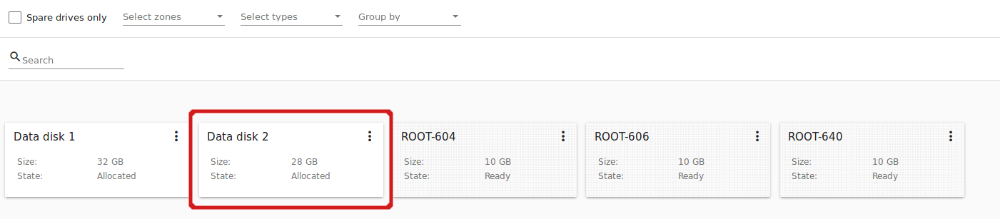

Click "Cancel" to drop all the settings. The drive will not be created then.

.. _Storage_Info:

Volume Details Sidebar
~~~~~~~~~~~~~~~~~~~~~~~~~~~~~

By clicking a disk in the list you can access the information on the volume. 

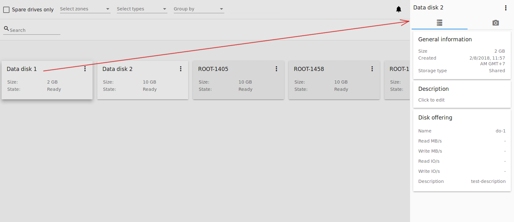

At the right sidebar you can find two tabs:

1. Volume tab - Provides the information on the disk volume:

- General information - Presents disk size, date and time of creation, the storage type (shared, local).
- Description - Allows entering a short description to the drive. Click at the Description card and enter a short description in the text block.
    
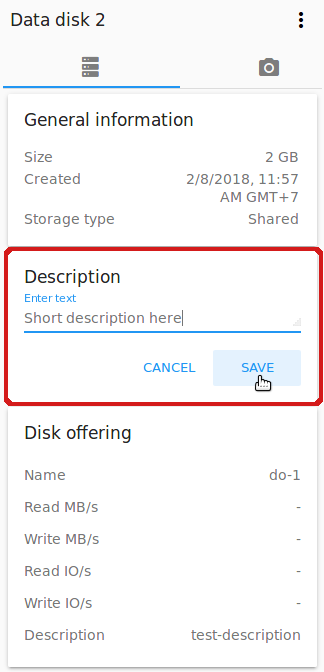

Click "Save" to save the description. Description will be saved to volume `tags <https://github.com/bwsw/cloudstack-ui/wiki/Tags>`_.

You can edit the description by clicking the "Edit" button |edit icon| in the tab.

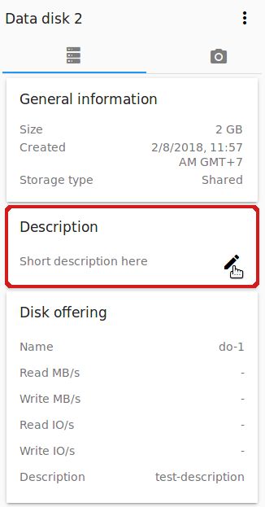
   
- Disk offering - Presents the information on the disk offering chosen at disk creation.
    
2. Snapshots tab - Allows creating disk snapshots. Snapshots can be taken for disks with the "Ready" status only.

   Click the "Add" button |create icon| and enter in the dialogue window:

    - Name - Define a name for the snapshot. It is auto-generated in the format ``<date>-<time>``. But you can specify any name you wish.
    - Description - Add a description of the snapshot to know what it contains.  
 
   Then click "Create" and see the snapshot has appeared in the list. 

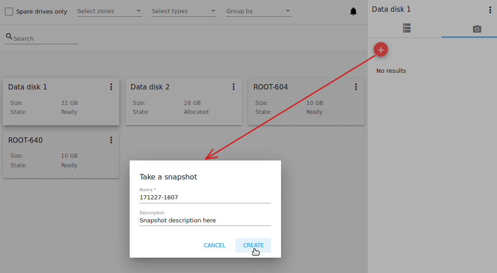
      
Every snapshot is saved in a separate card. There you will see the name and time of the snapshot. 

For each snapshot the list of actions is available. Find more information on snapshot actions in the :ref:`Actions_on_Snapshot_Volume` section below.

.. _Actions_on_Snapshot_Volume:

Snapshots Action Box 
""""""""""""""""""""""""""""

Like in the Virtual Machine information tab the same actions are available for a snapshot:
     
- **Create a template** - Allows creating a template from the snapshot. This template can be used for VM creation.
  
   Fill in the form to register a new template:
     
    - Name * - Enter a name of the new template.
    - Description * - Provide a short description of the template.
    - OS type * - Select an OS type from the drop-down list.
    - Group - Select a group from the drop-down list.
    - Password enabled - Tick this option if the template has the password change script installed. That means the VM created on the base of this template will be accessed by a password, and this password can be reset.
    - Dynamically scalable - Tick this option if the template contains XS/VM Ware tools to support the dynamic scaling of VM CPU/memory.
 
.. note:: Required fields are marked with an asterisk (*).
 
Click "Show additional fields" to expand the list of optional settings. It allows creating a template that requires HVM.
     
Once all fields are filled in click "Create" to create the new template.

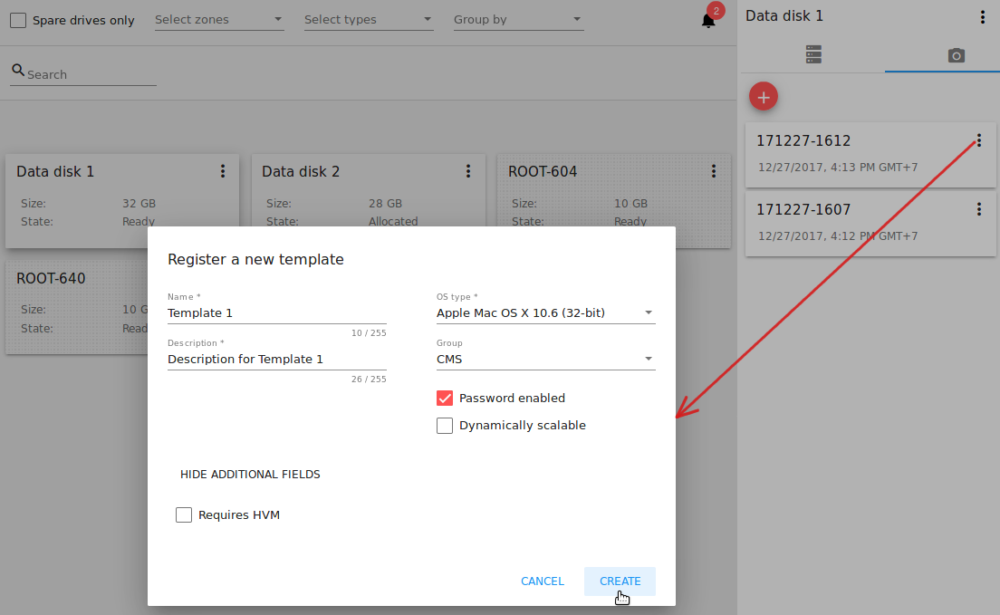

- **Create Volume** - Allows creating a volume from the snapshot.

Type a name for a new volume into the Name field in the modal window. Click “Create” to register a new volume.

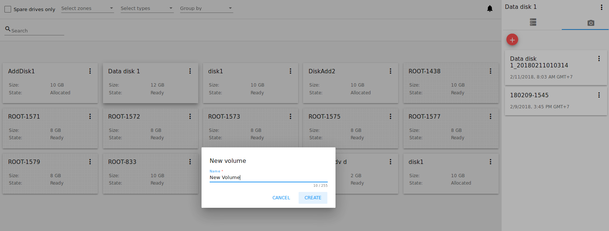

Click “Cancel” to cancel the volume creation.

- **Revert Volume To Snapshot** - Allows turning the volume back to the state of the snapshot. 

In the dialogue window confirm your action. Please, note, the virtual machine the volume is assigned to will be rebooted.

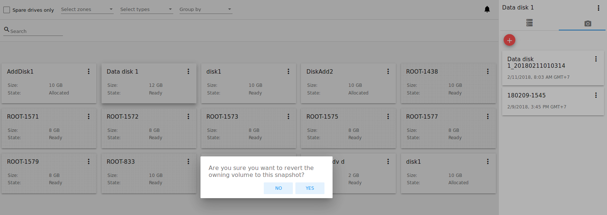

- **Delete** - Allows deleting the snapshot. Click “Delete” in the Action box and confirm your action in modal window. The snapshot will be deleted. Click “Cancel” to cancel the snapshot deleting.

.. Find the detailed description in the :ref:`Actions_on_Snapshots` section.

.. _Actions_on_Disks:

Volume Action Box 
~~~~~~~~~~~~~~~~~~~

Action on drives are available under the Actions button |actions icon|.

The following actions are available on disk:

For root disks:

 - Take a snapshot;
 - Set up snapshot schedule;
 - Resize the disk.
        
For data disks:
       
 - Take a snapshot;
 - Set up snapshot schedule;
 - Detach;
 - Resize the disk;
 - Delete.

**Take a snapshot**
  
You can take a snapshot of the disk to preserve the data volumes. Snapshots can be taken for disks with the "Ready" status only.
  
Click "Take a snapshot" in the disk Actions list and in the dialogue window enter the following information:
  
 - Name of the snapshot * - Define a name for the snapshot. It is autogenerated in the form ``<date>-<time>``. But you can specify any name you wish.
 - Description - Add a description of the snapshot to know what it contains. 
 
.. note:: Required fields are marked with an asterisk (*).

All snapshots are saved in the list of snapshots. For a snapshot you can:
  
- Create a template;  
- Delete the snapshot.

See the :ref:`Actions_on_Snapshot_Volume` section for more information.
   
**Set up snapshot schedule**

This action is available for disks with the "Ready" status only.

You can schedule the regular snapshotting by clicking "Set up snapshot schedule" in the Actions list.

In the appeared window set up the schedule for recurring snapshots:

 - Select the frequency of snapshotting - hourly, daily, weekly, monthly;
 - Select a minute (for hourly scheduling), the time (for daily scheduling), the day of week (for weekly scheduling) or the day of month (for monthly scheduling) when the snapshotting is to be done;
 - Select the timezone according to which the snapshotting is to be done at the specified time;
 - Set the number of snapshots to be made.

Click "+" to save the schedule. You can add more than one schedule but only one per each type (hourly, daily, weekly, monthly).

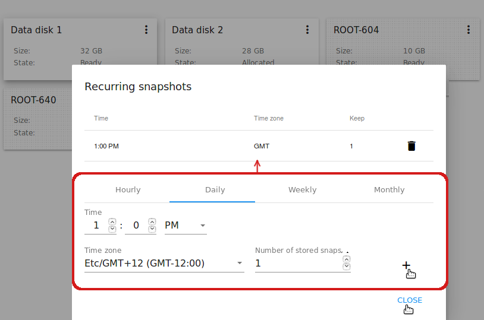
   
**Resize the disk**

.. note:: This action is available to data disks created on the base of disk offerings with a custom disk size. Disk offerings with custom disk size can be created by Root Administrators only.

You can change the disk size by selecting "Resize the disk" option in the Actions list. You are able to enlarge disk size only.

In the appeared window set up a new size and click "Resize" to save the edits.

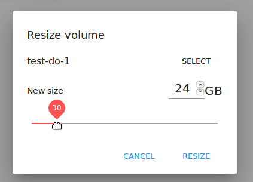

Click "Cancel" to drop the size changes.

**Attach/Detach**

This action can be applied to data disks. It allows attaching/detaching the data disk to/from the virtual machine.

Click "Attach" in the Actions list and in the dialogue window select a virtual machine to attach the disk to. Click "Attach" to perform the attachment.

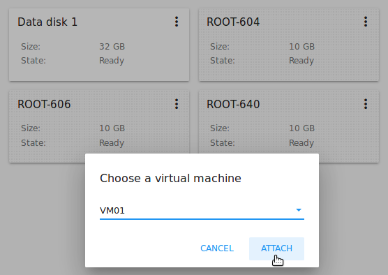

An attached disk can be detached. Click "Detach" in the Actions list and confirm your action in the dialogue window. The data disk will be detached from the virtual machine.

**Delete**

This action can be applied to data disks. It allows deleting a data disk from the system.

Click "Delete" in the Actions list and confirm your action in the dialogue window. 

If a volume has snapshots the system will ask you if you want to delete them as well. Click "YES" to delete the snapshots of the volume. Click "NO" to keep them.

The data disk will be deleted from the system.

.. |bell icon| image:: _static/bell_icon.png
.. |refresh icon| image:: _static/refresh_icon.png
.. |view icon| image:: _static/view_list_icon.png
.. |view box icon| image:: _static/box_icon.png
.. |view| image:: _static/view_icon.png
.. |actions icon| image:: _static/actions_icon.png
.. |edit icon| image:: _static/edit_icon.png
.. |box icon| image:: _static/box_icon.png
.. |create icon| image:: _static/create_icon.png
.. |copy icon| image:: _static/copy_icon.png
.. |color picker| image:: _static/color-picker_icon.png
.. |adv icon| image:: _static/adv_icon.png
