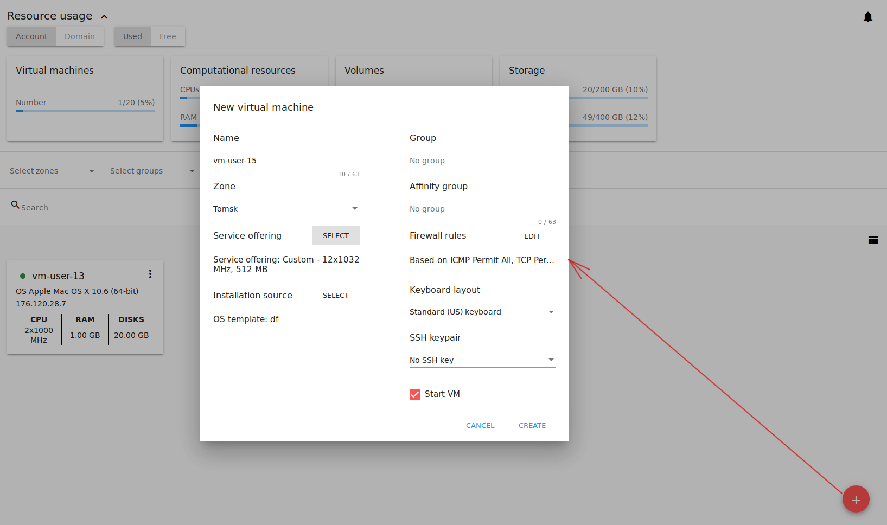
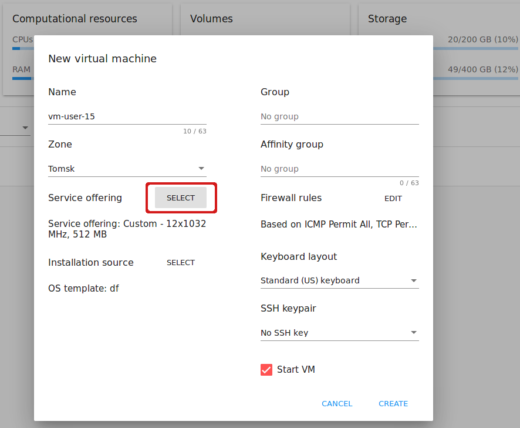
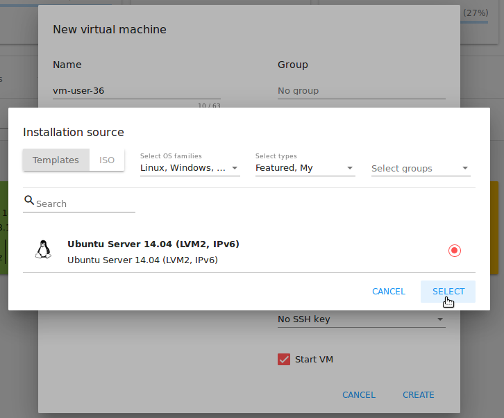
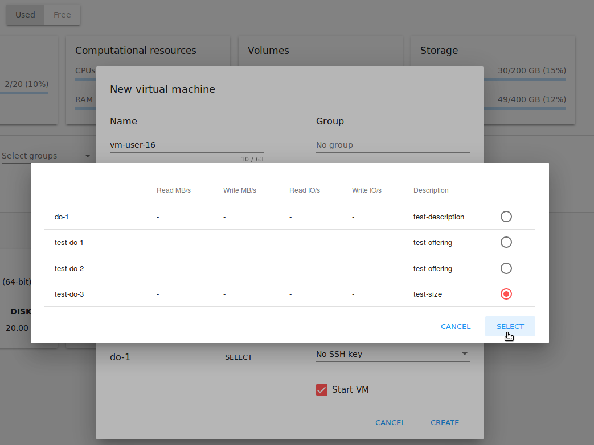
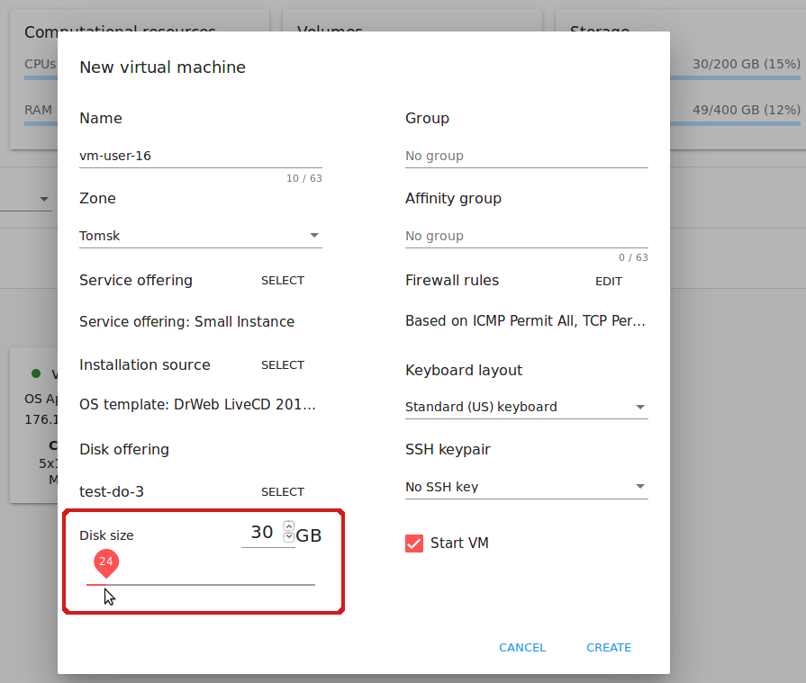
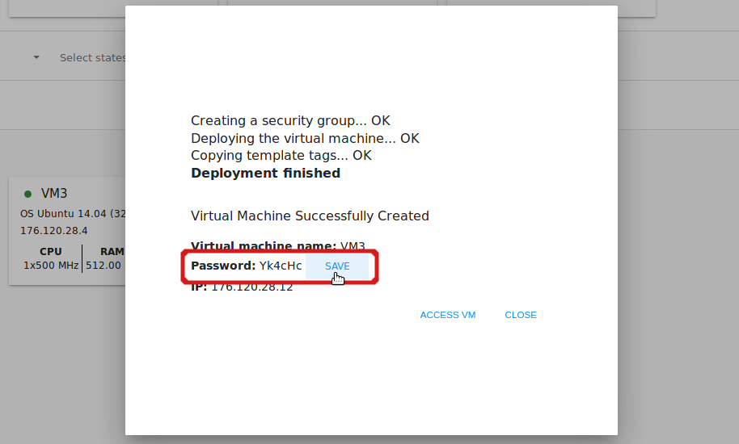
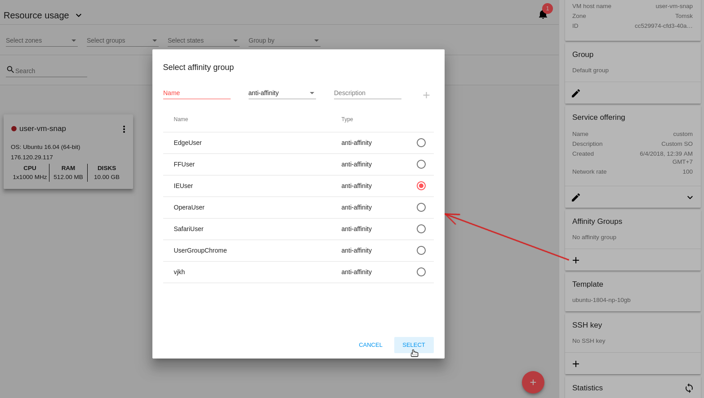

.. _VMs:

Virtual Machines
-------------------

.. Contents::

*Virtual Machines* is the starting section. Here and in all other views we implemented the “one-step” approach, and we also made it work without moving from view to view. So all actions on VMs can be managed from one screen view.

Virtual Machines List
~~~~~~~~~~~~~~~~~~~~~~~~~~~~~

At this page, you can see the list of your virtual machines available to your user only.

.. figure:: _static/VMs_List_User1.png

If you are a Domain Administrator you can see the virtual machines of all users in your account. Or select all accounts in the "Select accounts" option above the list to see the virtual machines for the whole domain.

.. figure:: _static/VMs_List_Admin1.png
   
You can change the data representation of existing virtual machines from "card" to "list". We have added the switch |view icon|/|box icon| in the upper-right corner of each section. This improvement gives a user an opportunity to work with data in each specific section in a more convenient way.

A list view can be switched to a box view:


And vice versa, switch a list view to a box view:

.. figure:: _static/VMs_Boxes.png

For each VM in the list you can see the following information: 

- VM name and IP;
- State - shows the VM state by color spot: green for Running, red for Stopped, yellow for changing status;
- OS family;
- CPU;
- RAM;
- Disks.

To the right the Actions button |actions icon| expands the list of actions available for the VM.

Filtering of Virtual Machines
""""""""""""""""""""""""""""""""""""

The filtering and search tool will help you to find a virtual machine in the list. 

.. figure:: _static/VMs_FilterAndSearch_User1.png
   
You can filter the VM list by accounts (available for Domain Administrators) and/or zones and/or groups and/or states. In the drop-down lists tick the filtering parameters and see the immediate result.

Besides, VMs can be grouped by zones and/or groups and/or colors and/or accounts. Grouping makes it easier to identify necessary VMs on the list.

.. figure:: _static/VMs_Filter.png
   
Use the search tool to find a virtual machine by its name or a part of the name.

Under the *Virtual Machines* section, you can open a form to create a new virtual machine.

.. _Create_VM:

Create a Virtual Machine 
~~~~~~~~~~~~~~~~~~~~~~~~~~~~~
Creating a new VM in CloudStack-UI is a one-step action. You can select options from one screen without additional steps.

To create a new VM click the "Create" button |create icon| at the bottom-right corner. 


   
In the *Create VM* form fill in the following fields:

.. note:: Required fields are marked with an asterisk (*).

1. **Name** * - A name of VM. The system suggests a meaningful autogenerated name in the following form ``vm-<username>-<counter>``. You can enter any name you wish. It should start with a letter, contain figures and Latin letters (up to 63 symbols) and be unique within the domain.
2. **Zone** * - A zone of VM operation. Select a zone from the drop-down list. The list of available zones is managed by a Root Administrator. More information about zones in CloudStack can be found in the `official documentation <http://docs.cloudstack.apache.org/en/latest/concepts.html?highlight=zone#about-zones>`_.
3. **Service offerings** * -  Select a set of options and resources for a VM, such as templates for creating virtual machines, disk storage, and other. The list of available service offerings is managed by an Administrator. Service offering availability is determined by zone in the `configuration file <https://github.com/bwsw/cloudstack-ui/blob/master/config-guide.md#offering-availability>`_.

Click "SELECT" in the Service Offerings block and choose a necessary option in the modal window. The list of service offerings can be of two types: Fixed and Custom. 

*Fixed* service offerings are the offerings with fixed parameters. They can not be changed. 

*Custom* service offerings are offerings with adjustable parameters. You can set the amount of CPU cores, CPU memory and Network rate as you need. 

Use the switcher "Fixed/Custom" above the list to select a necessary type of offerings. 

If service offering classes are determined in the configuration file (see the `configuration guide <https://github.com/bwsw/cloudstack-ui/blob/master/config-guide.md#service-offering-classes>`_), the list of service offerings is displayed as a list grouped by the determined classes. You can filter the list by classes using the filtering tool above the list. Classes provide additional semantics defining the purpose of VM. 

.. figure:: _static/VMs_Create_SOClasses.png

You also can use the search tool to find an option in the list by a name or a part of the name.

**Fixed Service Offerings**

For fixed service offerings the parameters are provided in the table per each option. Four main parameters are provided by default. They are:

- CPU Cores;
- CPU (MHz);
- Memory (MB);
- Network Rate (Mb/s).

Click "SHOW ADDITIONAL FIELDS" to the right to expand the range of parameters. Scroll the table to right and you will see:

- Disk read rate (Mb/s);
- Disk write rate (Mb/s);
- Disk read rate (IO/s);
- Disk write rate (IO/s).

You can hide the additional parameters by clicking "HIDE ADDITIONAL FIELDS".


Choose the option in the list and click "SELECT" below.


The settings will appear for the VM service offerings. 

**Custom Service Offerings**

For custom service offerings the parameters are also provided in the table per each option. Besides, you can see more parameters by clicking "SHOW ADDITIONAL FIELDS". 

By selecting an option in the list, you open a modal window where you can set a value for the following parameters:

- CPU Cores;
- CPU (MHz);
- Memory (MB).

These parameters can be predefined in the `configuration file <https://github.com/bwsw/cloudstack-ui/blob/master/config-guide.md#default-service-offering>`_ by an Administrator. The values specified there will be used as default parameters for a custom service offering.

Administrators can set limits for custom service offerings in the `configuration file <https://github.com/bwsw/cloudstack-ui/blob/master/config-guide.md#custom-offering-restrictions>`_. That means you cannot set values large than the limits specified for custom service offerings.


   
Click "CONFIRM" to set the custom service offering parameters. The modal window will close and the set values will appear in the list for the selected custom service offerings option. Click "CANCEL" to drop all the settings.

Click "SELECT" below the list to assign the service offerings to your machine. The custom settings will appear for the VM service offerings. Custom service offering parameters are saved to account tags (see the `list of tags <https://github.com/bwsw/cloudstack-ui/wiki/Tags>`_) if they are supported for the account. This will make it easier for you to use saved custom parameters for service offerings next time at VM creation as they will be predefined in the form automatically. Account tags can be switched on in the `configuration file <https://github.com/bwsw/cloudstack-ui/blob/master/config-guide.md#account-tags-enabled>`_  by an Administrator. 

You can change service offerings by clicking "SELECT" next to the settings in the creation form and choosing other parameters.  Click "CHANGE" below to assign the selected option to the VM.
   

   
4. **Installation source** * - Click "Select" to choose an installation source. Traditionally, there are two options of the virtual machine creation:
    
    - From a Template. 
    - From an ISO file.
    
   You will see a list in a modal window that contains templates/ISOs with the "Ready" status available for the selected zone, as well as user's account or the whole domain. 
   
   The filtering tool allows finding a necessary option by selecting among templates/ISOs by OS families, types and groups, or search the source by a name or a part of its name. 
   
   Tick the source in the list and click "SELECT" to implement the selected source.
   
   Click "CANCEL" to drop selected options. No source will be selected then.   


    
5. **Disk offering** - Available if ISO is selected as a source. Open a modal window where available disk offerings are listed by clicking "SELECT" in the disk offering section. The list of available options is managed by an Administrator. Disk offering availability is determined by zone in the `configuration file <https://github.com/bwsw/cloudstack-ui/blob/master/config-guide.md#offering-availability>`_.

For each disk offering you will see a range of parameters. The following parameters are shown by default:

- Read rate (MB/s);
- Write rate (MB/s);
- Read rate (IO/s);
- Write rate (IO/s).

More parameters can be added via the `configuration file <https://github.com/bwsw/cloudstack-ui/blob/master/config-guide.md#disk-offering-parameters>`_ by an Administrator.

Select a disk offering in the list and click "SELECT".



If the selected disk offering has a custom disk size (it is set by Administrator), you can change the disk size. Change the disk size moving the slider up to the volume size you wish.



Find more about disk offerings in the `official documentation <http://docs.cloudstack.apache.org/projects/cloudstack-administration/en/latest/service_offerings.html?highlight=Disk%20offering#compute-and-disk-service-offerings>`_.

6. **Group** - Select a group from the drop-down list. Or create a new group by typing its name right in the field. The group will be saved to the machine `tags <https://github.com/bwsw/cloudstack-ui/wiki/Tags>`_.
7. **Affinity group** - Select an affinity group from the drop-down list. Or create a new group entering it right in this field. The name should contain letters, figures, start from a letter and should not contain spaces. Its length should not exceed 63 symbols. What an affinity group is you can read in the `official documentation <http://docs.cloudstack.apache.org/projects/cloudstack-administration/en/latest/virtual_machines.html?highlight=Affinity#affinity-groups>`_.
8. **Firewall rules** - Click "Edit" to specify a security group for the VM. In the appeared window choose between "Create new" or "Select Shared" options. 
  
**Create new security group**

A new security group is created on the base of predefined templates. This security group will be created as a *private* group used for this VM only.

When creating a new security group, you can see all the templates are selected by default in the modal window. To form your custom security group, select a template in the "All templates" list at the left and move it to the "Selected templates" list at the right by clicking the arrow icon:
   

   
Click "SELECT ALL" to move all templates from left to right at once.

Click "RESET" to drop all selected templates.

In the list below you will see the rules corresponding to the selected templates. All of them are checked as selected. Uncheck those you do not wish to add to your VM as firewall rules.

Click "SAVE" to apply the selected rules to your virtual machine.

Click "CANCEL" to drop the selected options. No rules will be assigned to the virtual machine. You will return to the "Create new virtual machine" window.
   
**Select Shared security group**
   
If you would like to select an existing group of firewall rules, you can click the "Select Shared" option and tick those groups in the list that you want to assign to your VM. The security groups in the *Shared* list are used by other VMs in the domain. That means you won't be able to uncheck some rules in the group that you do not want to include into the list (like at creating VM from a template). You can assign only the whole shared security group to your VM. 
   
.. figure:: _static/VMs_Create_AddSecGr_Shared.png

You can edit a shared security group after VM is created. In the *Network* tab of the VM details sidebar the assigned shared security group(s) can be viewed and edited. Please, find more information on security group editing in the :ref:`VM_Network_Tab` section.

Click "Cancel" to drop the selected options. No rules will be assigned to the virtual machine. 
   
9. **Keyboard layout** - (is prepopulated). Select a keyboard layout from the drop-down list.
10. **SSH keypair** - Select an SSH keypair. The list of keys contains the SSH keys available for the account under which the VM is being created. Find more information on SSH keys in the :ref:`SSH_Keys` section.
11. **Start VM** - Tick the box to start the VM right after its deployment. If this option is activated, the VM acquires an IP and a password (if required by the template). If it is not, the machine IP is not available till VM is started, no password is assigned to it.

Once all fields are filled in, click "Create".

For some templates/ISO used at VM creation you are offered to accept the "Template/ISO Terms and Conditions Agreement". An administrator is able to specify an agreement for a template or ISO. An agreement may determine, for example, software licensing terms or restrictions on the liability of the software template vendor. A user must confirm it to continue VM installation from a chosen source. 

If you are creating a virtual machine on the base of a template/ISO that requires an agreement, read the terms in the appeared window and click "I AGREE" to continue.


Click "CANCEL" to close the terms and move back to the creation form. Change the installation source.

After clicking "CREATE", a dialogue window will appear where you can monitor the VM creation process: security group creation, virtual machine deployment, template tags copying, etc. These procedures are fulfilled one by one. A procedure in progress is marked with a spinner in the message. In case of an error occurring at any VM creation step, a user can understand at what step it has happened.

.. figure:: _static/VMs_Create_Logger.png

Once the VM creation process finishes, the success message will inform you of that. 

.. figure:: _static/VMs_Create_SuccessMessage.png
   
The message will show the list of all creation steps and the virtual machine information:

- VM name and IP (if it is available),
- VM Password - This field appears after the VM creation if a password is enabled for the template used for creating this machine. A password is autogenerated. Click "SAVE" next to it in the dialogue window if you want to save it for this VM. The password will be saved to the VM tags. You can see the saved password later by clicking "Access VM" in the Actions box for this machine.



The system will ask you if you wish to save passwords to VM tags by default for the virtual machines created in the future. Click "Yes" and the "Save VM password by default" option will be activated in the account settings:

.. figure:: _static/Settings_SavePass1.png

It means the password will be saved to tags automatically for all created virtual machines.

From this window, you can access the VM opening VNC console.

.. API log 

Close the dialogue window and make sure the newly created VM is in the list of virtual machines.

Click "CANCEL" to drop the VM creation.

Possible Issues When Creating a Virtual Machine
""""""""""""""""""""""""""""""""""""""""""""""""""""""""""

You can face the following issues when creating a virtual machine:

- Lack of resources.

  An important thing in CloudStack-UI is that the system immediately checks that a user has the amount of resources required to create a virtual machine. It does not allow launching the creation of a VM which will fail for sure because of the resource lack.

  If you lack the required amount of resources, the message will appear when clicking "Create Virtual Machine":

  "Insufficient resources. You ran out of Primary storage." 
 
  No VM creation form is available.
 
.. If there are insufficient resources you will not be allowed to create a new VM and start it upon creation. You will be able to create a new VM with the unchecked "Start VM" option. No IP is assigned to the VM in this case.

- VM name is not unique.

  If the name specified for the virtual machine is not unique within a domain, the dialogue window after VM creation will show an error. The VM will not be created. The creation form will be closed. You will have to open the VM creation form and fill it in again. You will have to specify another name for your VM.

.. _VM_Actions:

VM Action Box
~~~~~~~~~~~~~~~~~~~~~~~~~~~~~~~~~~
Once a VM instance is created, you can stop, restart, or delete it as needed. These actions are available under the "Actions" button |actions icon| to the right from each virtual machine in the list. 

.. figure:: _static/VMs_ActionBox1.png
   
It allows performing the following actions with the VM:

- Start VM - Allows a user to launch a VM, 

- Stop VM - Allows a user to stop a running VM, 

- Reboot VM - Allows a user to restart a VM, 

- Reinstall VM - Allows a user to reinstall a VM, 

- Destroy VM - Allows a user to delete a VM. After deleting the virtual machine will remain in the system. It will look faded in the list and can be recovered later. 

.. figure:: _static/VMs_Destroyed.png

To recover a destroyed VM (which is not expunged) open the Actions list and click "Recover".


Click "Expunge" to completely destroy the VM. The VM will not be available for recovering anymore.

.. figure:: _static/VMs_DestroyExpunge.png

When deleting a virtual machine, if the machine has data disks attached, the system will ask you in a dialogue window whether these disks should be deleted. If data disks have snapshots, you will be offered to delete the snapshots as well by activating a "Delete snapshots" option in the dialogue. 

Confirm your intention to delete disks (and snapshots) by clicking "Yes". Click "No" to cancel the disk (and snapshots) deleting.

.. figure:: _static/VMs_Destroy_DeleteSnaps.png

- Reset password - Allows a user to change the password for VM (available for started VMs only in case a VM requires a password). The VM will be rebooted if you reset the password. 

.. figure:: _static/VMs_ResetPassDialogue.png

After clicking "Yes" the VM will be rebooted and a new password will be autogenerated for it. You will see the new password in the dialogue window. 

.. figure:: _static/VMs_PasswordReset.png

Click "Save" to save the password for this VM. It will activate the "Save VM passwords by default" option in the *Settings* section. In the future the password will be saved automatically right at VM creation. Click "OK" to close the dialogue window. 

- Access VM - Opens an "Access VM" dialog window which allows to view VM name and IP, view and save a password for the VM and access the VM via the VNC console. 

.. figure:: _static/AccessVM.png

In the :ref:`VM_Access` section you can find more information on accessing a VM.

- Pulse - It is a new feature created in CloudStack-UI to visualize the VM performance statistics. By clicking "Pulse" at the Actions box you will open a modal window with 3 tabs: CPU/RAM, Network, Disk. There you can see the charts of resources statistics for the VM.


You can adjust the graphs by range, data aggregation period, shift interval and other parameters. 

This plugin is convenient for dynamic monitoring of VM performance. Find more information about it in the `official documentation <https://github.com/bwsw/cloudstack-ui/wiki/107-ReleaseNotes-En#pulse-plugin-experimental-function>`_. Pulse plugin deployment instructions can be found at the :ref:`Pulse_Plugin` page.

.. note:: Please, note, when performing one of the actions from the list, other actions in this list are disabled until the action in progress finishes.

.. _VM_Info:

VM Details Sidebar
~~~~~~~~~~~~~~~~~~~~

For each virtual machine, you can get the details.

By clicking a VM line or card you can open a sidebar to the right. 

.. figure:: _static/VMs_Details2.png
   
There you will find the information on the selected virtual machine:

1. VM name.
2. Color-picker |color picker| - Allows marking a virtual machine with a color to distinguish it in the list. The range of available colors for VMs is specified in the `configuration guide <https://github.com/bwsw/cloudstack-ui/blob/master/config-guide.md#vm-colors>`_. 
3. Actions on the VM. See the :ref:`VM_Actions` section below.

You will see four tabs in the sidebar. Let's describe what information on the virtual machine is presented in each tab.

Virtual Machine Tab
""""""""""""""""""""""""""
The Virtual Machine tab contains the general setting of the VM. Some settings can be edited here. At the bottom you can see the Statistics section which shows real-time data for the VM performance.

1. Description - A short description of the VM. Click the block to edit it. Enter a few words about the VM. Click "Save" to save the description. It is a custom description for your machine. It is saved to tags with ``csui.vm.description`` tag.

The description can be edited. Click "Edit" |edit icon| to change the description. 

.. figure:: _static/VMs_Details_EditDescription1.png

It also can be edited from the Tags tab. Click Edit icon |edit icon| next to the ``csui.vm.description`` tag and change the description text in the appeared form.


2. Zone - A zone selected for the VM to be available in.

#. Group - A custom group assigned to the VM. Edit this field by clicking the "Edit" button |edit icon|. In the appeared dialogue window choose a group from the drop-down list. Click "Assign" to assign the chosen group to the VM. 

.. figure:: _static/VMs_Details_EditGroup1.png
   
Or you can create a new group right from this window selecting the "Create a new group" option. Click "ASSIGN" to assign the created group to the VM. 

.. figure:: _static/VMs_Details_CreateGroup.png
   
To remove the assigned group select the "Remove from the group" option and click "REMOVE" to eliminate the assigned group from the VM.

.. figure:: _static/VMs_Details_RemoveGroup1.png
   
The VM group is a custom group. It is saved to VM tags with ``csui.vm.group`` tag. From the Tags tab, it also can be edited or deleted.

4. Service offering - The service offerings of the VM. Expand the section to view the whole list of offering parameters. 

Edit this field by clicking the "Edit" button |edit icon|. In the appeared window you will see the list of available service offerings. 

The list consists of two sections - Fixed and Custom. In each section, offerings can be filtered by classes if classes are determined in the `configuration file <https://github.com/bwsw/cloudstack-ui/blob/master/config-guide.md#service-offering-classes>`_. 

.. figure:: _static/VMs_Create_SOClasses.png

You can use the search tool to find an offering in the list by a name or a part of the name.

Select an option from the list to change the service offering. 

.. figure:: _static/VMs_Details_EditSO3.png

Click "Change" to implement the edits. 

A started virtual machine will be rebooted at editing the service offering.

5. Affinity Group - The affinity group assigned to the virtual machine. Edit this field by clicking the "Edit" button |edit icon|. In the dialogue window, choose an existing group or create a new one right in the dialogue window. Click "Assign" to assign the group to the VM. 

.. figure:: _static/VMs_Details_CreateAffGroup1.png
   
When assigning an affinity group to the started virtual machine, the system will suggest you stopping the VM. Click "OK" in the dialogue window. Then the VM will be started again.


   
The selected group can be removed by clicking "Edit" and choosing "Remove from the group" in the dialogue window.

.. figure:: _static/VMs_Details_RemoveAffGroup1.png
   
6. Template - Shows the template used to create the virtual machine.

#. SSH key - Shows the SSH key of the virtual machine. Add the SSH key by clicking "+". In the appeared window select the SSH key in the drop-down list and click "CHANGE":

.. figure:: _static/VMs_Details_AddSSH1.png
   
At saving the new SSH key for a started VM you will see the warning: "You need to stop the virtual machine to reset SSH key." Click "OK" if you want to stop it right now. Click "Cancel" to drop the edits.

8. Statistics - shows VM statistics on CPU utilized, Network read, Network write, Disk read, Disk write, Disk read (IO), Disk write (IO). Refresh data by clicking the "Refresh" button |refresh icon| in the upper-right corner.

Storage Tab
"""""""""""""""""""""""""""
The second tab - Storage - contains the information on the volumes allocated to the virtual machine.

.. figure:: _static/VMs_Details_Storage.png
   
In this tab the following information is presented:

1. **Disk information** 

Each VM has a root disk. Besides, data disks can be added to the VM.

The following general information on a root disk is presented (expand the card to see the whole list):

- Name - The disk name.
- Size - The disk size.
- Creation Date and Time. 
- Storage Type (Shared/Local)
- Last Snapshot information. 

2. **Attach a volume** - Allows attaching a data disk to the VM.

Additional volume (a data disk) can be attached to the VM. Click "Select" to select a data disk. Select a disk in the drop-down list and click "SELECT". 

.. figure:: _static/VMs_AttachVolume_Select1.png
   
The chosen data disk will appear for the virtual machine with the "Attach" button. Click "Attach" to attach the selected disk to the virtual machine.

.. figure:: _static/VMs_AttachVolume_Attach3.png

If there are no available spare drives yet, you can create one right from this panel. 

.. figure:: _static/VMs_Details_Storage_CreateNewVolume1.png

Click "Create new volume" and you will be moved to the Storage section. A "New volume" form will appear where you should specify the following information:

.. note:: Required fields are marked with an asterisk (*).

- Name * - Name of the new data disk.
- Zone * - Select a zone for it from the drop-down list.
- Disk offering * - Select a disk offering from the list in the modal window. The disk offering list is managed by Root Administrator. 
- Size - Set the disk size if it is available. Disk size can be changed if a custom disk offering is selected above.

Once all fields are filled in, click "CREATE" to save the new volume. 

Click "CANCEL" to drop the new volume creation.

.. figure:: _static/VMs_AttachVolume_Create1.png
   
Move back to the virtual machine information sidebar. Under the "Storage" tab in the "Attach a volume" section click "+" to select an additional disk. Select a data disk in the drop-down list and click "Select" to add it to the "Attach a volume" section. To attach the volume press the "Attach" button.

.. _Disk_action_box:

Volume Action Box
''''''''''''''''''''''''''''''

For each volume, the Actions list can be opened by clicking the actions icon |actions icon|.

The following actions on disks are available in this list:

For root disks:

 - Take a snapshot;
 - Set up snapshot schedule;
 - Resize the disk.
        
For data disks:
       
 - Take a snapshot;
 - Set up snapshot schedule;
 - Detach;
 - Resize the disk;
 - Delete.
  
**Take a snapshot**
  
You can take a VM snapshot to preserve all the VM’s data volumes as well as (optionally) its CPU/memory state. This is useful for quick restore of a VM.
  
Click "Take a snapshot" in the disk Actions list and in the dialogue window enter the following information:

.. note:: Required fields are marked with an asterisk (*).

 - Name of the snapshot * - Define a name for the snapshot. It is auto-generated in the form ``<date>-<time>``. But you can specify any name you wish.
 - Description - Add a description of the snapshot to know what it contains. 

.. figure:: _static/VMs_Info_Storage_Snapshot.png

All snapshots are saved in the list of snapshots. In the disk information, you will see the name and time of the *last-taken snapshot*. For each snapshot the list of actions is available. Find more information on snapshot actions in the :ref:`Actions_on_Snapshots` sections below.

**Set up snapshot schedule**

You can schedule regular snapshotting by clicking "Set up snapshot schedule" in the Actions list.

In the appeared window set up the schedule for recurring snapshots:

 - Select the frequency of snapshotting - hourly, daily, weekly, monthly;
 - Select a minute (for hourly scheduling), the time (for daily scheduling), the day of week (for weekly scheduling) or the day of month (for monthly scheduling) when the snapshotting is to be done;
 - Select the timezone according to which the snapshotting is to be done at the specified time;
 - Set the number of snapshots to be made.

Click "+" to save the schedule. You can add more than one schedule but only one per each type (hourly, daily, weekly, monthly).

.. figure:: _static/VMs_Info_Storage_Snapshot_Schedule.png

**Resize the disk**

.. note:: This action is available to data disks created on the base of disk offerings with a custom disk size. Disk offerings with custom disk size can be created by Root Administrators only.

Selecting "Resize the disk" option in the Actions list you are able to enlarge the disk size.

In the appeared window set up a new size using the slider and click "RESIZE" to save the edits.

.. figure:: _static/VMs_Info_Storage_Resize.png

Click "CANCEL" to drop the size changes.

**Detach**

This action can be applied to data disks. It allows detaching the data disk from the virtual machine.

Click "Detach" in the Actions list and confirm your action in the dialogue window.

.. figure:: _static/VMs_Details_Storage_Detach2.png
   
The data disk will be detached. It will be in the list of **Spare** drives in the *Storage* section.

**Delete**

This action can be applied to data disks. It allows deleting a data disk from the system right in the *Storage* VM details sidebar.

Click "Delete" in the volume Actions list and confirm your action in the dialogue window. 

.. figure:: _static/VMs_Details_Storage_DeleteDisk2.png
   
The data disk will be deleted from the system right at this moment.

If a disk has snapshots, the system will ask you if you want to delete the snapshots of the disk as well. Click "Yes" to delete the snapshots. Click "No" to leave the snapshots in the system after volume deleting.

.. _Actions_on_Snapshots:

Snapshot Action Box
`````````````````````````````````

For each snapshot the following actions are available:

- **Create a template** - Register a new template right from the disk information block of the sidebar. In the appeared window fill in the form:

.. note:: Required fields are marked with an asterisk (*).

    - Name * - Enter a name of the new template.
    - Description * - Provide a short description of the template.
    - OS type * - Select an OS type from the drop-down list.
    - Group - Select a group from the drop-down list.
    - Password enabled - Tick this option if your template has the CloudStack password change script installed. That means the VM created on the base of this template will be accessed by a password, and this password can be reset.
    - Dynamically scalable - Tick this option if the template contains XS/VM Ware tools to support dynamic scaling of VM CPU/memory.
 
Click "SHOW ADDITIONAL FIELDS" to expand the list of optional settings. It allows creating a template that requires HVM. Tick this option in this case.
     
Once all fields are filled in click "CREATE" to create the new template.
 
.. figure:: _static/VMs_Info_Storage_Snapshot_CreateTemplate2.png

- **Create Volume** - Allows creating a volume from the snapshot.

Type a name for a new volume into the Name field in the modal window. Click “CREATE” to register a new volume.

.. figure:: _static/VMs_SnapshotActions_CreateVolume1.png

Click “CANCEL” to cancel the volume creation.

- **Revert Volume To Snapshot** - Allows turning the volume back to the state of the snapshot. 

In the dialogue window confirm your action. Please, note, the virtual machine the volume is assigned to will be rebooted.

.. figure:: _static/VMs_SnapshotActions_Revert1.png

- **Delete** - allows deleting the last-taken snapshot.
   
Besides, you can see all the snapshots in the list by clicking the "VIEW ALL" button. In the appeared window you will see the list of all snapshots. For each snapshot in the list, the same actions are available: you can create a template, or delete a snapshot.

.. figure:: _static/VMs_Info_Storage_Snapshot_View2.png

3. **ISO** - Allows attaching ISO. 

Attach ISO by clicking the "Attach" button in the ISO card. In the dialogue window you will see the list of available ISO files. To easily find the ISO file you need, please, use the search tool above the list. Additionally, you can filter the list by OS family(-ies), by type(-s), by group(-s). Tick the ISO file you wish in the list and click "ATTACH". The ISO will be attached to the VM.

.. figure:: _static/VMs_AddISO3.png
   
You can detach the ISO file by clicking the "Detach" button.

.. figure:: _static/VMs_ISO_Detach2.png

.. _VM_Network_Tab:

Network Tab
""""""""""""""""""""""""""
Under the Network tab the network configurations of the VM are presented.


   
1. **NIC information** - VM network details are shown here: Network namе, Netmask, Gateway, IP, Broadcast URI, Traffic Type, Type, Default, MAC address.

You can add a secondary IP for the VM from this tab. Click "+" next to the Secondary IP option and confirm your action in the dialogue window. The IP appears for the VM.


You can delete the secondary IP by clicking the "Delete" button next to it.

2. **Firewall rules** - Allows viewing the security group assigned to the virtual machine. Click |view| to open the list of assigned security group(-s). 


You can filter the list by IP version, types and/or protocols. Or you can adjust the view by grouping the list by types and/or protocols.

.. figure:: _static/VMs_SG_Filter2.png

In the modal window you can edit a security group. Click "EDIT" to move to editing form. There you will be able to add rules, or delete the selected ones from the list.

To add rules, please, fill in the fields in the bar above the list and click "+":

.. figure:: _static/VMs_SG_Edit_Add1.png
   
To delete rules, please, click Delete icon in the list. The rule will be deleted from the security group.

.. figure:: _static/VMs_SG_Edit_Delete1.png
   
Then you can move back to the view mode, or close the window. 

Please, note, when editing shared security groups, a warning message appears:


Click "Yes" if you still want to edit a shared security group. You will be moved to the "Firewall" section where you can edit the security group. After editing, go back to the virtual machine that uses this group. You will see the rules are edited.

See the :ref:`Firewall` section for more information on firewall rules in the system.

Tags Tab
""""""""""""""""""""""""

Under this tab, you can create and see the VM tags. 

.. figure:: _static/VMs_Details_Tags1.png
   
CloudStack-UI uses tags very extensively to provide additional UX capabilities. Tags are key-value pairs. So it makes a kind of a key-value storage for the meta-information - VM description or group, or a user language. The tags used by Cloudstack-UI are system tags. They are prefixed with ``csui``. You can find the full list of system tags supported by CloudStack-UI at the `page <https://github.com/bwsw/cloudstack-ui/wiki/Tags>`_.

System tags are used to provide functionality from the user interface perspective. Changing these tags affects the functionality of the application. The "Show system tags" checkbox allows to view or hide system tags of the virtual machine. Uncheck this box to hide system tags from the list. It helps to avoid accidental unwanted changes. If a user has disabled displaying of these tags, the system will remember it and next time tags will also be hidden. 

To find the tag you are interested in, please, use the search tool above the tag list. You can enter a name or a part of the tag name to distinguish it in the list.


The tags assigned to the virtual machine are presented in the list. System tags are presented in one card, other tags - in a separate card. For each tag in the list the following actions are available when hovering the mouse over the tag key:

 - Edit - Allows editing the tag. In the appeared form define a new key and/or value (both fields are required). Click "Edit" to save the edits. Click "Cancel" to drop the edits. The tag won't be changed then.
  
 - Delete - Allows deleting the tag. Click "Delete" and confirm your action in the dialogue window.

.. figure:: _static/VMs_Details_Tags_Actions3.png
   
**Create Tags**

You can create a tag right from *Tags* tab. 

Click "Create" |create icon| and fill in the appeared form:

.. note:: Required fields are marked with an asterisk (*).

- Key * - Enter a key here. 
 
- Value * - Enter the value here.

.. figure:: _static/VMs_Tag_CreateNew1.png

When adding a system tag, click "+" in the card to open the creation form. You will see that the ``csui`` prefix is automatically prepopulated here. 

.. figure:: _static/VMs_SystemTag_Create1.png

If you create a non-system tag, it will be saved in a new card. If you have entered a key in the format ``<prefix>.<example>``, a card will be named as "<prefix>". When creating a new tag from this card, click "+" in the card and in the tag creation form the *Key* field will be prepopulated with the <prefix>.

.. figure:: _static/VMs_Tag_Create2.png

.. _VM_Access:

Access a Virtual Machine
~~~~~~~~~~~~~~~~~~~~~~~~~~~~~~~~~~~
Depending on the installation source (ISO or a Template) the system allows getting an access to the VM interaction interface. Currently, the following options are supported:

- Open VNC console - This button under the "Access VM" action allows opening a console.

.. figure:: _static/AccessVM_OpenConsole2.png

- WebShell if VM has a ``csui.vm.auth-mode`` tag with SSH value. To find more information on accessing VM via WebShell, please, refer to the `page <https://github.com/bwsw/cloudstack-ui/wiki/107-ReleaseNotes-En#webshell-plugin-experimental-function>`_. See the detailed instructions on the deployment of WebShell Plugin at the :ref:`Webshell_Plugin` page.

.. figure:: _static/AccessVM_WebShell1.png

- Access via HTTP if VM has a ``csui.vm.auth-mode`` tag with HTTP value. To configure access to VM via HTTP, please, refer to `page <https://github.com/bwsw/cloudstack-ui/wiki/Tags>`_.

.. figure:: _static/AccessVM_OpenURL2.png

You can choose the way you like and make necessary settings.

.. |bell icon| image:: _static/bell_icon.png
.. |refresh icon| image:: _static/refresh_icon.png
.. |view icon| image:: _static/view_list_icon.png
.. |view box icon| image:: _static/box_icon.png
.. |view| image:: _static/view_icon.png
.. |actions icon| image:: _static/actions_icon.png
.. |edit icon| image:: _static/edit_icon.png
.. |box icon| image:: _static/box_icon.png
.. |create icon| image:: _static/create_icon.png
.. |copy icon| image:: _static/copy_icon.png
.. |color picker| image:: _static/color-picker_icon.png
.. |adv icon| image:: _static/adv_icon.png

